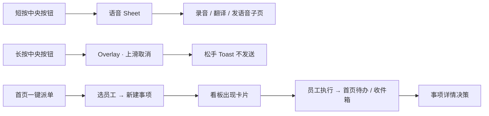
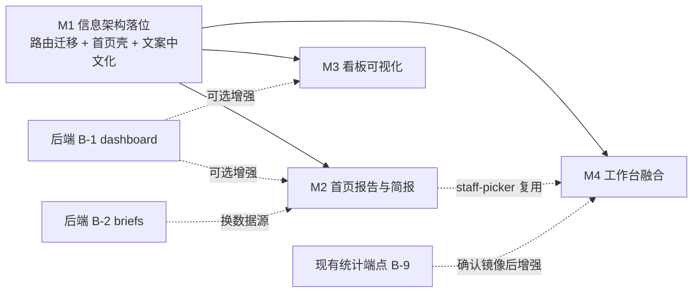

# utter-office（AI 秘书）移动端 PRD

> 版本：v1.8 · 2026-08-18
> 对齐代码：讲解壳原型 `docs/assets/prototypes/` + `apps/mobile` 现网长按录音（`record-button.tsx`）
> v1.8 修订：首页 Hero+Pulse、工作成果热力柱+横滑、待办决策队列、简报 Tab；专业版迁入「我的」；看板默认整盘密排、去掉报告占位；**中央按钮长按保持现网**（Overlay / 上滑取消 / Toast 不发送）。
> v1.7 修订：首页 §4.4 由「数据分析报告」改为 **工作成果（过去 24h 员工产出流）**；日/周/月 A 类指标下沉完整报告页；与行业简报边界写清。
> v1.6 修订：对照 StaffDeck 官网六步/六模块/三案例与可点击原型包纠偏——补 §2.5 正确翻译、§3.4 原型索引；首页/看板线框补阻断条；锁定档案 3 Tab；验收补原型主路径与工具脱敏三态。**禁止**再把行业简报写成「主动工作」、把三层可靠性写成已对齐、用 snapshot 冒充累计 KPI。
> 上游依据：[`docs/app-analysis.md`](./app-analysis.md)（现状分析；§16 已过期见该节文首）、[`docs/api-interfaces.md`](./api-interfaces.md)、[`docs/staffdeck-analysis.md`](./staffdeck-analysis.md)、[`docs/assets/prototypes/00-index.html`](./assets/prototypes/00-index.html)
> 外部参考：[StaffDeck](https://github.com/OpenBMB/StaffDeck) · [staffdeck.openbmb.cn](https://staffdeck.openbmb.cn/) · [Multica](https://github.com/multica-ai/multica) · [multica.ai](https://multica.ai/) · meet-think（`/Users/sun/Documents/code/meet-think`）

---

## 目录

- [0. 文档定位](#0-文档定位)
- [1. 产品主张与本期范围](#1-产品主张与本期范围)
- [2. 概念模型：Multica × StaffDeck](#2-概念模型multica--staffdeck)
- [2.5 StaffDeck 六步 / 六模块 / 三案例 → 移动端](#25-staffdeck-六步--六模块--三案例--移动端)
- [3. 信息架构与导航](#3-信息架构与导航)
- [3.4 原型索引](#34-原型索引)
- [4. 首页（Today）](#4-首页today)
- [5. 看板（Board）](#5-看板board)
- [6. 中央录音按钮（原型）](#6-中央录音按钮原型)
- [7. 工作台（Workbench）= 会话 × 数字员工](#7-工作台workbench-会话--数字员工)
- [8. 我的（Mine）](#8-我的mine)
- [9. 设计系统、文案与全局约定](#9-设计系统文案与全局约定)
- [10. 数据契约与后端需求](#10-数据契约与后端需求)
- [11. Mock / 真实能力边界总表](#11-mock--真实能力边界总表)
- [12. 迭代计划](#12-迭代计划)
- [13. 验收清单](#13-验收清单)
- [14. 风险与未决问题](#14-风险与未决问题)
- [15. 文档维护](#15-文档维护)

---

## 0. 文档定位

### 0.1 本文负责 / 不负责

| 负责 | 不负责 |
|---|---|
| 5 个底栏 Tab 的信息架构、每屏布局、交互规则 | 后端实现、数据库设计、服务端聚合逻辑 |
| 路由总表（新增 / 改造 / 保留 / 迁移） | 视觉稿像素级标注（由设计系统 token 推导） |
| 每屏的数据源、降级策略、Mock 边界 | 硬件（BLE）方案、真实音频采集 / ASR / 翻译引擎选型 |
| StaffDeck「数字员工」概念在移动端的落地映射（借鉴依据见 [`staffdeck-analysis.md`](./staffdeck-analysis.md)） | StaffDeck 后端能力移植（SOP 状态机、知识库 OKF、竞标 arena） |
| 分期计划与可 QA 的验收清单 | 商业化、定价、增长 |

### 0.2 与代码规则的关系

`apps/mobile/CLAUDE.md` 要求任何新功能先完成三步 pre-flight（读 web 实现 → 给出交互计划与 parity 点 → 等显式指令）。**本 PRD 即 pre-flight 第 2 步的成文版本**：每屏都标注了必须与 web/desktop 一致的语义点。开工前仍需按 §Pre-flight 第 1 步核对 `packages/core/<feature>/` 与 `packages/views/<feature>/` 的真实实现。

三条铁律在本 PRD 全程生效：

1. **数据契约镜像 web/desktop** —— 端点、请求体、响应 schema、缓存 key 前缀一致；UI / 交互可自由分歧。
2. **行为语义一致** —— 计数、可见性、权限、状态枚举、数据身份五项必须与 web 一致。
3. **mirror, don't import** —— 数据 / 实时层自持移动端版本。

### 0.3 Do / Don't

| Do | Don't |
|---|---|
| 新语义先落后端 / `packages/core`，移动端只做渲染层 | 在移动端造「本端独有」的数据模型覆盖层 |
| 按 §0.4 分级决定「补 mock」还是「显示缺失」 | 不加区分地一律 mock，或一律留空 |
| 复用已有组件与已有 picker / sheet 模式 | 为一两个调用方新建 `components/ui/` 原语 |
| 中文 Tab 名与屏内实际内容语义一致 | 保留「首页=收件箱、看板=我的事项」这类命名错位 |
| 录音相关全部标注「原型」，交互闭环但能力为 Mock | 短按录音已接本机加密内核；转写/纪要仍为 B 类示例。长按 Overlay 仍不采集 |
| 后端改造需求登记到 §10.2 并标注「本期不做」 | 本期动后端，或在移动端硬扛后端缺口 |

### 0.4 数据真实性分级（全文档通用口径）

「能不能用 mock 数据」不是一刀切，取决于**假数据会不会让用户做出错误决策**。全文按三级处理：

| 级别 | 定义 | 缺真实数据时怎么办 | 典型例子 |
|---|---|---|---|
| **A 类 · 决策型** | 用户会据此判断状态、分配精力、评估成本的**数字与状态** | **绝不 mock**。显示 `——` + 一行说明，宁可空着 | 完成数、运行时长、Tokens、失败率、未读计数、在手任务数、员工在岗状态 |
| **B 类 · 内容型** | 用户读取内容本身、不产生量化判断的**文本与素材** | **允许 mock**，但必须：① 集中在 `data/mocks/` ② UI 上有「示例数据」徽标 ③ 一个开关切回真实 | 行业简报正文、录音页的转写示例、翻译页的对话示例 |
| **C 类 · 结构型** | 只影响布局与交互演示的骨架 | 允许固定假值，无需徽标 | 骨架屏、波形动画高度、空态插画 |

**判据**：如果把假数字当真会让用户少派一个员工、多等一天、或误判成本，它就是 A 类。行业简报读错一条不会造成这种后果，所以它是 B 类，本期用 mock。

---

## 1. 产品主张与本期范围

### 1.1 一句话

> **utter-office 是一个「说一句话就有人接活」的移动端 AI 秘书**：需求从语音或一行文字进来，秘书把它变成事项，派给合适的数字员工，员工在你的运行时上干活并回报进度，你在手机上只做决策。

三层结构（每一屏都应能被归入其中一层）：

| 层 | 回答的问题 | 承载 Tab |
|---|---|---|
| 感知层 | 今天发生了什么？我要决定什么？ | 首页 |
| 治理层 | 整盘项目任务在哪个环节？谁在干？ | 看板 |
| 执行层 | 谁来干？现在干到哪了？让他改一下 | 工作台 + 中央录音 |
| 自我层 | 我的身份、偏好、报告、设置 | 我的 |

### 1.1.1 贯穿产品原则：HITL（Human in the Loop）

借鉴 StaffDeck 的贯穿原则（[分析报告 §6.1](./staffdeck-analysis.md#61-贯穿原则hitl)），明确写成本产品的设计前提而非补丁：

> **人在每个关键环节保留介入点：派单可改、过程全程可见、结果可收可退、异常必须找人。**

utter-office 已有的介入点必须在每一屏被表达出来，而不是藏在深层：

| 环节 | 介入方式 | 现有支撑 |
|---|---|---|
| 派单前 | 改负责人、改优先级、改截止日 | assignee / priority / due-date picker |
| 执行中 | 看运行记录、取消任务、追加评论 | `runs.tsx`、`/api/tasks/{id}/cancel`、评论 |
| 执行后 | 审阅、退回、@ 追问 | `in_review` 状态、@提及触发 |
| 异常 | 受阻可见、失败可见并可重试 | `blocked` 状态、inbox `agent_blocked` / `task_failed` |

**设计要求**：任何屏上出现「AI 正在做某事」时，必须同屏或一跳内可达「让我看 / 让我停 / 让我改」。这是本 PRD 评审新屏时的硬性检查项（见 §13.1）。

### 1.2 本期做（In Scope）

1. 5 Tab 信息架构重构：**首页 / 看板 / ●录 / 工作台 / 我的**。
2. 首页：快捷入口 + **工作成果（过去 24h 员工产出）** + 待办事项 + 行业简报推送（**简报 / 成果走 mock 展示，只做首页区块**；日/周/月量化报告下沉 `/{slug}/reports`）。
3. 看板：整盘项目任务的可视化管理（列视图 / 项目泳道 / 进度度量）。
4. 中央录音按钮：短按打开「录音 / 翻译 / 发语音」Sheet；**录音走本机加密采集**（分段、对账、导出真实；转写/纪要为 B 类示例）；**长按保持现网**（微信式 Overlay、上滑取消、松手 Toast，**不发会话、不跳工作台**）。
5. 工作台：把现有聊天与 StaffDeck「数字员工」概念融合成一屏（员工即频道）。
6. 我的：保留现有全部入口，重组分区并扩展报告 / 秘书设置 / 帮助。
7. 中英混用治理：把面向用户的展示文案**全部统一为中文**，不引入 i18n 框架（§9.5）。
8. 后端改造需求**只登记不实施**，集中在 §10.2。

### 1.3 本期不做（Out of Scope，明确排除）

| 不做 | 原因 | 何时再议 |
|---|---|---|
| **任何后端改动**（新端点、新字段、新 WS 事件） | 本期是移动端 IA 重构，后端并行改造会让联调面失控 | 需求已登记在 §10.2，后端排期后单独启动 |
| BLE 硬件按钮对接 | 无硬件、无协议、无固件 | 硬件方案定稿后单开 PRD |
| 真实 ASR / TTS / 翻译引擎 | 依赖服务端能力与成本模型 | 后端 A 线就绪后（传输层已留 Stub） |
| 定时任务 / Autopilot 移动端对接 | core 已有相关机制，但触发粒度、产物和 REST 可用性尚未确认 | §10.2 B-5 核验后 |
| StaffDeck 的 SOP 状态机、知识库 OKF、竞标 arena、员工模板广场、员工记忆、成长记录 | 后端与 `packages/core` 均无对应实体，移动端不能自造；其中 SOP 与 OKF 属**领域不匹配**（见 §2.1 借鉴边界表），不建议后续做 | 逐项登记在 §10.2 B-6 / B-7 / B-8 |
| 移动端创建 / 编辑数字员工（agent） | 后端 agent 写接口未镜像到移动端 | 员工名册只读版验收后 |
| Android 视觉对齐 | iOS 为唯一主目标（formSheet / ActionSheetIOS 依赖） | — |

---

## 2. 概念模型：Multica × StaffDeck

### 2.1 融合原则

StaffDeck 的价值是**把 AI agent 当受治理的软件角色**（岗位、能力边界、工作记录、反馈与人工兜底）。其 README 把「工号」写入产品主张，但分析基线的 `AgentProfile` schema 没有独立 `employee_no` 字段；utter-office 是否增加稳定工号属于自身产品选择，不是追平 StaffDeck 实现。utter-office 已有 `agent` / `squad` / `agent_task` / `runtime` 四个实体，概念上具备数字员工治理的基础骨架。

本期做法：**只做「身份层」的语义包装与渲染，不新造实体**。

- 对外文案（UI）用「数字员工」；
- 内部字段、端点、缓存 key 一律沿用 `agent`；
- 任何 StaffDeck 概念若在后端无字段支撑，要么由已有字段派生并标注派生规则，要么显式占位。

> **旁证**：StaffDeck 自己也用同一条原则。其多 Agent 团队决策记录写明「产品界面统一使用『项目领导』；`TL` 仅保留为内部角色、数据字段与 API 的兼容标识」（[分析报告 §6.1](./staffdeck-analysis.md#61-贯穿原则hitl)）。对外说业务语言、对内保留技术标识，是同一种做法。

#### 借鉴边界（重要）

完整分析见 [`docs/staffdeck-analysis.md`](./staffdeck-analysis.md)，结论一句话：

> 最值得借鉴的是 StaffDeck 的**治理层表达方式**——怎么让一个 agent 成为可评估、可比较、会成长且可人工接管的软件角色；SOP 状态机和 OKF 知识本体不宜直接照搬，应把「稳定方法 / 变化事实 / 外部动作 / 运行证据 / 人工边界」翻译到软件工程场景。

| 借鉴 | 不借鉴 | 原因 |
|---|---|---|
| 能力计数条（§7.5） | SOP 状态机 | 领域不匹配；截图实例的 0 次调用只能说明本次无可观察样本，不能验证或否定整体有效性 |
| 员工档案 Tab 结构（§7.6） | 知识库 OKF 分层检索 | `ProjectResource` 语义不等价，强行移植会造出空壳 |
| 绩效语义 KPI（§7.6） | 开放广场五列布局 | 手机屏宽放不下，且本期无模板资源 |
| 阻断提示的双重提醒模式（§7.2） | 竞标 arena（3 轮血条） | 需要竞标、裁决、独立会话、审计和黑板等完整子系统，并增加多轮模型工作量；成本收益未经本项目验证 |
| 员工即上下文（§7.1） | 微信 / 企业微信渠道 | 移动端本身就是渠道 |
| HITL 贯穿原则（§1.1.1） | 表格式管理页 | 桌面形态，手机不可用，改卡片 + 分组列表 |

### 2.2 概念映射表

对照依据包括 StaffDeck [开放 API v1](https://raw.githubusercontent.com/OpenBMB/StaffDeck/main/docs/open-api-v1.md)、桌面端截图与分析基线的 `main` 实现；其中团队、竞标与黑板属于 **main-only**，未进入核验时最新 Release `v0.3.1-beta.5`（详见分析报告 §3、§6）：

| StaffDeck 实体 | UI 文案 | 数据来源 | 状态 |
|---|---|---|---|
| `Agent` 数字员工 | 数字员工 | `Agent` | ✅ 已有 |
| 工号（utter-office 自身产品选择） | 工号 `EMP-xxxx` | 前端派生：`agent.id` 后 4 位大写 | ⚠️ 派生；UI 必须标注，不能暗示 StaffDeck 当前 schema 已有同名字段 |
| 岗位 / 职能 | 岗位 | `agent.description` 首句；空则显示「未设置岗位」 | ⚠️ 派生；后端补 `position` 后替换 |
| 入职时间 | 入职 | `agent.created_at` | ✅ 语义可直接复用 |
| 职责描述（含升级条件） | 描述 | `agent.description` 全文，2 行截断 | ✅ 已有字段，本期首次展示（§7.5） |
| 在线 / 下线 / 待审批 | 在岗 / 工作中 / 受阻 / 异常 / 离线 | `agent.status`（5 态） | ✅ 已有；「待审批」无对应，不引入 |
| 模型配置 | 模型与参数 | `agent.model` / thinking level | ✅ 已有；StaffDeck 是租户级 `ModelConfig` + 绑定，当前 Harness 仍选租户默认模型，两者不等价，本期不借鉴其管理页 |
| — （无对应） | 工位 | `Runtime.provider` + `status` + `runtime_mode` | ✅ **utter-office 独有**：员工跑在用户自己的机器上 |
| `GeneralSkill` 技能 | 技能 | `agent.skills[]` | ✅ 已有 |
| `Tool` 工具（HTTP/MCP；分桶是管理维度） | 工具 | `agent.mcp_config` + `composio_toolkit_allowlist` | ✅ 已有；必须处理两个 `*_redacted` 标记，本期从计数改为可展开（§7.5–7.6） |
| 在手任务 | 在手任务 | `/api/agent-task-snapshot` | ✅ 已有 |
| 工作记录 | 工作记录 | issue timeline 中 `author_type=agent` 的条目 + `/api/tasks/{id}/messages` | ✅ 已有 |
| 今日对话 / 累计对话 / 好评率 / 差评率 | 今日终态 / 近 30 天运行 / 近 30 天失败 / 近 30 天失败率 | `/api/agent-run-counts` + `/api/agent-activity-30d` | 🚧 core 已有，移动端尚未登记对接；本期未镜像则显示 `——` |
| 能力计数 `3 资料 2 技能 3 SOP` | `N 技能 / N 工具或已配置 / N 在手` | 上述三项 | ✅ 可落地，但工具脱敏时不能显示数字或 0 |
| `Team` + TL + 竞标 + 黑板 | 战队 | `Squad` + `leader_id` | ✅ utter-office 战队已有（本期只读）；StaffDeck 竞标 / 黑板为 main-only 且不引入 |
| `team_tasks` 当前实现（7 态） | 事项状态 | `IssueStatus`（7 态） | ⚠️ 只能比较状态词汇，不能据此认定模型接近 |
| `ScheduledTask` 定时任务 | — | 无（Multica 有 `autopilots`，移动端未对接） | ⬜ 不做，登记为 B-5（**高优先级**） |
| `Memory` 记忆（界面主张按员工/用户隔离，具体服务端隔离键待核验） | — | 无 | ⬜ 不做，显式占位（§7.6 能力区） |
| 成长记录（能力变更时间线） | — | 无能力变更事件流 | ⬜ 不做，登记为 B-6 |
| `SOP` 流程状态机 | — | 无 | ⬜ 不做（领域不匹配） |
| `KnowledgeBase` OKF 分层检索 | — | `ProjectResource` 勉强对应，语义不等价 | ⬜ 不做（领域不匹配） |
| `Gallery` 开放广场（五类） | — | 无 | ⬜ 不做，登记为 B-7 |

#### 任务状态词汇对照（不是状态机等价）

StaffDeck `main` 当前合法转换为：

```
pending     → bidding | in_progress | escalated
bidding     → pending | escalated
in_progress → review | escalated
review      → done | rework | escalated
rework      → in_progress | escalated
```

竞标结束先回到 `pending`；当前实现没有 `cancelled`，该状态只出现在早期设计草案。与 utter-office 仅做**词汇层面**比较时，可观察到三个显式语义：

| StaffDeck 独有 | utter-office 现状 | 语义差距 |
|---|---|---|
| `bidding` | 无 | 多候选竞标阶段 |
| `rework` | 用 `in_progress` 回退表示 | 缺「审阅后退回重做」的独立语义，时间线上看不出这次是返工 |
| `escalated` | 用 `blocked` 近似 | `blocked` 是「自己卡住了」，`escalated` 是「主动升级给人」，责任归属不同 |

这不表示两套模型“只差三个枚举”。StaffDeck 团队任务还包含竞标条件、认领与裁决、独立 Harness 会话、review/rework 循环、超时升级、审计事件、报告与黑板写入；`pending` 与 `backlog/todo` 也不是严格同义。

**本期不改**：`IssueStatus` 是核心模型，任何扩展都要同时定义合法转换、触发者、审计副作用、统计口径以及 web / desktop / mobile 三端渲染，不是移动端可以单方面推进的。登记为 §10.2 B-8 与 §14.2 待决策。

### 2.3 术语表（UI 文案 ↔ 代码字段）

| UI 中文 | 代码 / API | 说明 |
|---|---|---|
| 事项 | `issue` | 不叫「任务」，避免与 `agent_task` 混淆 |
| 任务运行 / 运行记录 | `agent_task` / task run | 一次 agent 执行 |
| 数字员工 | `agent` | |
| 战队 | `squad` | |
| 工位 | `runtime` | |
| 会话 | `chat_session` | |
| 收件箱 | `inbox` | |
| 项目 | `project` | |
| 默认智能体 / 默认员工 | 本地设置项（新增） | 见 §6.4 |
| 简报 | brief（新增，后端待定） | 行业简报推送 |

### 2.4 用户与场景

| 角色 | 场景 | 关键屏 |
|---|---|---|
| 一人公司 / 独立开发者 | 通勤路上口述需求 → 员工在家里的机器上跑 → 到公司看结果 | 录音 → 工作台 → 首页 |
| 小团队 Owner | 早上看整盘进度，决定哪些卡住的要人工介入 | 首页 → 看板 → 事项详情 |
| 团队成员 | 我被指派了什么、我创建的东西谁在跟 | 首页待办 → 我的事项 |

### 2.5 StaffDeck 六步 / 六模块 / 三案例 → 移动端

完整证据见 [`docs/staffdeck-analysis.md`](./staffdeck-analysis.md)。本节只写**正确翻译**；禁止把 StaffDeck 执行内核写成已在本 App 对齐。

#### 官方六步 → 本期主路径

StaffDeck README：创建 → 配置能力 → 发起会话 → 执行并观测 → 必要时介入 → 持续运营。

| 六步 | 移动端本期 | 不做 |
|---|---|---|
| 创建 | 名册空态：「请在 Web 端创建」 | 移动端创建员工 |
| 配置能力 | 档案「能力」Tab 只读（技能 / 工具展开 / 工位 / 模型 / 权限） | 编辑配置 |
| 发起会话 | Rail 点员工 / 档案「与他对话」/ 首页「派单」→ `staff-picker?intent=dispatch` | — |
| 执行并观测 | 工作台任务时间线 + 运行记录（对齐 Trace 可审计事件，不输出 COT） | 独立 Trace 后台 |
| 必要时介入 | 运行中同屏「查看记录 / 取消 / 追问」（HITL 一等公民） | — |
| 持续运营 | 记忆 / 定时 / 成长用说明卡；简报是资讯 mock | 用简报冒充定时巡检 |

#### 官网六模块 → 档案能力区

技能 → `agent.skills[]`；工具 → MCP/Composio 展开（脱敏三态）；可观测 → 工作记录 Tab 的在手 + 最近运行；知识 / 记忆 / 定时 → 「暂不支持 + 为什么」说明卡。**工位**是 utter-office 独有，放在能力 Tab 第一块。

#### 官网三案例 → 拆分原则（不是三个功能）

```text
稳定执行方法 → instructions / skills
会变化的项目事实 → repo / project context
外部动作 → MCP / runtime
运行证据 → task run / timeline
不确定与高风险 → 人工审阅 / 升级
```

- **经验继承**：名册/档案展示「能力范围 + 升级条件」描述，不造成长时间线（B-6）。
- **重复问答**：不做 FAQ 产品；用工作台会话 + 技能/工具边界表达「标准活交给员工」。
- **主动工作**：真落点是 §10.2 **B-5 autopilots**；档案页头「定时」为 `——`；首页简报保持「示例数据」资讯，文案禁止写成「员工已自动巡检」。

#### 三层可靠性 → 诚实对照（原则翻译，非已对齐）

| StaffDeck | utter-office 本期真实能力 | 禁止声称 |
|---|---|---|
| 流程可靠（SOP 断点续跑） | 事项状态 + 运行可取消 / 可追问 | 已有节点恢复 |
| 知识可靠（引用溯源） | 工具/技能展示诚实 + 脱敏 | 已有 OKF / 引用来源 |
| 迭代可靠（Trace + 反馈） | 运行记录可见 | 已有好评差评 / 成长事件回流 |

---

## 3. 信息架构与导航

### 3.1 底栏：2 + 1 + 2

```
┌───────────────────────────────────────────────────────────┐
│  首页        看板       ●录        工作台       我的        │
│  house    grid.2x2   [渐变按钮]   person.2.wave  person    │
│  badge:              长按录音     badge:                   │
│  收件箱未读           点按选择     会话未读                  │
└───────────────────────────────────────────────────────────┘
```

| # | route | 标题 | 图标（SF Symbol） | Badge | 现状 → 目标 |
|---|---|---|---|---|---|
| 1 | `home` | 首页 | `house` / `house.fill` | 收件箱未读数 | 收件箱列表 → **Today 仪表盘** |
| 2 | `board` | 看板 | `square.grid.2x2` / `.fill` | — | 我的事项 → **项目任务可视化看板** |
| 3 | `voice` | 录音 | 自定义 `RecordButton` | — | 保留（不导航） |
| 4 | `workbench` | 工作台 | `person.2.wave.2` / `.fill` | 会话未读数 | 聊天 → **会话 × 数字员工** |
| 5 | `mine` | 我的 | `person` / `.fill` | — | 保留 + 重组 |

**必须保持的 parity 点：**

- 首页 badge 仍走 `deduplicateInboxItems` → 过滤 `!read` → `>99` 显示 `99+`（`lib/unread-counts.ts`）。**即使首页不再直接渲染 inbox 列表，计数规则不能变** —— 这是 2026-05-09 事故的直接教训。
- 工作台 badge 仍走 `countUnreadChatMessages(sessions)`。
- 中央按钮 `tabPress` 继续 `preventDefault()`；`(tabs)/voice.tsx` 保留 `Redirect` 兜底 deep link。

### 3.2 路由总表

#### 改造（Tab 屏）

| 路由 | 文件 | 变更 |
|---|---|---|
| `/{slug}/home` | `(tabs)/home.tsx` | **重写**为 Today 仪表盘（§4） |
| `/{slug}/board` | `(tabs)/board.tsx` | **重写**为项目任务看板（§5） |
| `/{slug}/workbench` | `(tabs)/workbench.tsx` | 由 `chat.tsx` **重命名**并扩展员工 rail（§7）；M1 阶段只改 Tab 标题，M3 才改文件名 |
| `/{slug}/mine` | `(tabs)/mine.tsx` | 分区重组 + 新增入口（§8） |

#### 新增

| 路由 | 呈现 | 内容 |
|---|---|---|
| `/{slug}/inbox` | push | **收件箱**（从原 `home.tsx` 整体迁出，逻辑零改动） |
| `/{slug}/my-issues` | push | **我的事项**（从原 `board.tsx` 整体迁出，逻辑零改动） |
| `/{slug}/reports` | push | 报告详情页（日/周/月完整版，首页卡片的「查看完整报告」落点） |
| `/{slug}/brief/[id]` | push | 简报详情（Markdown 阅读 + 「组建小分队」CTA） |
| `/{slug}/briefs` | push | 行业简报列表（分类筛选 + 全部已读）—— **后置**，等 B-2 对接时做 |
| `/{slug}/staff` | push | 数字员工名册 |
| `/{slug}/staff/[id]` | push | 员工档案（工号 / 岗位 / 技能 / 在手任务 / 工作记录 / KPI） |
| `/{slug}/staff-picker` | formSheet | 选员工（派单、设默认员工共用；带原生搜索） |
| `/{slug}/board-view` | formSheet | 看板视图与筛选（项目 + 视图 + 状态 + 优先级 + 负责人） |
| `/{slug}/more/settings/assistant` | push | **秘书设置**（默认智能体、语音入口偏好、简报偏好） |

#### 保留（不动）

`/{slug}/issue/[id]` 及其全部子路由与 picker 族、`/{slug}/project/*`、`/{slug}/new-issue`、`/{slug}/search`、`/{slug}/chat-sessions`、`/{slug}/switch-workspace`、`/{slug}/issues-filter`、`/{slug}/mention-picker`、`/{slug}/voice-record` / `voice-talk` / `voice-translate`、`/{slug}/more/*` 全部。

#### 重命名的影响面（`chat` → `workbench`）

实际导航点（已核验代码，见 §14.3）：

- `components/voice/record-button.tsx` **长按不导航、不发消息**（仅 Overlay + Toast）—— **本期不改**
- `voice-talk.tsx` 子页内 hold-to-talk 仍走该页现有发送逻辑；若仍写 `/chat` 则随工作台路由改 `/workbench`
- `app/(app)/[workspace]/_layout.tsx` 中 `chat-sessions` sheet 的返回上下文
- `(tabs)/_layout.tsx` 的 `Tabs.Screen name` + Stack 标题
- `lib/use-send-voice-message.ts` **不导航**（只发送 + 失效缓存）；中央长按不调用它

无外部 deep link 依赖 `/chat`，因此不需要保留重定向。

### 3.3 主旅程



### 3.4 原型索引

可点击 HTML 原型包（像素级对齐 `apps/mobile` 实装；讲解壳：左导航 / 中预览 / 右说明）入口：[`docs/assets/prototypes/00-index.html`](./assets/prototypes/00-index.html)。手机框内路由经 `postMessage` 切换，不跳出讲解页。共享 `_shared.css` / `_shared.js` / `_shell.css`。

| 原型文件 | 对应路由 / 能力 | 里程碑 |
|---|---|---|
| `00-index.html` | 目录 + 主路径 + 借鉴边界 | — |
| `01-tab-ia.html` | 底栏 IA | M1 |
| `02-home.html` | `/{slug}/home` | M1–M2 |
| `03-board.html` | `/{slug}/board` | M3 |
| `04-voice.html` | 中央按钮 Sheet / Overlay 入口 | M1 / M4 |
| `12-voice-talk.html` | `/{slug}/voice-talk` 发语音 | M4 |
| `13-voice-record.html` | `/{slug}/voice-record` 录音 | M4 |
| `14-voice-translate.html` | `/{slug}/voice-translate` 翻译 | M4 |
| `05-workbench.html` | `/{slug}/workbench` | M4 |
| `06-mine.html` | `/{slug}/mine` | M1 / M4 |
| `07-staff-roster.html` | `/{slug}/staff` | M4 |
| `08-staff-profile.html` | `/{slug}/staff/[id]` | M4 |
| `09-staff-picker.html` | `/{slug}/staff-picker`（dispatch / default） | M1 / M2 |
| `10-assistant-settings.html` | `/{slug}/more/settings/assistant` | M2 |
| `11-brief-detail.html` | `/{slug}/brief/[id]` | M2 |
| `15-inbox.html` | `/{slug}/inbox` | M1 |
| `16-projects.html` | `/{slug}/more/projects` | M1 |

**编码注意**：原型是目标态。M1 我的页「数字员工」仍指 `more/agents`（避免死链），与原型 `/staff` 不一致属预期；M4 再改指向并删除占位。子页返回走导航栈（从哪来回哪里）；左栏选屏会清空栈。

**原型验收**（评审先于编码）：打开 `00-index.html`，四条主路径无死链；名册可见工具三态；档案 KPI 为 `——`；工作台运行中同屏 HITL 三入口；简报文案不写成主动工作；收件箱 / 项目可从首页 Pulse 与「我的」点通。

---

## 4. 首页（Today）

### 4.1 定位

首页回答两个问题：**「今天该我决定什么」** 和 **「这段时间发生了什么」**。它不是列表页，是决策台。

原收件箱列表迁到 `/{slug}/inbox`，主入口改为首页右上角铃铛（带未读点），Tab badge 保持不变。

### 4.2 布局

```
┌─ Header ────────────────────────────────────────┐
│  早上好，Sun                           🔔(3) 🔍 │
├─ 阻断提示条（条件渲染，最多 1 条，§7.2）──────┤
│  ⚠️ 有员工工位未绑定…              [去绑定]   │
├─ Hero ──────────────────────────────────────────┤
│  [一键派单 · 交给数字员工]  [新建事项]          │
│                         [语音下达]              │
├─ Pulse（组织在岗）──────────────────────────────┤
│  Utter Office · 3 位员工在岗        [头像叠] › │
│  项目 4 个进行中  │  收件箱 3 条未读            │
├─ ② 工作成果（过去 24h · ≠ 行业简报）───────────┤
│  工作成果 · 过去 24h · N 份     完整报告 ›     │
│  高峰 07:40 · 并行 2 人 · 活跃 3 人             │
│  [热力柱 + 头像落点 · 钟点轴右侧「现在」]        │
│  [横滑矮卡：员工 · 迷你图 · 类型 · 要点]        │
├─ ③ 待办事项（决策队列）─────────────────────────┤
│  待办 · 介入 N · 推进 M             全部 (K) › │
│  [需你介入] 受阻条 + 处理 ›                     │
│  [员工在推进] 今天/明天 · 进度示意 · 头像       │
├─ ④ 行业简报（示例数据 · ≠ 主动工作）───────────┤
│  行业简报 · N 未读                              │
│  [全部 / AI Infra / 竞品 / 政策 / 融资]         │
│  [密排行：色块 + 标题 + 右侧要点 chip]          │
└─────────────────────────────────────────────────┘
```

首页**不放**专业版工作区；该入口只在「我的」（§8）。各内容块标题收进白卡顶栏（蓝竖条 + meta），块与块拉开。

> **派单落点**：Hero「一键派单」→ `staff-picker?intent=dispatch`，**不是**名册。名册入口：Pulse 组织行、工作台 Rail「全部」、我的 → 数字员工。

> **「N 位员工在岗」判定口径（v1.5）**：统计非归档且当前用户可见的员工中，`agent.status` 处于 `idle` / `working`（在线可用）的数量；`blocked` / `error` / `offline` 不计入。与 web 员工列表的「在线」语义对齐（§13.2），不得用「所有可见员工数」冒充。

### 4.3 ① 捕获入口 + Pulse

**Hero（不对称）**

| 区块 | 标签 | 行为 |
|---|---|---|
| 主卡 | 一键派单 / 交给数字员工 | push `/{slug}/staff-picker?intent=dispatch` → 选中后 `new-issue` 预填 assignee |
| 次卡 | 新建事项 | push `/{slug}/new-issue`（modal） |
| 次卡 | 语音下达 | 打开与底栏中央按钮相同的语音 Sheet（短按三项） |

**Pulse（组织在岗）**：一行组织名 + 在岗数 + 头像叠，点进 `/{slug}/staff`；下行「项目」→ `/{slug}/more/projects`，「收件箱」→ `/{slug}/inbox`（角标与 Tab badge 同源 `useInboxUnreadCount`）。

不再做首页四格快捷 tile（派单/新建已在 Hero，项目/收件箱在 Pulse）。

### 4.4 ② 工作成果（过去 24 小时）

**定位**：数字员工 24 小时在干——首页展示**可扫读的产出物**（分析结论、日报/新闻摘要、事项交付），不是 Tokens / 运行时长仪表盘。

**与行业简报的边界**：简报（§4.6）是外部资讯阅读；本区块是**员工产出**。员工可产出「新闻摘要」类成果，但**不得**把简报列表并进本区块，也不得把本区块文案写成「员工已自动巡检」（主动工作落点仍是 §10.2 B-5）。

#### 首页区块（必做）

- 区块标题收进卡顶栏：**工作成果**；meta：`过去 24h · N 份` + 「示例」徽标；右侧：**完整报告 ›** → `/{slug}/reports`（量化报告下沉页，见下）。
- **上：24h 区间面积曲线** — 单条时间道，每人执行时段左右竖线框定，内为 token 使用度曲线 + 渐变填充；多人同时跑不同任务时在同一道上叠色。摘要行右侧可 **按人筛选**。高度 = token 使用度，有下限与封顶（小用量抬高、大用量压缩）。头像落在区间起点。时间轴只标有任务的起止（半小时取整），空档不标；最左为窗口起点、最右为「现在」；标签相对竖线水平居中；挤不下时优先保留开始时间。点击区间高亮该次产出，下方矮卡切到对应内容。
- **下：矮卡横滑**（员工 + 迷你图 + 类型 + 一句要点）。类型枚举：`每日新闻` | `数据分析` | `事项交付`（可映射 mock 的新闻摘要 / 分析结论 / 事项交付）。未点选时横滑全部；点选曲线后只展示该次产出。
- 点击矮卡 → 有关联 `issue_id` 则 push `issue/[id]`；有 `brief_id` 则 push `brief/[id]`；否则看板。
- 空态：`过去 24 小时暂无产出` + 「派单或开启定时任务后会出现在这里」。
- 本期数据为 **B 类 mock**（`data/mocks/outcomes.ts` + `USE_MOCK_OUTCOMES` + 「示例」徽标）。热力柱与迷你图是 **示意**，**禁止**在本卡把 Tokens / 运行时长当成 A 类 KPI。
- 后续真源：已完成事项结论、agent run 摘要、定时任务产物（B-5）；接口到位后只换数据源。

#### 完整数据报告页 `/{slug}/reports`（原首页报告卡下沉）

日/周/月量化指标**不再占据首页**，统一在本页（及「我的 → 数据报告」入口）展示。

| 周期 | 主指标（3 个） | 行内次指标 |
|---|---|---|
| 日 | 今日新建事项 / 今日完成 / 员工运行时长 | 进行中 · 待评审 · 受阻 · 失败 |
| 周 | 本周完成 / 本周运行时长 / Tokens | 7 日完成趋势迷你条 |
| 月 | 本月完成 / 本月运行时长 / Tokens | Top 3 员工贡献 / 失败（端点就绪后） |

| 指标 | 首选 | 降级（本期默认） |
|---|---|---|
| 完成 / 新建 / 状态分布 | `/api/dashboard/usage/daily` 🚧 | `/api/issues`（workspace 全量）客户端聚合 ✅ |
| 员工运行时长 | `/api/dashboard/agent-runtime` 等 🚧 | `——`（A 类，禁止 mock） |
| Tokens / 失败 | dashboard 🚧 | `——` |

**口径**：报告页为**工作区维度**；待办（§4.5）为**个人维度**，不共用 query key。周期切换记在 `useHomeViewStore`。指标全部 **A 类**——无数据源显示 `——` 而非 `0`。

### 4.5 ③ 待办事项（决策队列）

首页待办问的是 **「谁下一步：你还是员工」**，不要做成工作成果同款热力/横滑，也不要做成普通事项列表。

- 数据源：`myIssueListOptions(wsId, "assigned")` ✅ 已有，无新接口。
- 分两层：
  - **需你介入**（主）：`blocked`、以及待你评审的 `in_review`。一条行动条：状态章 + 标题 + 员工/逾期 + **处理 ›**。
  - **员工在推进**（次）：`in_progress` / `todo` / `backlog`。密排行：今天/明天 · 标题 · 进度示意条 · 头像。进度条为 **状态示意**（进行中中段、排队浅条），不是 A 类完成度百分比。
- 顶栏 meta：`介入 N · 推进 M`；右侧「全部 (K) ›」→ `/{slug}/my-issues`。K 为 assigned 未完成计数，**与我的事项页同 scope 一致**。
- 行点击 → push `issue/[id]`。
- 空态：「今天没有待办」+ 去看板。
- 实时：复用 `useMyIssuesRealtime`。

### 4.6 ④ 行业简报推送（本期走 Mock 数据）

按 §0.4，简报是 **B 类内容型数据**：读错一条不会让用户做错决策，所以本期用 mock 数据先把展示做出来。

**内容来源已确认后续对接**（见 §10.2 B-2），因此本期原则是**快速出展示、不过度设计**：把「首页区块 + 详情页」做完就够，其余能力等真实数据源到位再补。数据类型按最终接口契约定义，接口上线后只换数据源，UI 零改动。

#### 范围分层

| 层 | 内容 | 何时做 |
|---|---|---|
| **必做（M2）** | mock 数据文件 + 首页密排 5 条 + 行业 Tab 过滤 + 详情页只读阅读 + 「示例数据」徽标 | 本期 |
| **可选增强** | 「组建小分队」闭环（临时小队 + 真实产出，非联网检索） | M2 有余力即做 |
| **后置** | 独立列表页 `/{slug}/briefs`、已读持久化、「全部已读」、`brief:created` 实时 | 等 B-2 对接时一起做 |

后置项不写代码，但**路由与 key 结构预留**（§10.3），避免届时返工。

#### 首页区块（必做）

- 卡顶栏：**行业简报** + 当前 Tab 未读数 + **「示例数据」** 徽标。
- **行业 Tab**：全部 / AI Infra / 竞品 / 政策 / 融资；过滤仅改列表，不跳独立列表页。
- 展示最多 **5 条**密排行：小色块（分类字）+ 标题 1 行 + 来源 · 相对时间 + 右侧要点（↓40% / 新 / 摘要）。不做大封面长摘要。
- 点击行 → push `/{slug}/brief/[id]`。
- 已读态：内存态即可（冷启动重置可接受）。
- 无独立「更多 ›」（列表页后置）。
- 空态：该分类暂无简报 / 「接入后每日推送与你项目相关的行业动态」。

#### 简报详情页 `/{slug}/brief/[id]`（必做）

```
┌─ ‹ 返回                              分享 ⋯ │
├─────────────────────────────────────────────┤
│  （简报正文）                                │
├─────────────────────────────────────────────┤
│  ● 任务小队                      [调整]     │
│  评估对本仓库的影响，产出可执行待办           │
│  (横滑) [k情报] [c评估] [m落地] …可至 10 人  │
│  3 人 · 理解 → 对照 → 落地                   │
│  ┌─────────────────────────────────────┐    │
│  │  深入分析探索                       │    │
│  └─────────────────────────────────────┘    │
└─────────────────────────────────────────────┘
```

- 正文复用现有 Markdown 渲染（`lib/markdown/`），**不新写渲染器**。
- 「分享」走 `Share.share`；来源链接走 `expo-linking`。

#### 「任务小队」（可选增强）

**概念不变**：为本条简报临时组队（理解 → 对照 → 落地），结案即散。

**展示必须收敛**（避免「字多看不懂 / 10 人撑爆屏」）：

| 区域 | 主信息 | 禁止堆在主卡 |
|---|---|---|
| 标题区 | 「任务小队」+ **一句目标** | 长「为何组队」说明 |
| 成员区 | **横滑头像条**（席位短标签 + 人名） | 每人一张职责大卡 |
| 副行 | `N 人 · 理解 → 对照 → 落地` | 产出说明长段落 |
| CTA | **深入分析探索** | 「派出任务小队」等其它文案 |

**调整小队** Sheet：一行 = 头像 + 席位 + 人名 + 换 + 开关；底钮 **保存小队**。详细分工写入派出后的 issue 描述，不在选人 UI 重复。

派出预填：标题 `深入分析：{简报标题}`；描述含目标与编组。

> 本期不做竞标 arena；不做无边界联网检索派单。

#### Mock 数据设计

文件：`apps/mobile/data/mocks/briefs.ts`（集中管理，见 §10.6）

| 要求 | 说明 |
|---|---|
| 条数 | **5 条**首页密排（分类 Tab 过滤）；文件内可多备 1–2 条验证截断 |
| 分类覆盖 | AI Infra / 竞品 / 政策 / 融资 各 1–2 条 |
| 相关度 | 含 `high` / `medium` / `low` 三档，验证竖条样式 |
| 时间 | 用相对当前时间的偏移量生成（`Date.now() - 2 * 3600_000` 等），**不写死绝对时间**，否则过几天全变成「3 天前」 |
| 正文 | 至少 2 条含完整 Markdown（标题 / 列表 / 引用 / 代码块 / 链接），用来验证渲染管线 |
| 长度 | 含 1 条超长标题、1 条超短正文，验证截断与空白 |
| 内容 | 用真实行业口吻撰写，不用 `Lorem ipsum` / `测试1234` |

类型定义与 §10.2 B-2 登记的后端契约**字段完全一致**，接真实接口时删除本文件即可，不改类型、不改组件。

#### 切换到真实数据

```ts
// data/queries/briefs.ts
const USE_MOCK_BRIEFS = true;  // 后端 /api/briefs 上线后改 false 并删除 data/mocks/briefs.ts

export function briefListOptions(wsId: string | null) {
  return queryOptions({
    queryKey: briefKeys.list(wsId, null),
    queryFn: ({ signal }) =>
      USE_MOCK_BRIEFS ? listMockBriefs() : api.listBriefs({ signal }),
  });
}
```

单一常量控制，且「示例数据」徽标由同一常量驱动 —— 保证不会出现「换了真数据但徽标还在」或反之。

### 4.7 状态矩阵

遵循 §9.4 全局约定，首页的特殊之处在于「区块级独立降级」——任一区块失败不影响其他区块。

| 状态 | 表现 |
|---|---|
| Loading | Header 正常渲染；② 2–3 条成果 skeleton；③ 3 行 skeleton；④ 2 行 skeleton |
| Error（首屏全失败） | 保留 Header + 快捷入口；下方整块错误文案 + Retry |
| Error（部分区块失败） | 失败区块内显示单行错误 + 重试链接，其他区块正常 |
| Empty | 各区块独立空态（见各节） |
| 离线 | 走 TanStack Query 缓存渲染；顶部不加全局横幅（避免与聊天的 offline-banner 语义打架） |
| 下拉刷新 | 刷新 ②③④ 全部查询 |

### 4.8 首页验收

- [ ] Tab 标题「首页」，屏内标题为问候语，语义不再是收件箱。
- [ ] 铃铛未读点、快捷入口角标、Tab badge 三处数字完全一致，且等于 web 侧边栏 Inbox 数。
- [ ] **工作成果**为 24h 热力柱 + 头像落点 + 矮卡横滑；无日/周/月大指标卡；专业版卡不在首页。
- [ ] 工作成果 mock 带「示例」徽标，与 `USE_MOCK_OUTCOMES` 同源；不把 Tokens / 时长当 A 类 KPI。
- [ ] 「完整报告 ›」进入 `/{slug}/reports`；该页日/周/月切换正常；无 dashboard 时缺失指标为 `——`。
- [ ] 待办是决策队列：需你介入（blocked / in_review）在上，员工在推进在下；「全部 (K)」与我的事项同 scope。
- [ ] 行业简报密排 5 条 + 行业 Tab；带「示例数据」徽标且与 `USE_MOCK_BRIEFS` 同源。
- [ ] 简报详情 Markdown 正文（含代码块、图片、引用）渲染正常，不崩不留白。
- [ ] mock 简报的相对时间随日期推移仍然合理（不出现「30 天前」全量堆积）。
- [ ] 无独立「更多 ›」死链（列表页后置）。
- [ ] *（若做了可选增强）*「组建小分队」能走通到真实 issue 创建，预填含小队分工与交付物；禁止写成联网检索。
- [ ] 从 web 改一条 assigned issue 的状态，首页待办 ≤500ms 更新，无需下拉。

---

## 5. 看板（Board）

### 5.1 定位

看板 = **整盘项目任务的可视化管理**（workspace 级，不是「我的」）。「我的事项」迁到 `/{slug}/my-issues`（由首页待办与我的页进入）。

### 5.2 三视图

顶部分段：**整盘 | 按状态 | 按人**（默认整盘）。项目 chip **仅非整盘**显示。标题收进白卡顶栏，事项行密排（色点 · 编号 · 标签 · 头像），与首页同一信息密度。

```
┌─ Header ────────────────────────────────────────┐
│  看板                            ⚙︎filter  🔍  ✚ │
│  [ 整盘 | 按状态 | 按人 ]                        │
│  [ 全部项目 ▾ ]     ← 仅按状态 / 按人           │
├─ 阻断提示条（条件渲染，最多 1 条，§7.2）──────┤
├─────────────────────────────────────────────────┤
```

#### 视图 A：按状态（横向列）

横向分页，一页一列；列头 = 状态图标 + 中文名 + 计数。

```
│ ◐ 进行中 (5)                          ‹ 2/6 ›  │
│ ┌───────────────────────────────────────────┐  │
│ │ MUL-42 重构鉴权中间件                     │  │
│ │ 🅐 mika · 高 · Auth 重构 · ● 运行中        │  │
│ ├───────────────────────────────────────────┤  │
│ │ MUL-45 补 sqlc 查询                       │  │
│ │ 🅐 codex · 中 · Auth 重构                 │  │
│ └───────────────────────────────────────────┘  │
│           ● ○ ○ ○ ○ ○                          │
```

- 列顺序 = `BOARD_STATUSES`（`backlog / todo / in_progress / in_review / done / blocked`），**`cancelled` 不显示** —— 与 web 一致（`lib/issue-status.ts`）。
- 列容器：`FlatList horizontal pagingEnabled`，页宽 = 屏宽 − 32（露出下一列 16px 边缘作为可滑动暗示）。
- 列内：`FlashList` + 复用现有 `IssueRow`，追加「员工 chip + 运行中脉冲点」（复用 `AgentHeaderBadge` / `PulseDot` 的视觉语言）。
- 列头下方页码指示器 + 底部圆点，两处联动。
- **不做拖拽换列**。理由：手机上「横向分页 + 竖向滚动 + 拖拽跨页」三种手势必然互相吞掉；且事项状态变更已有成熟的 picker 路径。替代方案：长按卡片 → `ActionSheetIOS`「移到 待规划 / 待处理 / 进行中 / 待评审 / 已完成 / 受阻 / 已取消 / 改派员工 / 打开详情」（文案按 §9.5 译法表），走 `useUpdateIssue` 乐观更新。

#### 视图 B：按人（项目泳道）

产品命名「按人」，实装按**项目**分组（与原型一致）。每泳道一张白卡：顶栏项目名 + 未完成数；卡内密排事项行。`done` / `cancelled` 不进泳道。无项目的事项归入末尾「未归属项目」。点顶栏 → push `project/[id]`。

#### 视图 C：整盘（默认）

工作区级概况，**不做**「数据分析报告」占位卡（完整报告在 `/{slug}/reports` / 我的 → 数据报告）。

| 区块 | 内容 | 数据源 |
|---|---|---|
| 整盘概况 | 完成数 + 迷你 spark + 运行时长 / Tokens / 失败；近 7/30/90 天 | dashboard 🚧；缺失则 `——` |
| 进行中 | 完成/进行/受阻/失败比例条 + 需关注密排行（最多 3–5） | `/api/issues` + 窗口计数 |
| 员工用量 | 头像 + 时长/失败 + tokens 条 + 失败分布 | `/api/dashboard/*` by-agent 🚧 |

时间窗：7 / 30 / 90 天。**端点 404 时整盘概况降级为说明卡**，进行中事项列表仍可用 issues 渲染，不整页空白。

### 5.3 筛选

- `/{slug}/board-view` formSheet：项目（单选，含「全部」）、视图（列/泳道/进度）、状态（多选）、优先级（多选）、负责人（成员 / 员工 / 战队，复用 assignee picker 的原生搜索）。
- 复用 `SHEET_OPTIONS`（`formSheet` + grabber + `[0.6, 0.95]` + radius 20 + `headerShown: false`）。
- 状态存 `useBoardViewStore`（Zustand），随 `useClearFiltersOnWorkspaceChange` 在切工作区时清空。
- 有筛选生效时 Header 显示 chip 行 + filter 按钮红点（复用现有 `board.tsx` 的 chip 行实现）。

### 5.4 数据与实时

- 主数据：`/api/issues`（workspace 全量，`status` / `project_id` / `assignee` 参数由服务端支持部分、客户端补齐）+ `/api/projects` ✅ **本期不需要新接口**。
- 缓存 key：新增 `issueKeys.boardList(wsId, filterHash)`，挂在 `issueKeys.all(wsId)` 前缀下，保证 `issue:*` 事件可达。
- 实时：新增 `useBoardRealtime`（listing-level，挂 `<RealtimeSubscriptions />`），订阅 `issue:created` / `issue:updated` / `issue:deleted` / `project:updated`。
  - `issue:updated` 带完整对象 → patch（跨列移动 = 从旧列数组移除 + 插入新列）；
  - `issue:created` 只有 id 或缺少筛选上下文 → invalidate `boardList`；
  - 重连只失效自己的 key。
- **parity 点**：列内可见性与计数必须等于 web 看板同筛选下的结果；`cancelled` 的隐藏规则、未归属项目的归组规则都以 web 为准。

### 5.5 看板验收

- [ ] 列顺序与 `BOARD_STATUSES` 完全一致，无 `cancelled` 列。
- [ ] 每列计数 = web 同筛选下该状态的事项数。
- [ ] 横向分页每次停在整列，不出现半列。
- [ ] 长按卡片改状态后，卡片 ≤500ms 出现在新列（乐观），服务端 WS 事件到达后不发生二次跳动/回弹。
- [ ] 按人泳道为项目白卡 + 密排行；无报告占位。
- [ ] dashboard 端点 404 时，整盘概况降级说明，进行中列表仍可看 issues。
- [ ] 切换工作区后筛选被清空。

---

## 6. 中央录音按钮

> **短按「录音」接本机加密内核**（采集 / 分段 / 对账 / 导出 / 播放为真；转写与纪要为 B 类示例）。**长按说话按当前 App 实装，本期不改**：微信式按住 overlay、上滑取消、松手 Toast，**不发送会话**。讲解壳 HTML 仅示意入口，不得覆盖 `RecordButton` / `VoiceOverlay` 手势。

### 6.1 长按状态机（保持现状，对齐 `record-button.tsx`）

阈值 `holdMs` 来自秘书设置 `useAssistantStore.holdThresholdMs`（默认 0.5s），不是写死常量。

```
pressIn
  ├─ scale 1 → 0.92（120ms）
  ├─ 启动 holdMs 计时器
  └─ 手势不被 Tab 栏取消（RN responder，非 RNGH Pan）

release < holdMs  ──▶ 打开语音 Sheet（三选一）
                       ├─ 录音   → push /{slug}/voice-record（真实采集）
                       ├─ 翻译   → push /{slug}/voice-record?intent=translate
                       └─ 发语音 → push /{slug}/voice-talk

计时器到达 holdMs ──▶ Haptics.medium
                       + recording = true
                       + 按钮 mic → 4 柱 EQ
                       + RecordingOverlay（Portal，pointerEvents=none，手指仍在按钮上）

recording 中上滑 ≥80px ──▶ 取消区；松手无 Toast、不发送

release（recording 且未取消）──▶ Haptics.success
                       + 关闭 overlay
                       + 原型 Toast（不发送对话、不跳工作台）
```

按钮视觉：58×58，圆角 18，渐变 `#2F62F0 → #3B6FFF → #5B8AFF`。

### 6.2 本期对中央按钮的约束

| 项 | 说明 |
|---|---|
| **不改长按** | 不改为「松手发给默认员工 / 跳工作台」；保持 Toast 原型 |
| Sheet 三项 | 「录音」「翻译」进入真实录制页（翻译为同页 `?intent=translate`）；不再带「原型」徽标。发语音仍进 `voice-talk` |
| 首页「语音下达」 | 只 `openSheet()`，不模拟长按 |
| 录制中离开 | tabs 上方「录制中 / 已暂停」条回录制页；Android 另有通知与悬浮窗 |

### 6.3 录音与详情

| 页面 | 结构 | 能力 |
|---|---|---|
| `/{slug}/voice-record` | 顶部状态胶囊 + 转写列表 + 底部 Dock（波形 / 计时 / 暂停 / 停止） | ✅ 本机加密录音；⬜ 转写示例 |
| `/{slug}/recordings` | 听脑式列表（标题 / 时长 / 时间） | ✅ 本地登记 |
| `/{slug}/recordings/[id]` | 真播放器（expo-audio）+ 三 Tab `原文精转 / 关键纪要 / 智能分析` + 底部 Ask | ✅ 播放；⬜ 内容示例徽标 |
| `/{slug}/voice-talk` | 160×160 圆形 hold-to-talk | ✅ 真发消息 / ⬜ 无音频 |

Dock 计时格式：`<1h` 用 `MM:SS`，`≥1h` 用 `HH:MM:SS`，等宽数字。

停止后导出 `export.m4a`（超长录音分卷 `export-001.m4a`…）并进入详情。转写/纪要/分析在后端未就绪时写入 `TranscriptStore` 的 B 类示例，UI 带「示例」徽标。内核细节见 [`录音实现方案.md`](./录音实现方案.md)。

### 6.4 默认智能体（新增设置项）

| 项 | 设计 |
|---|---|
| 存储 | Zustand + SecureStore 持久化，key `utter_default_agent_id`，**按 workspace 分别存**（`{wsId: agentId}` 映射） |
| 设置入口 | 我的 → 秘书设置 → 默认数字员工；工作台员工 rail 长按菜单「设为默认」 |
| 选择器 | 复用 `/{slug}/staff-picker?intent=default`（formSheet + 原生搜索） |
| 回退链 | 用户设置 → 该员工已归档/不可见则清空并回退 → 第一个非归档且 `visibility` 可见的 agent → 无则空态 |
| 显示 | 默认员工用于发语音子页 / 工作台。**中央长按 Overlay 不显示「将发送给」**（因为不发送） |

**parity 点**：可用员工的判定必须走 `lib/can-assign-agent.ts` / `lib/workspace-agent-availability.ts` 与 `is-agent-runtime-bound.ts`，不自己判断 `archived_at`。

### 6.5 录音验收

- [ ] 短按 < holdMs 出 Sheet，三项齐全；「录音」「翻译」**无**原型徽标。
- [ ] 长按 ≥ holdMs 出 EQ + Overlay；上滑取消无 Toast；松手仅原型 Toast，**不发消息、不跳工作台**（与现网 App 一致）。
- [ ] 短按「录音」能开录、暂停/继续、停止后产出可播放文件并进入详情；转写带「示例」徽标。
- [ ] `adb shell am force-stop` 后冷启动出现恢复对话框；继续则 `lastIndex+1` 续录。
- [ ] `(tabs)/voice` deep link 命中时重定向到首页，不出现空白 Tab。

---

## 7. 工作台（Workbench）= 会话 × 数字员工

### 7.1 融合思路：**员工即频道**

现有 `ChatSession` 已带 `agent_id`，天然是「与某个员工的对话频道」。因此融合不需要新增数据模型：

> 把员工列表提到会话之上，成为常驻横向 rail。**点员工 = 切到与该员工的会话**，长按 = 打开员工档案。

这样 StaffDeck 的「员工在岗、能力、在手任务」和 Multica 的「会话、任务、运行记录」在同一屏共存，且**不压缩聊天的输入体验**（composer / 键盘 / 消息列表布局全部保留）。

被否掉的方案：顶部 `会话 | 名册 | 任务` 三段 segmented —— 会把消息列表压矮，且每次切换都要重建键盘上下文，聊天体验退化。

#### 借鉴印证：员工是上下文，不是列表项

StaffDeck 桌面端把「当前员工」做成侧边栏的上下文切换器：切换员工后，下方 8 个菜单（员工档案 / 定时任务 / 记忆 / 对话日志 / 知识库 / 技能 / SOP / 工具）的内容**整体跟着切换**（[分析报告 §2.1](./staffdeck-analysis.md#21-双层导航平台级--当前员工级)）。这把「管理 N 个员工」降维成「管理当前这一个」。

移动端沿用同一个 IA 模式，rail 就是竖版侧边栏的横向压缩：

| StaffDeck 桌面端 | utter-office 移动端 |
|---|---|
| 侧边栏「当前员工」下拉 | 横向员工 Rail 的选中态 |
| 切换后 8 个菜单内容整体换 | 切换后会话 + Header + 在手任务角标整体换 |
| 底部「对话端 ⇄」切到聊天形态 | 本来就在聊天形态里，无需切换 |

**因此 rail 的选中态不只是「切会话」，而是「切整个工作台的上下文」**。本期上下文只含会话与在手任务；未来接入定时任务、记忆时，直接挂在同一个上下文下，不需要重做 IA。

### 7.2 布局

```
┌─ Header ────────────────────────────────────────┐
│  🅐 mika  ▾  «鉴权重构讨论»            ⋯    ✚   │
├─ 阻断提示条（条件渲染，最多 1 条）★新增 ───────┤
│  ⚠️ 工位未绑定，员工暂时无法执行任务   [去绑定]   │
├─ 员工 Rail（横向，56px，常驻） ────────────────┤
│  ⬤mika  ⬤codex  ⬤claude  ⭘kimi   👥   →全部   │
│  在岗●   工作中◐   受阻⊘    离线○   战队       │
├─ 消息列表 ─────────────────────────────────────┤
│  ...（现有 ChatMessageList，含任务时间线、       │
│      thinking / tool calls 折叠、quick_actions） │
├─ 横幅区（条件渲染，现有）─────────────────────┤
│  NoAgentBanner / OfflineBanner / RuntimeRequired │
├─ Composer（现有 ChatComposer）─────────────────┤
└─────────────────────────────────────────────────┘
```

#### 阻断提示条（★本期新增，零后端改动）

**问题**：现有 `NoAgentBanner` / `OfflineBanner` / `RuntimeRequiredBanner` 三个横幅都挂在 composer 上方，只在工作台可见。用户停在首页或看板时，**根本不知道员工已经不可用了**，派单出去才发现。

**借鉴边界**：StaffDeck 仅在截图 01、02 的部分平台页使用顶部横条 + 侧边栏橙点提示「模型未配置」，03–09 只看到侧边栏提示（[分析报告 §2.2](./staffdeck-analysis.md#22-模型配置告警)）。utter-office 借鉴的是**双重提示 + 一键跳转**模式，触发域改为员工 / 工位 / 网络可用性，不声称复刻 StaffDeck 的全局模型告警。

**本期落地**（组件 `BlockingNoticeBar`）：

| 触发条件 | 判定依据 | 文案 | 行动按钮 |
|---|---|---|---|
| 无任何数字员工 | `/api/agents` 返回空 | 还没有数字员工，请先在 Web 端创建 | 无（仅说明） |
| 当前员工未绑定工位 | `agent.runtime_id` 为空 | 工位未绑定，员工暂时无法执行任务 | 去绑定 → 员工档案 |
| 当前员工工位离线 | `/api/runtimes` 该 runtime `offline` | 工位离线，任务会排队等待 | 查看工位 → 员工档案 |
| 网络离线 | `useNetworkStatus` | 网络已断开，正在重连 | 无 |

约定：

- **优先级从上到下，同时只显示 1 条**（避免横条堆叠把内容挤走）。
- 底栏对应 Tab **不加数字 badge**（badge 的语义已被未读数占用，见 §9.3），改用图标旁的小圆点表示「有需处理项」，与 StaffDeck 的侧边栏橙点同构。
- 提示条**可折叠但不可永久关闭**：阻断条件消失则自动消失，条件仍在则每次进入重新展开。
- 首页与看板复用同一组件与同一判定，保证三屏口径一致（实现落在 `components/shared/blocking-notice-bar.tsx`，数据来自已订阅的 query，**不新增请求**）。

### 7.3 员工 Rail

| 元素 | 规格 |
|---|---|
| 项 | 40px 头像（`ActorAvatar`）+ 状态点（`PresenceDot`）+ 名字（10px，1 行截断） |
| 状态点色 | 在岗 `success` / 工作中 品牌蓝 + `PulseDot` 脉冲 / 受阻 `warning` / 异常 `destructive` / 离线 `mutedForeground` |
| 未读 | 头像右上角小红点（该员工名下会话 `has_unread`） |
| 在手任务 | 头像右下角数字角标（来自 `/api/agent-task-snapshot`） |
| 选中态 | 品牌色 2px 环 + 名字加粗 |
| 点击 | 切到该员工的最近会话；无会话则创建（`POST /api/chat/sessions`，`agent_id` 指定） |
| 长按 | `ActionSheetIOS`：查看档案 / 设为默认员工 / 新建会话 / 会话历史 |
| 末位 | 战队入口（`squad`，只读列表）+ 「全部 ›」→ push `/{slug}/staff` |
| 数据 | `/api/agents` + `/api/runtimes` + `/api/agent-task-snapshot` + `/api/chat/sessions` ✅ 全部已有 |
| 实时 | `agent:status` / `agent:created` / `agent:archived` / `agent:restored`（patch）+ `chat:session_updated`（未读点） |

**parity 点**：员工的可见性（`visibility` / `permission_mode` / `invocation_targets`）判定必须走 core 的纯函数；rail 里不允许出现当前用户无权触发的员工，否则与 web 的 agent 选择器不一致。

### 7.4 会话区（保留现有全部能力）

不做功能改动，仅确认这些必须继续工作：单屏 IA、首次进入 hydrate 最近会话、乐观突发发送、`chat-sessions` formSheet 切换、`⋯` 删除 / `✚` 新建 + `AgentPickerSheet`、`useChatSessionRealtime`、任务时间线、`quick_actions`、三个横幅、自动 markRead、草稿 store。

Header 变更：会话标题左侧的 agent 头像与 rail 选中项联动（同一员工，两处高亮同步）。

### 7.5 数字员工名册 `/{slug}/staff`

替换 `more/agents.tsx` 的 "Agents coming soon." 占位。

```
┌─ 数字员工 (5)                        ⚙︎filter   │
├─────────────────────────────────────────────────┤
│ ┌───────────────────────────────────────────┐  │
│ │ 🅐 mika              ● 工作中              │  │
│ │ EMP-4F2A · 研发助理                        │  │
│ │ 熟悉本仓库鉴权与支付模块，可独立完成接口     │  │
│ │ 改造与单测；涉及数据库迁移时交回给我确认。   │  │
│ │ ────────────────────────────────────────  │  │
│ │ 工位 claude · 云端                         │  │
│ │ ────────────────────────────────────────  │  │
│ │    4        3        2                     │  │
│ │   技能      工具     在手                   │  │
│ └───────────────────────────────────────────┘  │
│ ┌───────────────────────────────────────────┐  │
│ │ 🅐 codex             ○ 离线                │  │
│ │ EMP-91BC · 未设置岗位                      │  │
│ │ 工位 未绑定 ⚠︎                              │  │
│ │    0        0        0                     │  │
│ │   技能      工具     在手                   │  │
│ └───────────────────────────────────────────┘  │
├─ 战队 (2) ─────────────────────────────────────┤
│  🛡 后端小队 · 队长 mika · 3 名成员            │
└─────────────────────────────────────────────────┘
```

- 分组：在岗/工作中 → 受阻/异常 → 离线 → 已归档（折叠）。
- 筛选：状态、`runtime_mode`（本地/云端）、是否已绑定工位。
- 空态：「还没有数字员工」+ 说明「请在 Web 端创建」（本期移动端不支持创建）。

#### 能力计数条（★本期新增，零后端改动）

**借鉴**：StaffDeck 的员工卡片底部固定一条 `3 资料 / 2 技能 / 3 SOP`（[分析报告 §4.1](./staffdeck-analysis.md#41-我的数字员工)）。三个数字就回答了「这个员工到底有多能干」，成本只是三个 count，但让抽象的 agent 有了**可比较的能力密度**；空员工一眼看出是 `0 / 0 / 0`。

**对齐到 utter-office 的三个计数**（全部来自已订阅的数据，不新增请求）：

| 计数 | 取值 | 数据源 | 点击 |
|---|---|---|---|
| **技能** | `agent.skills.length` | `/api/agents` ✅ | 展开技能 chip 列表 |
| **工具** | 有权限时：MCP 服务器数 + Composio 工具包数；脱敏时：「已配置」或 `——` | `agent.mcp_config` + `composio_toolkit_allowlist` + 两个 `*_redacted` 标记 ✅ | 跳档案页「能力」Tab |
| **在手** | 该员工全部活跃任务数：`queued` / `dispatched` / `waiting_local_directory` / `running` | `/api/agent-task-snapshot` ✅ | 跳档案页「在手任务」 |

约定：

- 技能数与在手数属于 §0.4 的 A 类数据，永远不许 mock；取不到时显示 `——` 或隐藏对应格，不显示 0（`0` 和「不知道」是两件事）。
- 工具配置必须先看 `mcp_config_redacted` / `composio_toolkit_allowlist_redacted`：任一为 `true` 时表示**已配置但当前用户无权看详情**，工具格显示「已配置」或 `——` + tooltip「无权限查看详情」，禁止计数，尤其禁止显示 0。
- 只有 `!redacted` 且数据结构可解析时才显示工具数字；旧后端未返回 redacted 标记且字段为 `undefined` 时按「未知」处理，不假定为空。
- 计数口径必须与 web 侧一致：工具数的「服务器数 + 工具包数」相加规则要走 core 的同一个纯函数，否则同一个员工在两端显示不同数字，违反 §13.2 的行为语义 parity。
- 排版沿用 StaffDeck 的「大数字上、小标签下」，三等分；数字 `text-lg font-semibold`，标签 `text-[10px] text-muted-foreground`。

#### 岗位描述写清升级条件（★文案约定）

StaffDeck 的员工描述同时写了**能做什么**和**什么时候交给人**：

> 熟悉公司报销、差旅、预算与发票全流程，能解答报销政策、核对单据合规性、发起报销与额度查询，**遇到超标或特殊情形时把问题带上下文交还给财务负责人**。

这是「受治理的软件角色」的具体写法——把升级条件写进岗位描述本身，而不是藏在 prompt 里。

本期落地：名册卡片与档案页把 `agent.description` 展示为 2 行截断（现在完全没展示）。同时在 §8.4 秘书设置页与文案规范中给出**推荐写法模板**，引导用户按「能力范围 + 升级条件」两段式填写：

```
{能力范围一句话}；{触发条件}时把问题带上下文交还给{负责人}。
```

移动端本期只读不可编辑（创建与编辑仍在 Web 端），因此这条是**文案引导**而非强制校验。

### 7.6 员工档案 `/{slug}/staff/[id]`

原设计是单页长滚动，信息过载且没有为未来能力（定时任务、记忆）预留位置。**改为「固定页头 + 三 Tab」结构**，借鉴 StaffDeck 员工档案的信息分层（[分析报告 §4.3](./staffdeck-analysis.md#43-员工档案--工作记录)）。

#### IA 锁定（v1.6，避免改回 4 Tab）

StaffDeck 桌面是 **4 Tab**（工作记录 / 定时任务 / 记忆 / 对话日志）+ 侧栏 4 个能力页。手机屏宽不够，本 App **锁定**为：

- 页头固定 + **3 Tab：工作记录 / 能力 / 会话**
- 定时、记忆并入能力区说明卡，不单独做第 4、第 5 个 Tab
- StaffDeck「管理端 ⇄ 对话端」两套形态，本 App **合成工作台一屏**；档案「与他对话」只切回工作台该员工上下文，不新开对话端

对照原型：[`08-staff-profile.html`](./assets/prototypes/08-staff-profile.html)。

#### 页头（固定，不随 Tab 滚动）

```
┌─────────────────────────────────────────────────┐
│   🅐        mika  研发助理                       │
│  (64px)     ● 工作中 · 归属 @sun · 入职 07-08    │
│                                                 │
│  熟悉本仓库鉴权与支付模块，可独立完成接口改造与   │
│  单测；涉及数据库迁移时交回给我确认。             │
│                                                 │
│   4 技能  │  3 工具  │  2 在手  │  —— 定时      │
│                                                 │
│  [ 与他对话 ]        [ 派单给他 ]                │
└─────────────────────────────────────────────────┘
├── 工作记录 ── 能力 ── 会话 ──────────────────────┤
```

- 「入职」= `agent.created_at`，「工号」在名册卡片已展示，档案页头不重复。
- 能力计数 chip 行与名册卡片同源同口径（§7.5）。第 4 个「定时」是结构预留，本期显示 `——` 且置灰，配合 tooltip「暂不支持定时任务」；未实现不等于真实计数为 0。
- 两个主动作常驻页头，不随 Tab 变化。

#### Tab 1 · 工作记录（默认）

| 区块 | 内容 | 数据源 | 状态 |
|---|---|---|---|
| KPI 四格 | 今日终态 / 近 30 天运行 / 近 30 天失败 / 近 30 天失败率 | 见下方「KPI 口径」 | 🚧 需确认统计端点已镜像；否则 `——` |
| 在手任务 | 任务列表（状态 / 关联事项 / 可取消） | `/api/agent-task-snapshot`、`/api/tasks/{id}/cancel` | ✅ |
| 最近运行 | 运行记录时间线（复用 `RunRow`），按天分组 | `/api/issues/{id}/task-runs`、`/api/tasks/{id}/messages` | ✅ |
| 成长记录 | ⬜ 不做（需后端能力变更事件流，登记为 B-6） | — | ⬜ |

#### KPI 口径改版（★绩效语义保留，数据边界修正）

原设计的 KPI 是「运行时长 / Tokens / 失败率」，三项全部依赖尚未上线的 `/api/dashboard/*-by-agent`，结果就是**整块永远显示 `——`**。

StaffDeck 用的是 `今日对话 / 累计对话 / 好评率 / 差评率`（[分析报告 §4.3](./staffdeck-analysis.md#43-员工档案--工作记录)）。这组指标回答的是「**干得好不好**」，而运行时长和 Tokens 只回答「干了多少」——前者才是「员工绩效」该有的语义。

`/api/agent-task-snapshot` **不能**用于计算历史 KPI：它只返回全部活跃任务（`queued/dispatched/waiting_local_directory/running`）以及每位员工最近一条终态任务，用途是 presence 与“最近活动”，不是统计历史。

core 已有两条 30 天统计端点，但 `docs/api-interfaces.md` 尚未登记为移动端已对接：

- `GET /api/agent-run-counts`：每位员工近 30 天运行数；
- `GET /api/agent-activity-30d`：按员工、按日返回 `task_count` / `failed_count`，以 `completed_at` 分桶。

因此四格改成**有固定时间窗口、能被现有契约直接证明**的指标：

| 格 | 口径 | 计算方式 | 分级 |
|---|---|---|---|
| 今日终态 | 今日 bucket 的 `task_count` | `/api/agent-activity-30d` | A 类（真实） |
| 近 30 天运行 | `run_count` | `/api/agent-run-counts` | A 类（真实） |
| 近 30 天失败 | 30 天 `failed_count` 求和 | `/api/agent-activity-30d` | A 类（真实） |
| 近 30 天失败率 | `Σfailed_count / Σtask_count` | 同上，红底 | A 类（真实） |

约束（必须遵守，否则会产生误导性数字）：

- **分母 < 5 时不显示百分比**，改显示 `样本不足（N 次）`。小样本百分比（1 次失败 = 100% 失败率）是典型的误导性统计。
- 页面必须明确显示「近 30 天」；禁止再使用「累计」二字，除非后端提供全量累计契约。
- `failed_count` 是 `task_count` 的子集；当前契约没有单独返回取消数，因此本期只展示失败率，不从 `1 - 失败率` 推导“成功率”。
- 两条端点任一未镜像、404、权限不足或数据契约不完整时，四格对应项显示 `——` +「统计接口待接入」，不得用 snapshot 补算。
- 未来 dashboard 提供 `cancelled_count` 后，可按 `(task_count - failed_count - cancelled_count) / (task_count - cancelled_count)` 增加成功率；`cancelled` 不计入成功/失败分母。

#### Tab 2 · 能力

| 区块 | 内容 | 数据源 | 状态 |
|---|---|---|---|
| 工位 | provider / `runtime_mode` / 在线状态 / 未绑定警示 | `/api/runtimes` | ✅ |
| 模型与参数 | 模型 / thinking level / 最大并发 | `/api/agents` | ✅ |
| 技能 | chip 列表（可横向滚动） | `agent.skills[]` | ✅ |
| 工具 | 有权限时展开 MCP 服务器 + Composio 工具包；脱敏时只显示「已配置，无权限查看详情」 | `agent.mcp_config`、`composio_toolkit_allowlist`、两个 `*_redacted` | ✅ |
| 权限 | `visibility` / `permission_mode` / `invocation_targets` | `/api/agents` | ✅ |
| 治理（占位） | 知识库 / 长期记忆 / 定时任务 / SOP | 无 | ⬜ 显式「暂不支持」，不做假交互 |

> 工具从「只计数」改为「可展开」：StaffDeck 的工具页把标识（`expense.quota_query`）、类型（HTTP）、Method 全列出来，用户才知道员工到底能碰什么系统。utter-office 的 `mcp_config` 已经有这些信息，不展开是浪费。

#### Tab 3 · 会话

该员工名下的会话列表（复用 `chat-sessions` 的行组件），按 `updated_at` 倒序，带未读点。点击 = 切到工作台该会话。

#### 「暂不支持」卡的写法

治理占位卡必须说明**为什么没有**，而不是干巴巴一句「即将支持」（借鉴 StaffDeck 记忆页空态「当前员工暂无用户记忆；新的对话记忆会按员工和用户隔离沉淀」的写法，见 §9.4）：

> **长期记忆**
> 暂不支持。员工目前不会跨会话记住你的偏好，每次对话都是独立上下文。

不做假交互：不放置无效的开关、按钮或「敬请期待」的点击态。

### 7.7 工作台验收

- [ ] Rail 中员工的在岗状态与 web 的 agent 状态一致，`agent:status` 事件到达后 ≤500ms 更新。
- [ ] Rail 中不出现当前用户无权触发的员工。
- [ ] 点 rail 切会话后，Header 头像 / 名称 / 会话标题三处同步。
- [ ] 员工无历史会话时点击自动创建会话且能立即发消息。
- [ ] 会话区所有原有能力零回归（发送乐观突发、任务时间线、quick_actions、三横幅、删除/新建、未读清除）。
- [ ] 名册页无 "Agents coming soon."。
- [ ] 未读 badge 仍等于 `countUnreadChatMessages(sessions)`。
- [ ] **能力计数条**：技能数、在手数与 web 同源；工具配置脱敏时显示「已配置」或 `——`，不显示 0、不泄露数量；仅在未脱敏时核对工具数字。
- [ ] **档案页 KPI**：只读 `/api/agent-run-counts` 与 `/api/agent-activity-30d`；未镜像则显示 `——`；近 30 天失败率分母 < 5 时显示「样本不足（N 次）」，不从失败率反推成功率。
- [ ] **阻断提示条**：同时只显示 1 条且按约定优先级；条件消失后自动消失；折叠后重进仍展开；首页 / 看板 / 工作台三屏判定口径一致且未新增网络请求。
- [ ] **档案 Tab**：切换 Tab 时页头不重排、不闪烁；「定时」计数置灰且有说明；治理占位卡无可点击的假交互。
- [ ] **HITL 检查**：工作台任意「AI 正在执行」状态下，同屏或一跳内可达「看运行记录 / 取消任务 / 追加评论」。

---

## 8. 我的（Mine）

### 8.1 原则

**现有 9 行入口全部保留、路由不变**，只做分区重组与新增。避免用户重新学习。

### 8.2 目标结构

```
┌─ 我的 ────────────────── 右上组织 chip 切换 ────┐
│ ┌─ 身份卡 ──────────────────────────────────┐  │
│ │ 👤 Sun            sun@example.com       ›  │  │
│ └───────────────────────────────────────────┘  │
├─ 专业版工作区（首页迁入）───────────────────────┤
│  当前 · 免费体验     席位 3/5 · 并发 1          │
│  无限员工 / 优先队列 / 高级报表 / 审计日志      │
│  展示入口 · 不产生扣费                          │
├─ 工作 ──────────────────────────────────────────┤
│  📥 收件箱                              3   ›  │
│  ☑︎ 我的事项 / 置顶 / 事项 / 项目 / 数字员工   ›  │
├─ 设置与秘书 ────────────────────────────────────┤
│  🤖 秘书设置 / 📊 数据报告 / 设置 / 资料 / 通知 │
├─ 关于 ──────────────────────────────────────────┤
│  ℹ︎ 版本                                        │
└─────────────────────────────────────────────────┘
```

### 8.3 明细

| 分区 | 行 | 路由 | 状态 |
|---|---|---|---|
| 身份 | 用户 name + email | `/{slug}/more/settings/profile` | 保留 |
| 顶栏 | 组织 chip | `/{slug}/switch-workspace`（单工作区时 disabled） | 保留 |
| 专业版 | 方案条 + 权益四宫 + CTA | Alert 占位，不扣费 | 从首页迁入并升级 |
| 工作 | 收件箱（未读角标） | `/{slug}/inbox` | 新增 |
| 工作 | 我的事项 | `/{slug}/my-issues` | 新增 |
| 工作 | 置顶 | `/{slug}/more/pins` | 保留 |
| 工作 | 事项 | `/{slug}/more/issues` | 保留 |
| 工作 | 项目 | `/{slug}/more/projects` | 保留 |
| 工作 | 数字员工 | `/{slug}/staff` | M4 改指向并处置 `more/agents.tsx`（**已决策：删除 + 重定向**，§14.2#7）；M1 阶段该行仍指 `more/agents`（占位）避免死链 |
| 报告 | 数据报告 | `/{slug}/reports` | 新增 |
| 秘书 | 秘书设置 | `/{slug}/more/settings/assistant` | 新增 |
| 设置 | 设置 / 个人资料 / 通知 | `more/settings`、`more/settings/profile`、`more/settings/notifications` | 保留 |
| 关于 | 帮助与反馈 | 外链 / 邮件 | M4 |
| 关于 | 版本号 | 非可点行，取 `expo-application` + `X-Client-Version` | 新增 |

### 8.4 秘书设置页 `/{slug}/more/settings/assistant`

| 项 | 控件 | 存储 |
|---|---|---|
| 默认数字员工 | 行 → `/{slug}/staff-picker?intent=default` | SecureStore `utter_default_agent_id`（按 wsId） |
| 长按录音时长阈值 | Segmented（0.5s / 1s / 2s），默认 0.5s | 本地持久化；只改进入 Overlay 的等待，不改松手结果 |
| 松手后自动跳工作台 | Switch，默认开 | **预留、不接中央长按**。现网中央按钮松手只 Toast，不跳转、不发送 |
| 语音入口默认项 | Segmented（录音 / 翻译 / 发语音），影响 Sheet 高亮项 | 本地持久化 |
| 简报推送偏好 | 分类多选 + 每日推送时间 | ⬜ 占位（等后端 `/api/briefs` 契约） |

**注意**：`more/settings.tsx` 里现有的 Appearance（Light/Dark/System）与 Sign out 保持原位不迁移。

### 8.5 我的验收

- [ ] 原有工作/设置入口全部可达。
- [ ] 专业版卡在「我的」、不在首页；展示当前方案与席位/并发，点击不扣费。
- [ ] 数字员工行进 `/staff`，不再落到 "Agents coming soon."。
- [ ] 收件箱行角标与首页 Pulse、Tab badge 三处一致。
- [ ] 主题切换、登出、通知偏好等原有功能零回归。

---

## 9. 设计系统、文案与全局约定

### 9.1 沿用现有 token（不新增颜色）

来源：`apps/mobile/global.css` + `apps/mobile/lib/theme.ts`（两者必须同步修改）。

| 用途 | token |
|---|---|
| 品牌 / 主 CTA / 录音按钮 / 选中态 | `brand` `hsl(225 71% 58%)` |
| 完成 / 在岗 | `success` `hsl(142 71% 45%)` |
| 受阻 / 警示 | `warning` `hsl(48 89% 47%)` |
| 失败 / 异常 / 逾期 | `destructive` |
| 优先级 | `priority` `hsl(25 95% 53%)` |
| 卡片 / 分层 | `card` / `surface1` / `surface2` |
| 次要文本 | `mutedForeground` |
| 图表 | `chart1`–`chart5` |
| 圆角 | `radius` `0.625rem`（10px）；卡片 12–16；sheet 20 |

**不引入毛玻璃 / 多渐变卡**。meet-think 的 Decision Soft 视觉不移植；utter-office 保持 RNR/shadcn 的中性卡片风格，仅中央录音按钮保留渐变（已实现）。

### 9.2 组件增量清单

遵守「三个调用方 + RNR 无对应」才建 `components/ui/` 原语的门槛。

| 目录 | 新增组件 | 说明 |
|---|---|---|
| `components/home/` | `quick-actions.tsx` | 4 格快捷入口 |
| | `outcome-feed.tsx` | 过去 24h 工作成果流（上员工、下产出） |
| | `report-card.tsx` | （可选保留）报告页可复用的日/周/月指标块；首页不再挂载 |
| | `metric-ring.tsx` | 环形指标（**3+ 调用方**：日/周/月 各 3 个 → 满足门槛） |
| | `todo-list.tsx` | 待办 preview（可复用 `2ec29e87` 分支实现） |
| | `brief-list.tsx` | 简报 preview（可复用 `2ec29e87` 分支实现） |
| `components/board/` | `board-columns.tsx` | 横向分页列视图 |
| | `board-column.tsx` | 单列（列头 + FlashList） |
| | `board-swimlanes.tsx` | 项目泳道 |
| | `task-progress.tsx` / `agent-usage.tsx` / `format.ts` | 复用 `4376479f` 分支实现 |
| `components/staff/` | `staff-rail.tsx` | 工作台员工横向 rail |
| | `staff-card.tsx` | 名册卡片 |
| | `staff-profile-*.tsx` | 档案页分区（身份 / 工位 / 能力 / 在手 / 记录 / KPI） |
| `components/ui/` | `segmented.tsx` | 优先用已装的 `@react-native-segmented-control/segmented-control`；**不新写** |
| | `stat-placeholder.tsx` | `——` + 说明的统一缺失态（≥3 调用方） |

复用而**不重写**：`IssueRow`、`ProjectRow`、`StatusIcon`、`PriorityIcon`、`ActorAvatar`、`PresenceDot`、`PulseDot`、`AgentHeaderBadge`、`RunRow`、`NavRow`、`SectionGroup`、`Card`、`Skeleton`、`HeaderActions`、`AttributeChip`、全部 picker 纯体。

### 9.3 交互一致性硬约束

- 所有新 picker / 筛选 sheet 走统一 `SHEET_OPTIONS`，与 issue-detail chip 行手势一致。
- 长列表用 `@shopify/flash-list`。
- 破坏性滑动只 reveal 不自动触发，过阈值一次 haptic（`swipeable-inbox-row.tsx` 是参照实现）。
- 一次性确认走 `Alert.alert`；一选多走 `ActionSheetIOS`；不手搓 Modal。
- 动画统一：快 150ms / 常规 220ms / 强调 320ms，曲线 easeOutCubic。

### 9.4 全局状态与降级约定

之前只在首页定义了状态矩阵，这里提升为全局规范 —— 每个新屏都必须覆盖这 6 态。

| 态 | 统一做法 | 反例（禁止） |
|---|---|---|
| Loading | 骨架屏，形状贴合真实内容（行高、头像位、列数一致）；**不用全屏 spinner** | 转圈遮罩、空白屏 |
| Empty | 图标 + 一句话说明 + 一个可执行 CTA | 只有一句「暂无数据」 |
| Error | 一句人话 + 「重试」；区块级失败只坏那一块 | 抛出 `API error: 500` 原文、整屏白 |
| Partial（部分数据源缺失） | 缺失位显示 `——` + 统一说明组件 `stat-placeholder` | 用 `0` 填充 |
| Offline | 走 Query 缓存渲染，不加全局横幅（避免与聊天已有的 `offline-banner` 语义打架） | 弹「网络错误」Alert |
| Refreshing | 下拉刷新 spinner，仅在该屏 focused 时显示 | 后台屏也转圈 |

补充规则：

- **`——` 是缺失，`0` 是真的零。** 二者含义不同，实现时必须区分 `undefined` 与 `0`。
- **404 不弹窗。** 未上线端点返回 404 时静默降级，只在开发日志里 `console.warn`（`api.ts` 已有该行为）。
- **一屏只有一个主 CTA。** 空态 CTA 与页面主按钮不能同时抢焦点。
- **无障碍基线**：所有可点区域 ≥44×44pt；纯图标按钮必须有 `accessibilityLabel`；状态不能只靠颜色区分（状态点必须同时有形状或文字）。

### 9.5 文案与语言规范（已确认：本期只做中文）

**现状是中英混用**，且没有 i18n 基础设施（仓库内无 i18n 库，`locale` 相关命中全是日期格式化）：

| 位置 | 现状 | 例子 |
|---|---|---|
| 底栏 Tab | 中文 | 首页 / 看板 / 聊天 / 我的 |
| 「我的」页行标签 | 中文 | 置顶 / 事项 / 项目 / 智能体 |
| **Stack 页面标题** | **英文** | `Issues` / `Projects` / `Agents` / `Pinned` / `Settings` / `Profile` / `Notifications` / `New Issue` / `Search` |
| **事项状态标签** | **英文** | `Backlog` / `Todo` / `In Progress` / `In Review` / `Done` / `Blocked` |
| **优先级标签** | **英文** | `No priority` / `Low` / `Medium` / `High` / `Urgent` |

结果是：用户在「我的」点中文的「事项」，进去看到英文标题 `Issues`，列表分组是英文 `In Progress`。这是本期必须一并收掉的债。

#### 本期规则

1. **面向用户的展示文案统一为中文**，覆盖：Stack 页面标题、`STATUS_LABEL`、`PRIORITY_LABEL`、空态、错误、按钮、Toast。
2. **代码标识符保持英文**：枚举值、字段名、路由段、缓存 key、组件名一律不变。
3. **`BOARD_STATUSES` 的顺序与成员不许动** —— 那是行为语义（§0.2 铁律 2），只改 `STATUS_LABEL` 的**显示值**。这是展示层改动，不违反 mirror 规则。
4. **不引入 i18n 框架**。当前只有中文一种目标语言，引入 i18n 会在没有第二语言的情况下增加一层间接。文案就地写中文常量；等真有多语言需求时再统一抽取。
5. **术语必须查 §2.3 术语表**，不允许同一概念出现两种译法（例：`issue` 全程叫「事项」，不能有的地方叫「任务」）。

#### 译法对照（本期落地）

| 英文 | 中文 | 英文 | 中文 |
|---|---|---|---|
| Backlog | 待规划 | No priority | 无优先级 |
| Todo | 待处理 | Low | 低 |
| In Progress | 进行中 | Medium | 中 |
| In Review | 待评审 | High | 高 |
| Done | 已完成 | Urgent | 紧急 |
| Blocked | 受阻 | Issues | 事项 |
| Cancelled | 已取消 | Projects | 项目 |
| Pinned | 置顶 | Agents | 数字员工 |
| Settings | 设置 | Profile | 个人资料 |
| Notifications | 通知 | Search | 搜索 |
| New Issue | 新建事项 | New Project | 新建项目 |
| Assignee | 负责人 | Mention | 提及 |

> ⚠️ `MUL-NN` 这类 `identifier` 是**数据身份**，任何情况下不翻译、不改格式。

### 9.6 首屏请求预算（蜂窝流量法则）

移动端用户按流量付费，`invalidateQueries` 是一次网络往返。每屏首次进入的请求数必须可数、可解释：

| 屏 | 首屏请求 | 数量 | 说明 |
|---|---|---|---|
| 首页 | `issues(assigned 待办)`、`agents`、`members`、`projects`、`briefs(mock)`、`outcomes(mock)` | **4 网络 + 2 本地** | Pulse 要在岗与项目数；工作成果 / 简报为本地 mock |
| 看板 · 列/泳道 | `issues(board)`、`projects` | **2** | 筛选变化只换 key，不额外拉 |
| 看板 · 进度 | dashboard × 6（若已上线） | **6** | 未上线时 **0**（探测缓存到会话结束） |
| 工作台 | `agents`、`runtimes`、`agent-task-snapshot`、`chat/sessions`、`chat/messages` | **5** | rail 与会话共用前三个 |
| 员工名册 | 复用工作台已缓存的 3 个 | **0** | 只在缓存过期时刷新 |
| 员工档案 KPI | `agent-run-counts`、`agent-activity-30d`（仅 B-9 确认后） | **最多 2** | workspace 级单次拉取供全部员工复用；未确认时 0 请求并显示占位 |
| 我的 | 复用已缓存 | **0** | 角标全部来自已有缓存 |

规则：

- **同一 scope 只拉一次**。首页待办用 assigned scope；`/{slug}/reports` 再拉 workspace 全量做聚合时，key 挂 `issueKeys.all(wsId)` 前缀，保证 `issue:*` 事件可达（§5.4 同规则）。
- **跨屏共享缓存**。工作台拉过的 `agents` / `runtimes` / `agent-task-snapshot`，名册页与档案页直接复用。
- **WS 事件优先 patch**，payload 带完整对象时用 `setQueryData`，只在「只有 id / 缓存形态不匹配 / 事件稀少 / 重连后」才 invalidate。
- **dashboard 探测只做一次**：首个端点 404 即整体降级，判定结果缓存到本次会话结束，不逐个试探 6 次。

---

## 10. 数据契约与后端需求

### 10.1 本期**不需要**新接口即可完成的部分

首页快捷入口、待办；看板列视图 + 泳道视图 + 筛选；工作台员工 rail + 名册 + 档案（KPI 除外）；我的全部；录音原型。

依赖：`/api/issues`、`/api/projects`、`/api/agents`、`/api/runtimes`、`/api/agent-task-snapshot`、`/api/squads`、`/api/chat/*`、`/api/inbox`、`/api/tasks/*` —— 全部 ✅ 已上线已对接。`agent-task-snapshot` 只用于 presence / 最近活动，不进入员工历史 KPI。

> **移动端数据层补充（v1.5）**：名册/档案的**工具计数与展开**依赖移动端 `AgentSchema` 增加 `mcp_config` / `mcp_config_redacted` / `composio_toolkit_allowlist` 解析（数据源 `/api/agents` 已有这些字段，移动端 schema 未解析，属数据层扩展、非新接口；见 §14.3）。

### 10.2 后端需求清单（本期不做，仅登记）

> **本期不动后端。** 下表是移动端改造过程中识别出的后端缺口，登记在此供后端排期，每项都给出了移动端的兜底方案，因此**不阻塞本期交付**。

#### B-1 · 已有实现待上线：dashboard 聚合端点（P0）

6 个端点已在分支 `agent/mmsan/4376479f` 中被移动端对接过，服务端侧尚未上线。

| 端点 | 用在哪 | 移动端兜底 |
|---|---|---|
| `GET /api/dashboard/usage/daily` | 完整报告页、看板 Hero | `/api/issues` 客户端聚合「完成 / 新建 / 状态分布」 |
| `GET /api/dashboard/usage/by-agent` | 看板员工用量、员工档案 KPI | 区块占位 |
| `GET /api/dashboard/agent-runtime` | 首页运行时长、看板 Hero | 指标 `——` |
| `GET /api/dashboard/runtime/daily` | 看板趋势 | 区块占位 |
| `GET /api/dashboard/failures/daily` | 首页失败数、看板 Hero | 指标 `——` |
| `GET /api/dashboard/failures/by-agent` | 看板失败分类、档案 KPI | 区块占位 |

**两个必须注意的前置条件：**

1. 上线后还必须把这 6 条加入平台 **API mirror 白名单**，否则真机请求 404。
2. **时区口径**：聚合的「今日 / 本周 / 本月」边界必须按 `user.timezone` 在服务端算。客户端不做本地日期换算（`start_date` / `due_date` 是 date-only 字符串，禁止 `new Date()` 本地格式化）。口径不统一会导致手机与 web 的「今日完成」差一天。

#### B-2 · 新增：行业简报（P1，**已确认后续对接**）

内容来源已确认后续会接，本期移动端只用 mock 数据做展示（§4.6），接口上线后改一个常量即可切换。**mock 的类型定义必须与下表字段完全一致**，这样切换时不需要改类型或组件。

```ts
// GET /api/briefs?limit=20&cursor=<id>&category=<string>
type Brief = {
  id: string
  workspace_id: string
  category: string                            // "AI Infra" | "竞品" | "政策" | "融资" | ...
  title: string
  summary: string                             // 纯文本，列表用
  content: string                             // Markdown，详情用
  source_url: string | null
  source_name: string | null
  published_at: string                        // RFC3339
  read: boolean
  relevance: "high" | "medium" | "low"        // 与当前 workspace 的相关度
}

// POST /api/briefs/{id}/read      标记已读
// POST /api/briefs/read-all       全部已读
```

WS 事件建议：`brief:created`，payload 带**完整对象**（便于 patch-over-invalidate，省一次蜂窝往返）。

契约设计时需一并确认：内容来源（自建抓取 + 模型摘要 / 第三方源）决定是否需要版权声明字段，以及 `source_url` / `source_name` 是否必填。移动端已按「可为 null」实现，两种方案都能兼容。

#### B-3 · 待评估字段：数字员工身份层（P2）

| 字段 | 实体 | 类型 | 移动端兜底 |
|---|---|---|---|
| `employee_no` | `Agent` | `string` | `agent.id` 后 4 位大写，前缀 `EMP-` |
| `position` | `Agent` | `string` | `agent.description` 首句，空则显示「未设置岗位」 |

这是 utter-office 自身的信息架构选择，不是 StaffDeck 当前 schema 的必补字段。兜底能用，但工号会随 id 变化且不保证全局唯一可读，岗位靠首句切分不稳定；本期必须标注「派生」，待确认用户确实需要稳定工号后再决定是否新增字段。

#### B-5 · 新增：定时任务 / Autopilot 移动端对接（**P1，建议优先立项**）

依据 StaffDeck 的「自动任务」闭环（定义 / 调度 / 执行记录 / 人工暂停与立即执行，[分析报告 §5.3](./staffdeck-analysis.md#53-自动任务trace-与人工兜底闭环)），并结合 utter-office 现有 autopilot 机制登记。

**为什么优先**：utter-office 的产品定位是「装在口袋里的 AI 秘书」。秘书最核心的能力不是「你问我答」，而是「**你还没问，我已经准备好了**」——每天早上 8 点把简报和待办整理好、每周五生成周报、每天站会前汇总昨日进展。这个能力缺失时，首页的「数据分析报告」只能是被动查询，而不是主动推送，产品定位就落空了一半。

**关键前提（需后端确认）**：`packages/core` 已有 **autopilots**（cron 机制），据 [`app-analysis.md`](./app-analysis.md) 记录存在但移动端未对接。因此这一项**可能不是「新建能力」而是「镜像已有能力」**，成本可能远低于其他 B 项。需要后端先回答：

1. autopilots 现有的触发粒度、可配置项、执行产物分别是什么？
2. 能否绑定到 agent 并产出可在移动端渲染的结果（inbox 条目 / 简报 / 报告）？
3. 是否有对应的 REST 端点，还是只有内部调度？

**若可复用，移动端所需接口**（参考 StaffDeck 的定时任务模型，见分析报告 §4.4）：

```ts
// GET  /api/agents/{id}/scheduled-tasks     任务定义列表
// GET  /api/agents/{id}/scheduled-tasks/{taskId}/runs   执行记录
// POST /api/scheduled-tasks/{taskId}:pause | :resume | :run
```

**UI 落点**：员工档案「定时任务」Tab（或能力区入口，最终以移动端宽度测试决定；页头已预留「定时」位）+ 首页报告卡的「本报告由每日 08:00 定时任务生成」来源标注。

**移动端兜底**：本期能力计数条「定时」显示 `——` 且置灰 + tooltip「暂不支持定时任务」，不做假计数或假交互。

#### B-6 · 新增：员工能力变更事件流（成长记录，P2）

StaffDeck 截图中的「成长记录」把能力变更做成横向时间线（如新增 SOP / 技能，见分析报告 §2.3）；该页面形态可证明，完整服务端事件契约仍需另行核验。它解决的是数字员工最大的感知问题：**你不知道它比上周强在哪。**

需要后端提供 agent 的能力变更事件（技能增删、工具增删、模型变更、权限变更），带 `occurred_at` 与变更摘要。

移动端兜底：本期不做，档案页「工作记录」Tab 只展示运行记录时间线，不假装有成长记录。

#### B-7 · 新增：数字员工模板 / 广场（P3）

StaffDeck 的开放广场提供五类可复制模板（员工 / 知识库 / 技能 / SOP / 工具），语义是**只读模板 + 复制或绑定两条路径**（`:add` 加入可用列表不复制资源，`source_mode:"copy"` 创建可独立修改的副本，见分析报告 §4.2）。

对 utter-office 的价值：新用户建 workspace 后面对一个空员工列表，不知道该配什么。若能提供「代码审查员 / 测试工程师 / 文档维护者」等预置模板，冷启动成本大幅下降。

移动端本期不做（也不支持创建员工）。若立项，建议直接沿用 StaffDeck 的「复制 vs 绑定」双路径语义，这个区分是对的。

#### B-8 · 待决策：不在本期也不建议近期做

| 项 | 涉及改动 | 为什么先不做 |
|---|---|---|
| StaffDeck 式竞标子系统 | 竞标任务、候选资格、独立会话、TL 裁决、审计、黑板与三端 UI | 不是给 `IssueStatus` 增加 `bidding` 即可成立；main 实现还包含 3 轮 arena 与 TL 评审，多轮模型成本存在但不能仅凭截图给出固定调用数 |
| `IssueStatus` 增加 `rework` / `escalated` | 合法转换 + 触发者 + 审计副作用 + 统计 + 三端渲染 | 可参考其语义，但不能与 `bidding` 打包成“补三个枚举”；分别作为跨端状态模型议题评估 |
| 员工记忆（员工 × 用户隔离） | 新实体 + 作用域 + 保留 / 删除策略 + 清除入口 | 隔离原则值得借鉴，但具体 `(user_id, agent_id)` 隔离键与现有 schema 仍需验证，不能写成已确认实现 |
| 员工 SOP / 状态机 | 新实体 + 执行引擎 | 领域不匹配（这里的工作是写代码不是走审批流）；截图实例 0 次调用无法证明整体有效或无效 |
| 知识库 OKF 分层 + 引用溯源 | 新实体 + 检索层 | `ProjectResource` 语义不等价，不能强行复用 |
| 好评 / 差评反馈 | 会话与任务的评价字段 | 需先有足够运行量，否则样本不足百分比无意义（同 §7.6 的分母约束） |
| 移动端创建 / 编辑 agent | agent 写接口镜像 + 权限判定 | 员工名册只读版验收后再议 |

#### B-9 · 已有统计端点待确认移动端镜像（P0）

core 已有 `GET /api/agent-run-counts` 与 `GET /api/agent-activity-30d`，分别提供近 30 天运行数与按日终态 / 失败计数；它们比 `agent-task-snapshot` 更适合员工档案 KPI。当前 `docs/api-interfaces.md` 未把两条列为移动端已对接，因此本 PRD 不把它们视为可用事实。

确认步骤：

1. 核对真机 API mirror 是否放行两条路由及 workspace header / 权限语义；
2. 补入 `docs/api-interfaces.md` 并对齐 core 类型；
3. 移动端接入后按 §7.6 渲染近 30 天 KPI；
4. 任一步未完成时显示 `——`，不得改用 snapshot 或本地缓存拼成历史统计。

本项优先级为 P0 是因为它纠正 A 类数据真实性，不代表本期必须修改后端；若路由已可达，只需移动端对接与文档登记。

#### 依赖影响一览

| 后端项 | 不做的话，本期哪些验收项拿不到满分 |
|---|---|
| B-1 | 完整报告页 2/3 指标为 `——`；看板视图 C 整块占位。员工档案 KPI 不从 dashboard 或 snapshot 猜测，见 B-9 |
| B-2 | 简报带「示例数据」徽标，不能作为正式能力对外宣传 |
| B-3 | 员工工号 / 岗位为派生值，档案页需注明「派生」 |
| B-5 | 首页报告只能被动查询，无法主动推送；「AI 秘书」定位落空一半。**本期无验收影响，但影响产品叙事** |
| B-6 / B-7 / B-8 | 无影响（本期本就不做） |
| B-9 | 员工档案四格 KPI 显示 `——` +「统计接口待接入」；名册与工作记录仍可验收 |

### 10.3 查询层新增

```ts
// data/queries/home.ts
export const homeKeys = {
  all: (wsId: string | null) => ["home", wsId] as const,
  report: (wsId: string | null, period: "day" | "week" | "month") =>
    [...homeKeys.all(wsId), "report", period] as const,
};

// data/queries/board.ts
export const boardKeys = {
  all: (wsId: string | null) => ["board", wsId] as const,
  list: (wsId: string | null, filterHash: string) =>
    [...boardKeys.all(wsId), "list", filterHash] as const,
};

// data/queries/staff.ts
export const staffKeys = {
  all: (wsId: string | null) => ["staff", wsId] as const,
  list: (wsId: string | null) => [...staffKeys.all(wsId), "list"] as const,
  detail: (wsId: string | null, agentId: string) =>
    [...staffKeys.all(wsId), "detail", agentId] as const,
  activity30d: (wsId: string | null) =>
    [...staffKeys.all(wsId), "activity", "30d"] as const,
  runCounts30d: (wsId: string | null) =>
    [...staffKeys.all(wsId), "run-counts", "30d"] as const,
};

// data/queries/briefs.ts —— 本期数据源为 mock，key 结构按最终接口设计，切换时零改动
export const briefKeys = {
  all: (wsId: string | null) => ["briefs", wsId] as const,
  list: (wsId: string | null, category: string | null) =>
    [...briefKeys.all(wsId), "list", category ?? "all"] as const,
  detail: (wsId: string | null, id: string) =>
    [...briefKeys.all(wsId), "detail", id] as const,
};
```

规则：

- 3 段 key（与 web 对齐）；看板事项列表 key 挂 `issueKeys.all(wsId)` 前缀下，以便 `issue:*` 失效可达。
- 每个 `queryFn` 必须解构 `{ signal }` 传给 api（`grep "queryFn: () =>" apps/mobile/data/queries/` 应为 0 命中）。**mock 分支也要保持这个形状** —— `queryFn: ({ signal }) => USE_MOCK ? listMockBriefs() : api.listBriefs({ signal })`，这样换真实数据源时不需要改函数签名。
- 员工 KPI 的 `activity30d` / `runCounts30d` 只在 B-9 确认后启用；失败时进入 A 类占位，不配置 mock、不降级读取 `agent-task-snapshot`。

### 10.4 实时层新增

| Hook | 挂载 | 订阅 | 策略 |
|---|---|---|---|
| `useBoardRealtime` | listing-level | `issue:created/updated/deleted`、`project:updated` | 带完整对象 → patch（跨列移动）；仅 id → invalidate |
| `useStaffRealtime` | listing-level | `agent:created/archived/restored/status`、`daemon:register` | patch |
| `useHomeRealtime` | listing-level | 复用 `useMyIssuesRealtime` + `useInboxRealtime`，**不新建** | — |
| `useBriefsRealtime` | — | `brief:created` | **本期不建**（mock 数据无实时源），接 B-2 时再加 |

每个 hook 只在 `onReconnect` 里失效自己的 key，禁止全局全失效。

### 10.5 本地状态新增

| store | 内容 | 持久化 |
|---|---|---|
| `home-view-store` | 报告周期 day/week/month | 内存，切工作区清空 |
| `board-view-store` | 视图 / 项目 / 状态 / 优先级 / 负责人筛选 | 内存，切工作区清空 |
| `assistant-store` | 默认员工（按 wsId）、长按阈值、自动跳转、语音默认项 | SecureStore |

简报已读态本期**只用组件内存态**，不建 store、不持久化 —— 冷启动重置可接受，等 B-2 的 `read` 字段来接管。

### 10.6 Mock 数据管理约定

参考 meet-think 的 `PreviewMock` 集中管理思路 —— mock 散落在组件里是后期清理不干净的主因。

| 规则 | 说明 |
|---|---|
| **集中存放** | 全部 mock 放 `apps/mobile/data/mocks/`，一个数据域一个文件（`briefs.ts`、`voice-transcript.ts`、`voice-translate.ts`） |
| **单一开关** | 每个域一个 `USE_MOCK_*` 常量，放在对应的 `data/queries/*.ts` 顶部，同时驱动数据源与 UI 徽标 |
| **类型对齐** | mock 的类型必须 `import type` 自最终的真实类型定义，不另写一套；接口上线后删文件即可，不用改类型 |
| **徽标强制** | B 类 mock 数据（§0.4）在 UI 上必须有「示例数据」灰色徽标，由 `USE_MOCK_*` 同一常量控制 |
| **相对时间** | 时间字段用 `Date.now()` 偏移生成，禁止写死绝对时间戳 |
| **内容质量** | 用真实业务口吻撰写，禁止 `Lorem ipsum` / `测试1234` / `aaa` |
| **不进 Release** | 构建 Release 变体时，`USE_MOCK_*` 为 `true` 的域必须在 PR 描述中列出，由评审确认是否可对外演示 |
| **清理登记** | 每个 mock 文件头部注释写明：对应哪个后端需求编号（如 `// 对应 PRD §10.2 B-2，接口上线后删除本文件`） |

当前登记的 mock 域：

| 域 | 文件 | 对应后端需求 | 级别 | 清理时机 |
|---|---|---|---|---|
| 行业简报 | `data/mocks/briefs.ts` | B-2（**已确认后续对接**） | B 类（带徽标） | B-2 上线时删除 |
| 工作成果 | `data/mocks/outcomes.ts` | B-5 / Run 产物回流（后续） | B 类（带徽标） | 真源接入后删除 |
| 录音转写示例 | `data/mocks/recordings.ts` + `TranscriptStore` | Stub ASR | B 类（「示例」徽标，开关 `USE_MOCK_RECORDING_CONTENT`） | 接入真实 ASR 时 |
| 翻译对话示例 | `data/mocks/voice-translate.ts` | 无 | B 类（原型横幅覆盖） | 接入真实翻译时 |

---

## 11. Mock / 真实能力边界总表

写进 PRD 是为了防止 demo 误导评审。任何交付演示都必须按此表口径说明。分级依据见 §0.4。

| 能力 | 真实 | Mock / 占位 | 不做 |
|---|---|---|---|
| 收件箱、事项、项目、评论、标签、置顶、搜索 | ✅ 全真 | | |
| 聊天会话、消息、任务时间线、quick_actions | ✅ 全真 | | |
| 数字员工名册 / 档案（身份 / 工位 / 技能 / 在手 / 记录） | ✅ 全真 | 工号、岗位为前端派生；工具脱敏时仅显示「已配置」或 `——` | |
| 员工 KPI（今日终态 / 近 30 天运行 / 失败数 / 失败率） | B-9 两端点确认镜像后 ✅ 全真 | ⬜ 未镜像 → `——`，禁止 snapshot 补算 | |
| 首页待办 | ✅ 客户端聚合 | | |
| 完整报告页完成/新建/状态分布 | ✅ 客户端聚合（`/{slug}/reports`） | | |
| 完整报告页运行时长 / Tokens / 失败数 | | ⬜ A 类 → `——` | |
| 首页工作成果（24h 产出流） | | 🟡 **B 类 mock**，带「示例」徽标；≠ 简报、≠ KPI | |
| 行业简报列表 / 详情 / 已读 | | 🟡 **B 类 mock 数据**，带「示例数据」徽标 | |
| 简报「组建小分队」 | ✅ 真建 issue、真指派 | 输入素材来自 mock 简报；产出为结论/待办，非检索摘要 | |
| 看板列视图 / 泳道视图 / 筛选 | ✅ 全真 | | |
| 看板进度视图 | | ⬜ 端点未上线 → 单卡占位 | |
| 中央按钮长按 / 动画 / 触感 | ✅ 真交互（Overlay + 上滑取消 + Toast） | **不发消息、不跳工作台** | |
| 音频采集 / 波形来自麦克风 | | ⬜ C 类，动画为程序生成 | |
| ASR 转写 / 翻译 / TTS | | 🟡 B 类 mock 文本，原型横幅覆盖 | ❌ 本期不接引擎 |
| BLE 硬件按钮 | | | ❌ 本期不接 |
| 移动端创建 / 编辑数字员工 | | | ❌ 本期不做 |
| 员工能力计数条（技能 / 工具 / 在手） | ✅ 可见数据全真 | 工具脱敏显示「已配置」或 `——`；未知项不显示 0 | |
| 员工档案 KPI（今日终态 / 近 30 天运行 / 失败数 / 失败率） | B-9 确认后 ✅ 服务端聚合结果 | 未确认则 `——`；分母 <5 显示「样本不足」 | |
| 阻断提示条（无员工 / 未绑定 / 离线） | ✅ 全真 | | |
| 成长记录时间线 | | ⬜ 不做（需 B-6 事件流），档案页不假装有 | |
| 定时任务 | | ⬜ `——` 且置灰 + 「暂不支持」说明 | ❌ 本期不做（B-5 已登记） |
| 记忆 / SOP / 知识库 / 员工模板广场 | | ⬜ 档案页「暂不支持」说明卡，不可点击 | ❌ 本期不做 |
| 竞标 arena / 黑板 | | | ❌ 本期不做（B-8） |
| **任何后端改动** | | 需求登记在 §10.2 | ❌ 本期不做 |

图例：✅ 真实 · 🟡 B 类内容型 mock（带徽标，可演示） · ⬜ A/C 类占位（不可当能力宣传） · ❌ 明确不做

---

## 12. 迭代计划

每个里程碑独立可验收、独立可合并。**M1 是其余三个的前置**；M2 / M3 / M4 之间无依赖，可并行。



虚线 = 不阻塞，只是有了会更完整。

### 拆解粒度约定

每个编号项 = 一个可独立 review 的 PR，控制在「一个屏 / 一个能力」以内。跨 3 个以上文件的 UI 重构必须拆开提。禁止「顺手」把 Tier C 组件（`ActorAvatar` / `StatusIcon` 等）在功能 PR 里一起重写。

### M1 · 信息架构落位（无新数据依赖，无后端依赖）

| # | 内容 | 影响面 |
|---|---|---|
| 1 | 收件箱整体迁出到 `/{slug}/inbox`（逻辑零改动，含 dedup / 滑动归档 / 批量操作） | 新增 1 路由，移动 1 屏 |
| 2 | 我的事项整体迁出到 `/{slug}/my-issues`（逻辑零改动，含三 scope / 筛选） | 新增 1 路由，移动 1 屏 |
| 3 | Tab 语义修正：标题 / 图标确认；第 4 Tab 标题改「工作台」（文件暂不改名） | `(tabs)/_layout.tsx` |
| 4 | 首页新壳：Header（问候 + 铃铛 + 搜索）+ 快捷入口 4 格 + 待办区块（真数据）；工作成果与简报区块先放骨架 | 新增 `components/home/` |
| 5 | **`staff-picker` formSheet 路由**（`?intent=dispatch` / `?intent=default` 两用：agents 列表 + 原生搜索）——**从 M2 拉前**，避免 M1 派单入口死链（§14.2#7 已决策） | 新增 1 路由 |
| 6 | 我的页分区重组 + 新增收件箱 / 我的事项 / 版本号行；「智能体」行改标签「数字员工」但**路由保持 `more/agents`**（`/staff` 是 M4 才建，M1 不制造死链） | `mine.tsx` |
| 7 | 中央按钮：Sheet 三项 + 原型徽标。**长按保持现网**（Overlay / 上滑取消 / Toast 不发送），不接「将发送给」与跳工作台 | `components/voice/` |
| 8 | **文案中文化**（§9.5）：Stack 标题 + `STATUS_LABEL` + `PRIORITY_LABEL` + 空态 / 错误 / 按钮 | 独立 PR，纯展示层 |
| 9 | 全局状态与降级组件：`stat-placeholder` + 统一空态 / 错误组件（§9.4） | 新增 2 组件 |

**验收关口**：Tab badge / 铃铛 / 快捷入口角标 / 我的页角标四处数字一致；全 App 无残留英文展示文案；原有全部功能零回归；派单入口可走通到 `staff-picker`（不落死链）；中央长按松手仅 Toast，不发消息、不跳工作台。

### M2 · 首页成果、报告与简报

| # | 内容 | 后端依赖 |
|---|---|---|
| 1 | **工作成果**首页区块（24h 热力柱 + 头像落点 + 矮卡横滑）+ mock | 无 |
| 2 | 完整报告页 `/{slug}/reports`：日/周/月 + 客户端聚合 + dashboard 探测降级 | 无 |
| 3 | 「我的 → 数据报告」入口保留 | 无 |
| 4 | **行业简报 mock 数据源** `data/mocks/briefs.ts` + `USE_MOCK_BRIEFS` 开关 + 「示例数据」徽标 | 无 |
| 5 | 简报首页密排 + 行业 Tab + 详情页 `/{slug}/brief/[id]`（独立列表页后置） | 无 |
| 6 | 秘书设置页 + 默认员工（`staff-picker?intent=default`）。**不改中央按钮长按发送** | 无 |
| 7 | *（可选）* 简报「组建小分队」→ 确认小队 + 预填新建事项 | 无 |

**验收关口**：工作成果为热力+横滑且带示例徽标；待办分介入/推进；简报 Tab 密排；报告页缺失指标显示 `——`。

### M3 · 看板可视化

1. 列视图（横向分页 + 长按改状态 ActionSheet）。
2. 项目泳道视图。
3. `board-view` formSheet 筛选 + `board-view-store`。
4. `useBoardRealtime`（含跨列 patch）。
5. 整盘视图密排概况 + 进行中 + 员工用量（端点 404 时概况降级，列表仍可用）。**dashboard 数据层**已在 `data/queries/dashboard.ts`。

**验收关口**：列/泳道/筛选基于 `/api/issues` + `/api/projects`；整盘无报告占位；长按改状态乐观更新 ≤500ms 无回弹。

### M4 · 工作台融合（落实经 v1.1 核验的 StaffDeck 借鉴项）

| # | 内容 | 借鉴来源 | 后端依赖 |
|---|---|---|---|
| 1 | `chat.tsx` → `workbench.tsx` 重命名 + 调用点更新（§3.2 修正后的文件清单：`record-button.tsx`、⑤ 分支 `voice-talk.tsx`、`_layout.tsx` chat-sessions sheet 上下文、`Tabs.Screen name`） | — | 无 |
| 2 | 员工 rail（状态点 / 未读 / 在手角标 / 长按菜单 / 切会话 / 自动建会话） | 员工即上下文 | 无 |
| 3 | **`BlockingNoticeBar` 阻断提示条**，三屏复用（§7.2） | 双重提示模式 | 无 |
| 4 | **数据层扩展：移动端 `AgentSchema` 增加 `mcp_config` / `mcp_config_redacted` / `composio_toolkit_allowlist` 解析并与 core 类型对齐**（`packages/core/types/agent.ts` 已有，移动端未解析；工具计数/展开的前置，§14.3 核验记录） | — | 无（后端零改动） |
| 5 | 名册页 `/{slug}/staff`，替换 `more/agents.tsx` 占位；**含能力计数条 + 描述 2 行展示**；我的页「数字员工」行改指向 `/staff` | 能力计数 / 岗位描述 | 无；需遵守脱敏规则 |
| 6 | 员工档案页 `/{slug}/staff/[id]`，**页头 + 三 Tab 结构**（§7.6） | 档案 Tab | 无 |
| 7 | **档案 KPI 四格改绩效口径**：今日终态 / 近 30 天运行 / 近 30 天失败 / 近 30 天失败率 | 绩效语义 KPI | B-9；未确认则占位 |
| 8 | 「暂不支持」卡的说明式写法（记忆 / 定时任务 / 知识库 / SOP） | 能力边界说明 | 无 |
| 9 | `useStaffRealtime` | — | 无 |
| 10 | 三个语音子页接入 `voice-meet-think` 分支的原型 UI + 原型横幅，示例文本抽到 `data/mocks/voice-*.ts`；voice-talk 的 /chat 跳转同步改为 /workbench | — | 无 |
| 11 | **处置 `more/agents.tsx`（§14.2#7 决策落地）：删除文件，`/{slug}/more/agents` 重定向到 `/{slug}/staff`** | — | 无 |

**验收关口**：能力计数遵守脱敏与未知态；档案 KPI 不读 snapshot、未镜像即显示 `——`、失败率分母 < 5 时显示「样本不足」；阻断提示条三屏口径一致且零新增请求；HITL 检查通过（§13.1）；名册工具计数基于扩展后的 AgentSchema 真实解析。

> 第 6 项保留「从用量转向绩效」的产品方向，但不承诺本期一定有数字：只有 B-9 的 30 天统计端点在真机可达并完成文档登记后才显示；否则宁可占位，也不把快照数据包装成累计绩效。

### 分支收敛建议

| 现有分支 | 处理 |
|---|---|
| `agent/mmsan/2ec29e87`（首页） | 拆解复用其 `stats-card` / `todo-list` / `brief-list` / `my-issues.tsx`，并入 M1+M2；`brief-list` 的「简报生成中」空态改为 mock 数据渲染。分支本身关闭 |
| `agent/mmsan/4376479f`（看板 dashboard） | 其组件并入 M3 视图 C，board tab 主体按本 PRD 重写，分支关闭 |
| `agent/mmsan/voice-meet-think` | 并入 M4 第 9 项，补原型横幅后关闭 |
| `agent/mmsan/2f51477b`（本地） | 确认内容后合并或删除 |

---

## 13. 验收清单

### 13.1 全局

- [ ] `pnpm typecheck` / `pnpm lint` / `pnpm test` 全绿。
- [ ] `grep "queryFn: () =>" apps/mobile/data/queries/` 零命中。
- [ ] 每个 Tab 有标题；每个新屏有标题；底栏 5 项有图标。
- [ ] 深色 / 浅色 / 跟随系统三种主题下无硬编码颜色（新代码不出现 hex）。
- [ ] iPhone SE3（375pt）与 Pro Max 两档宽度下无截断、无溢出。
- [ ] 全部新增 sheet 使用 `SHEET_OPTIONS`，手势与 issue-detail chip 行一致。
- [ ] 任一新增列表页在弱网 / 离线下能从缓存渲染，不白屏。
- [ ] **本期零服务端改动**：不新增 / 修改服务端契约。若 B-9 证实现有端点已可供移动端调用，可只补移动端 client 与 `docs/api-interfaces.md` 登记；若需改 API mirror / 权限配置，则移出本期。
- [ ] 全 App 无残留英文展示文案（Stack 标题、状态、优先级、空态、按钮、Toast 全中文）。
- [ ] 每个新屏 6 态齐全（Loading / Empty / Error / Partial / Offline / Refreshing，§9.4）。
- [ ] 首屏请求数符合 §9.6 预算；同一份数据无重复拉取。
- [ ] 可点区域 ≥44×44pt；纯图标按钮有 `accessibilityLabel`；状态不只靠颜色区分。
- [ ] **HITL 可达性（§1.1.1）**：任一屏出现「AI 正在执行」的表达时，同屏或一跳内可达「看运行记录 / 取消 / 追加评论」三者之一。新屏评审必查。
- [ ] **百分比样本约束**：全 App 任何百分比指标，分母 < 5 时不显示百分比，改显示样本量；所有窗口统计必须显式标注范围（如「近 30 天」）。

### 13.2 行为语义 parity（逐项对照 web）

- [ ] 收件箱计数与去重规则（`deduplicateInboxItems`）。
- [ ] 看板每列可见性与计数（含 `cancelled` 隐藏）。
- [ ] 我的事项三 scope 的成员集合。
- [ ] 员工可见性与可触发性判定。
- [ ] 工具配置脱敏判定：`*_redacted=true` 时不泄露列表或数量，且不把未知显示成 0。
- [ ] 会话未读计数。
- [ ] 状态 / 优先级 / inbox type 全枚举有渲染分支 + 未知值兜底。
- [ ] 项目进度 = `done_count / issue_count`。

### 13.3 原型与 Mock 口径

- [ ] 录音相关每屏都有「原型」标识。
- [ ] **A 类数据（§0.4）无一处用 0 或假数字冒充** —— 统计、未知计数、时长、Tokens、失败率缺失时全部走 `——`；脱敏配置显示「已配置」或 `——`。
- [ ] `agent-task-snapshot` 只用于活跃态 / 最近活动，未参与累计、近 30 天或成功 / 失败率计算。
- [ ] **B 类 mock 数据（简报、录音示例文本）全部带可见标识**，且标识与 `USE_MOCK_*` 常量同源。
- [ ] 全部 mock 集中在 `data/mocks/`，每个文件头注明对应的后端需求编号（§10.6）。
- [ ] mock 时间字段为相对生成，运行一周后仍显示合理的相对时间。
- [ ] 档案页治理区块用「暂不支持 + 为什么」的说明式写法（§7.6），不是「即将支持」，且不可点击产生假流程。
- [ ] 演示前逐项对照 §11 边界表，能说清每个区块是真实、mock 还是占位。
- [ ] **原型主路径可点通**：打开 [`docs/assets/prototypes/00-index.html`](./assets/prototypes/00-index.html)，§3.4 所列四条路径无死链。
- [ ] **工具脱敏三态在原型中可见**：名册/档案同时展示可计数数字、「已配置」、未知 `——`（见 `07` / `08`）。
- [ ] **简报 ≠ 主动工作**：简报详情与秘书设置文案不声称员工已自动巡检；主动工作落点为 B-5。

---

## 14. 风险与未决问题

### 14.1 风险

| 风险 | 影响 | 缓解 |
|---|---|---|
| dashboard 6 端点长期不上线 | 首页报告卡 2/3 指标、看板视图 C 为 `——` / 占位，产品观感差 | M2 交付时以 `/api/issues` 客户端聚合先撑住「完成 / 新建 / 状态分布」；员工 KPI 走独立的 B-9，不再与 dashboard 混为一谈 |
| B-9 两条统计端点未镜像或口径不完整 | 员工档案 KPI 无数字 | 显示 `——` +「统计接口待接入」；禁止用 snapshot 补算；确认无需服务端改动后再纳入 M4 |
| 工具配置对当前用户脱敏 | 工具数被误显示为 0，造成“未配置”的错误判断，或泄露能力数量 | 先判两个 `*_redacted` 标记；脱敏时只显示「已配置」或 `——` |
| 简报 mock 数据被误当成真实能力 | 对外宣传或验收时口径失真 | 强制「示例数据」徽标 + §11 边界表 + 演示前对照检查；徽标与开关同源，无法只删徽标 |
| 简报区块被过度设计 | 为一块「后续要换数据源」的内容投入过多，M2 延期 | 已按 §4.6 分层收窄到「首页区块 + 详情页」；列表页、分类筛选、已读持久化、实时全部后置 |
| 文案中文化触碰 `STATUS_LABEL` | 若误改枚举值或顺序，会破坏与 web 的计数 / 可见性一致 | 只改 `Record` 的**值**，不动 key 与 `BOARD_STATUSES` 数组；该 PR 单独提交并核对看板计数 |
| 中文化后与 web 出现「同一状态两种叫法」 | 跨端沟通成本（web 说 In Review，手机说待评审） | §9.5 译法表作为唯一口径；建议 web 后续也走中文化，本期至少保证移动端内部自洽 |
| 「数字员工」隐喻误导管理预期 | 用户以为可以像管人一样考核 / 授权 | UI 文案框定为「受治理的软件角色」；档案页明示能力边界与工位依赖；不做拟人化 KPI 排名 |
| 移动端擅自扩展语义 | 与 web 出现两套心智模型（2026-05-09 事故重演） | 工号 / 岗位标注为派生；先验证使用价值，再决定是否补后端字段；任何新语义先做跨端决策 |
| 后端仍指向 `api.multica.ai` | 数据是 multica 生产数据，演示有泄露风险 | 演示使用专用 workspace；utter-office 自有后端就绪后切换 `.env.staging` / `.env.production` |
| 看板横向分页与竖向滚动手势冲突 | 列表滑动误触发换列 | 用 `pagingEnabled` + `directionalLockEnabled`；提交前在真机做手势回归 |
| 中央按钮长按误触 | 误进 Overlay | 阈值可配；上滑取消；松手 **不发消息**（现网已如此，本期保持） |

### 14.2 未决问题（需决策）

#### 已决策（v1.2 确认）

| 问题 | 结论 |
|---|---|
| 行业简报内容来源 | **后续对接**。本期用 mock 快速出展示，范围按 §4.6 分层收窄；接口契约见 §10.2 B-2 |
| 界面语言 | **本期只做中文**。现有英文展示文案全部改为中文，不引入 i18n 框架；范围与译法见 §9.5 |
| 首页工作成果口径（§4.4） | **过去 24h 员工产出流**（B 类 mock 可展示）。日/周/月 A 类指标下沉 `/{slug}/reports`；待办仍为 assigned scope |
| `staff-picker` 归属（M1 vs M2） | **M1 建路由**（`?intent=dispatch` / `?intent=default`），M2 秘书设置页使用；消除 M1 派单死链 |
| 中央按钮长按 | **保持现网**：Overlay + 上滑取消 + Toast 不发送。秘书设置默认员工只服务发语音子页 / 工作台，不改中央长按 |
| `more/agents.tsx` 如何处置 | **删除 + 重定向**到 `/staff`，M4 执行 |

#### 待决策

不阻塞本期开工，但影响后续排期，建议在 M1 结束前给出结论。

| # | 问题 | 影响 | 倾向建议 |
|---|---|---|---|
| 1 | **B-1（dashboard）什么时候排期**？ | 首页报告卡 2/3 指标、看板视图 C 等它；员工 KPI 不依赖它 | 后端最高优先，它是「AI 秘书」首页与看板的数据底座 |
| 2 | **报告统计的时区口径谁算**？ | 不统一会导致手机与 web 的「今日完成」差一天 | 服务端按 `user.timezone` 聚合，客户端不做本地换算 |
| 3 | **web / desktop 是否也中文化**？ | 若不同步，跨端沟通会出现「In Review vs 待评审」 | 本期只保证移动端自洽；建议后续统一，但不阻塞 |
| 4 | **`packages/core` 的 autopilots 能否复用为「定时任务」**？（§10.2 B-5） | 决定「AI 秘书主动推送」这个核心叙事能不能成立，以及成本是「镜像已有能力」还是「新建能力」 | **优先级仅次于 B-1**。请后端先回答触发粒度、可配置项、执行产物、是否有 REST 端点四个问题，再决定排期 |
| 5 | **`IssueStatus` 是否补 `rework` / `escalated`**？ | 两者都需要合法转换、触发者、审计、统计与三端适配；不能和竞标子系统简化为“补三个枚举” | 分别做跨端状态模型评审；仅在现有流程有明确用例时增加。StaffDeck 式 `bidding` 单独作为完整子系统评估 |
| 6 | **埋点方案**？仓库当前无分析 SDK | 报告卡周期切换率、快捷入口点击分布、长按录音使用率是本期最想知道的三个数，现在拿不到 | M1 期间定 SDK 与事件命名规范，M2 起随功能埋 |
| 7 | **移动端要不要能创建数字员工**？ | 决定是否镜像 agent 写接口与权限判定；也决定 B-7 员工模板有没有落点 | 名册只读版验收、确认使用频次后再议 |
| 9 | **员工头像是否投入设计资源**？ | StaffDeck 用统一风格手绘人物插画（[分析报告 §8](./staffdeck-analysis.md#8-设计语言观察)），把 agent 从「工具」推向「同事」；现在是 `ActorAvatar` 首字母色块 | 与产品叙事强相关但非功能项。建议 M4 验收后单独评估，不占本期工时 |
| 10 | **B-9 两条统计端点是否已在真机 API mirror 可达**？ | 决定员工档案 KPI 本期显示真数据还是 `——` | M4 开工前按 §10.2 B-9 验证；若需服务端配置改动则不阻塞本期，继续占位 |

### 14.3 代码核验记录（v1.5）

本修订基于对 `apps/mobile`（main 分支）与 `packages/core` 的静态逐条核验，关键证据：

| 核验点 | 结论 | 证据 |
|---|---|---|
| 首页=Today 决策台、看板=整盘/按状态/按人 | 与 §3.2/§4/§5 一致 | `home.tsx`、`board.tsx` |
| 中央按钮松手 Toast、不发消息、不跳工作台 | 现状属实（v1.8 保持） | `record-button.tsx` finish → `showToast(VOICE_PROTOTYPE_TOAST)` |
| `use-send-voice-message` 不导航 | §3.2 原标注错误，已修正 | 该文件仅 `send()` 发送 + invalidate |
| 工具字段后端已有、移动端未解析 | §7.5 标 ✅ 超前，M4 补 schema 扩展 | `packages/core/types/agent.ts:483-501` vs `data/schemas.ts` AgentSchema |
| dashboard / agent-run-counts / agent-activity-30d 未在移动端 | B-1/B-9 登记属实 | `data/api.ts` 无对应方法；`packages/core/api/client.ts:1959-1964` 有 |
| `@react-native-segmented-control` 已装 | §9.2 前置成立 | `package.json` |
| voice.tsx 重定向首页、more/agents 为占位 | 属实 | `(tabs)/voice.tsx`、`more/agents.tsx` |
| 未读计数：收件箱 dedup→!read→99+、会话 countUnreadChatMessages | 与 §3.1 parity 点一致 | `lib/unread-counts.ts` |

---

## 15. 文档维护

| 何时更新本文 | 更新什么 |
|---|---|
| Tab / 路由增删 | §3.2 路由总表 |
| 后端需求排期 / 上线 | §10.2 对应编号标注状态，并同步 `docs/api-interfaces.md` |
| B-9 端点确认可达 | `docs/api-interfaces.md` 登记两条统计端点，并把 §7.6 / §11 / M4 的占位状态改为真实 |
| mock 换成真实数据源 | §4.6 开关改 `false`、§10.6 域表删行、§11 边界表改 ✅ |
| 后端补 `employee_no` / `position` | §2.2、§10.2 B-3 去掉派生兜底 |
| 里程碑完成 | §12 勾选 + §13 验收结果 |
| 未决问题有结论 | §14.2 移入正文或明确否决 |

**后端需求状态标记约定**（用在 §10.2）：`📋 已登记` → `🗓 已排期` → `🚧 开发中` → `✅ 已上线` → `🔗 已对接`。

**配套文档**：现状分析见 [`docs/app-analysis.md`](./app-analysis.md)；接口清单见 [`docs/api-interfaces.md`](./api-interfaces.md)；StaffDeck 借鉴依据见 [`docs/staffdeck-analysis.md`](./staffdeck-analysis.md)（本 PRD 中所有标注「借鉴」的设计都应在该文档中找得到出处）；移动端开发规则见 `apps/mobile/CLAUDE.md`（本 PRD 不覆盖其任何条款，冲突时以 CLAUDE.md 为准）。

### 修订记录

| v1.9 | 2026-08-18 | 短按录音落地本机加密内核（分段/HMAC/崩溃恢复/分卷导出）；转写与纪要仍为 B 类示例；长按 Overlay 契约不变 |
| v1.6 | 2026-08-17 | StaffDeck 整合复审：① 新增 §2.5（六步/六模块/三案例正确翻译 + 三层可靠性诚实对照）；② 新增 §3.4 原型索引并对齐 `docs/assets/prototypes/`；③ 首页/看板线框补阻断条，报告卡运行时长改为 `——`；④ 锁定档案 3 Tab IA；⑤ §13.3 补原型主路径、工具脱敏三态、简报≠主动工作；⑥ 明确禁止简报冒充主动工作、snapshot 冒充累计 KPI、只差三枚举等旧结论 |
| v1.5 | 2026-08-16 | **重新整理版**。基于 main 代码逐条核验修复 7 处串联断点并落地 4 项口径决策：① §4.4/§9.6 报告卡口径统一为工作区维度，首屏预算改 4 网络、移除「共用 key」规则；② §3.2 重命名影响点修正（导航在 record-button.tsx 与 voice-talk.tsx，use-send-voice-message 不导航）；③ AgentSchema 补 mcp_config/composio 字段（M4 数据层扩展）；④ staff-picker 提前到 M1、默认员工设置留 M2、中央按钮 M1/M2 职责拆分；⑤ §8.3 与 §14.2#7 处置口径统一为「M4 删除+重定向」；⑥ 首页「在岗」判定口径定义；⑦ M3 明确从 4376479f 迁入 dashboard 数据层；⑧ 补 §14.3 代码核验记录 |
| v1.4 | 2026-08-16 | 对照 [`docs/staffdeck-analysis.md`](./staffdeck-analysis.md) v1.1 与当前 core 契约纠偏：① 团队任务由“只差三个枚举”改为完整子系统差异，并标注 main-only / Release 边界；② 修正 `agent-task-snapshot` 只能提供活跃任务 + 每员工最近终态，禁止用于累计或成功率；③ KPI 改为两条既有 30 天统计端点，新增 B-9 真机 mirror 确认，未对接时一律 `——`；④ 工具计数补 `*_redacted` 脱敏规则；⑤ 未支持的定时任务从假 0 改为 `——`；⑥ 收敛工号、模型绑定、SOP 0 次、竞标成本、记忆隔离与告警范围等过强结论；⑦ 同步 M4、边界表、请求预算、风险与验收 |
| v1.3 | 2026-08-16 | 基于 [`docs/staffdeck-analysis.md`](./staffdeck-analysis.md) 初版整合 HITL、员工即上下文、阻断提示、能力计数、档案 Tab、绩效 KPI、定时任务、成长记录与模板广场等借鉴项；其中“任务状态只差三个枚举”与“snapshot 可客户端聚合累计 KPI”等结论已由 v1.4 纠正 |
| v1.2 | 2026-08-16 | 依据决策收窄范围：① 简报内容来源确认后续对接，本期按「快速出展示」把范围分层为「必做（首页区块 + 详情页）/ 可选（深挖派单）/ 后置（列表页、分类筛选、已读持久化、实时）」，mock 条数降到 6–8，已读态改内存态不持久化；② 界面语言确认本期只做中文、现有英文全部改中文，§9.5 标记为已确认；③ §14.2 拆分为「已决策 / 待决策」两段 |
| v1.1 | 2026-08-16 | ① 行业简报改为 **mock 数据**跑通列表/详情/深挖全链路，新增 §0.4 数据真实性分级作为判据；② 后端需求集中为 §10.2 并全部标注「本期不做」；③ 新增 §9.4 全局状态降级约定、§9.5 文案与语言规范（治理中英混用）、§9.6 首屏请求预算、§10.6 Mock 数据管理约定；④ §12 补里程碑依赖图与拆解粒度；⑤ 验收清单补零后端改动、文案、6 态、请求预算、无障碍五项 |
| v1.0 | 2026-08-16 | 首版：5 Tab 重构（首页 Today / 项目看板 / 录音原型 / 工作台融合 StaffDeck / 我的重组），明确排除 BLE 与真实录音 ASR |
