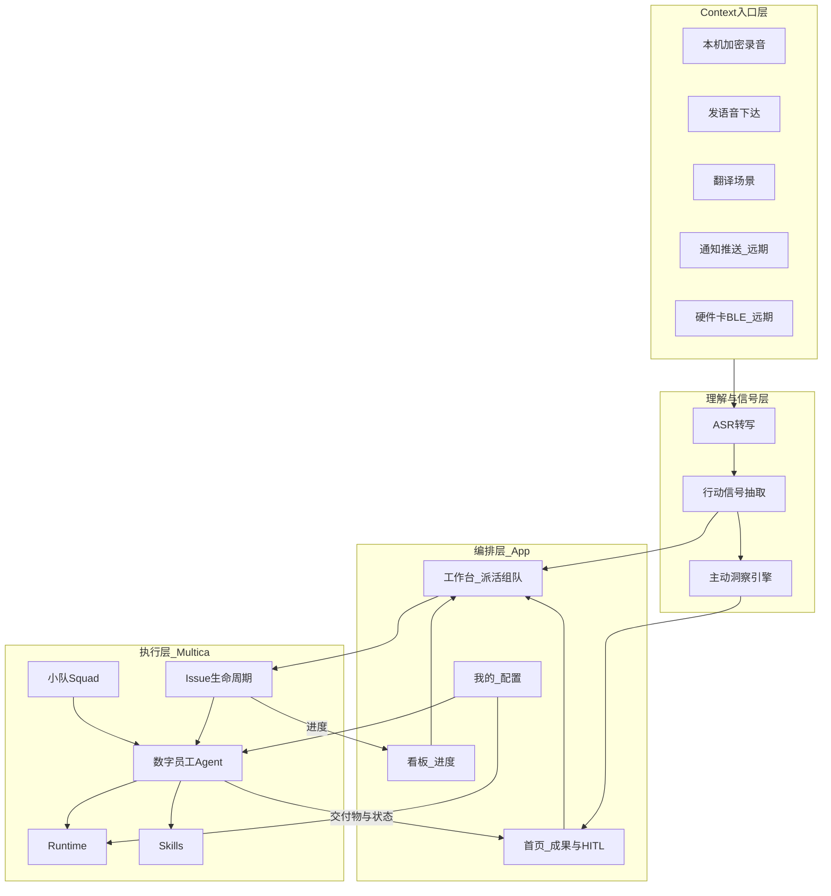

# utter-office 产品规划蓝图 v2

> 版本：v2.0 · 2026-08-21  
> 状态：**产品叙事与架构定稿**；App 代码暂不改；下一步先改原型对齐，再按 PRD 实装。  
> 配套文档：[`app-prd.md`](./app-prd.md)（v2）· [`app-prd-v1.8-archive.md`](./app-prd-v1.8-archive.md)（旧秘书叙事归档）· [`录音实现方案.md`](./录音实现方案.md) · 原型 [`assets/prototypes/00-index.html`](./assets/prototypes/00-index.html)

---

## 目录

1. [为什么要有 v2](#1-为什么要有-v2)
2. [外部资料洞察摘要](#2-外部资料洞察摘要)
3. [与本仓库现状的对照](#3-与本仓库现状的对照)
4. [产品定位与一句话](#4-产品定位与一句话)
5. [价值公式与用户角色](#5-价值公式与用户角色)
6. [系统架构蓝图](#6-系统架构蓝图)
7. [概念词典](#7-概念词典)
8. [信息架构](#8-信息架构)
9. [产品原则（硬条件）](#9-产品原则硬条件)
10. [能力地图与分期](#10-能力地图与分期)
11. [竞品/范式映射](#11-竞品范式映射)
12. [风险与决策](#12-风险与决策)
13. [下一步工作顺序](#13-下一步工作顺序)

---

## 1. 为什么要有 v2

### 1.1 旧叙事的问题（v1.x / 现网 App）

| 旧心智 | 症状 | 后果 |
|--------|------|------|
| 「AI 秘书」+ 聊天 | 工作台默认气泡会话、员工即频道 | 用户以为产品是陪聊，不是派活 |
| 首页「看」多于「拿」 | Hero/Pulse/资讯简报 | 打不开就能拿走结果 |
| 录音 = 录音笔 | 「录音卡」想象锁死 | 忽略 Context→行动信号 |
| 功能堆砌 | 易被下一波 Agent 框架拉平 | 护城河浅 |

### 1.2 v2 要回答的问题

1. 在 **OpenClaw 式 Agent 执行层** 已存在时，移动端 App 的不可替代价值是什么？  
2. 在 **C·ONE 式 Context 硬件** 叙事下，中央录音应扮演什么角色？  
3. 如何把 Multica（派活/生命周期/Runtime）与 StaffDeck（员工治理）合成 **小队作战台**，而不是再做一个 ChatGPT 壳？

### 1.3 结论（本蓝图立场）

> **utter-office = 人 + 数字员工小队的移动端 Context 作战台。**  
> Context 进 → Multica 驱动 Agent 推进 → 人只拿成果、看进度、做审批。  
> 聊天只是下达通道；录音只是 Context 入口之一。

---

## 2. 外部资料洞察摘要

依据：王自如 × 肖睿哲播客；小天fotos《因为这张卡片，我又开始用 OpenClaw 了》；StaffDeck / Multica / NBBOSS 公开定位。

### 2.1 时代结构：哑铃型

- 一端：算力/模型超级平台  
- 一端：超级个体 / 极小团队 × AI 杠杆  
- 中间：堆人力的「普通公司」被挤爆  

**对本产品：** 服务哑铃右端与小组织——用小队可见性替代「堆人头」。

### 2.2 价值公式重构

| 维度 | 旧逻辑 | 新逻辑 |
|------|--------|--------|
| 价值 | 时间 × 人力 | **判断力 × AI 杠杆率** |
| 经验 | 年限堆叠 | **提问质量 + 上下文密度** |
| 普通人 | 安全 | **最先被自动化吃掉的一层** |

人被降价的是 **执行**；升值的是 **判断 / 品味 / 闭环**。

### 2.3 Context 是养料，对话不是主入口

肖睿哲：AI Agent 的未来不是「对话」，而是 **上下文协同**——持续感知、后台整理与推进；人从操作工变成 **审批者**。

C·ONE 正名：**C = Context，不是录音卡**。能力三角：

1. 语音采集  
2. 通知/推送采集（远期）  
3. 把 Context 变成任务交给任意 Agent（开放 CLI / 生态）

小天判断硬件三问：**新场景？新入口？开放 CLI？**

### 2.4 「虾来了」的产品教训

OpenClaw 拉高天花板后，**堆具体 Feature 会被瞬间打穿**；给 Agent 的应是 **Context 能力管道**，不是越来越细的死功能。

### 2.5 上半场 / 下半场

- 上半场：技能门槛拉平（人人能用 AI）  
- 下半场：稀缺 = **独有上下文 + 判断力 + 执行闭环**  

「没有普通人」≈ **没有地方埋平庸**。

### 2.6 可产品化的场景清单

| 场景 | 产品含义 |
|------|----------|
| 跑步灵感一键进队 | 发语音/录音 → 待派发或自动派 |
| 会议纪要 → 行动信号 | 转写不是终点，事项候选才是 |
| AI 访谈引导思维 | 长 Context → 草案交付物待验收 |
| 通知流画像（出差带药等） | 洞察推送 + 远期 Push Context |
| 灯效回传 | App badge/推送；远期硬件 |

---

## 3. 与本仓库现状的对照

### 3.1 已有资产（应保留并放大）

| 资产 | 位置 | 蓝图中的角色 |
|------|------|----------------|
| Multica Issue / Agent / Squad / Runtime | `packages/core` + 移动端 data 层 | **执行与协作内核** |
| 加密录音采集 | `docs/录音实现方案.md` + `encrypted-recording` | **Context 入口技术底座** |
| StaffDeck 治理表达 | `staffdeck-analysis.md`、名册/档案原型 | **数字员工身份层** |
| 数字员工原型大改 | `docs/assets/prototypes/` | **IA 与交互真源（先于 App）** |
| HITL / A·B·C 数据分级 | 旧 PRD | **可信与决策纪律（保留）** |
| 行为语义 parity | `apps/mobile/CLAUDE.md` | **跨端一致铁律（保留）** |

### 3.2 缺口（文档已定、App 未跟）

| 缺口 | 原型状态 | App 状态 |
|------|----------|----------|
| 首页拿成果 + 洞察动作化 | ✅ 已改 | ❌ 仍偏旧决策台 |
| 看板进度首屏 | ✅ 已改 | ❌ 仍偏整盘 BI |
| 工作台编排台非聊天 | ✅ 已改 | ❌ 仍会话为主 |
| 我的=配置中心 | ✅ 已改 | ❌ 仍菜单堆叠 |
| Context→行动信号管道 | 文案有、能力 mock | ❌ 未接 |
| 通知/硬件 Context | 未做 | 明确远期 |

### 3.3 文档与代码的工作纪律（本次）

1. **先文档与原型**（本蓝图 + PRD v2）  
2. **再改原型**（用户将另开计划）  
3. **后改 App**（严格按 PRD + parity）  
4. **后端改动只登记不实施**（除非另开专项）

---

## 4. 产品定位与一句话

### 4.1 一句话

> **开口或按一下，上下文进小队；数字员工在 Runtime 上推进；你只拿成果、看进度、做审批。**

### 4.2 品类声明

| 我们是 | 我们不是 |
|--------|----------|
| 小队 Context 作战台 | ChatGPT / 陪聊秘书 |
| Multica 的移动端治理与 HITL 面 | 又一个录音笔 App |
| 开放执行（多 Runtime / 多模型管道） | 绑死单一「龙虾」品牌 |
| 人机环：审批与验收 | 全自动无人值守幻想 |

### 4.3 品牌隐喻（对内）

- **龙虾 / OpenClaw** = 「会动手的 Agent 执行层」的参照物 → 我们用 **Multica Agent + Runtime**  
- **C·ONE** = 「Context 物理入口」的参照物 → 我们用 **中央 ●录 + 远期硬件/通知**  
- **StaffDeck** = 「员工可治理」的参照物 → 我们用 **名册/档案/边界/Trace 表达**

---

## 5. 价值公式与用户角色

```text
价值 ≈ 判断力 × AI杠杆率 × 上下文密度
```

| 角色 | 核心诉求 | 主落点 Tab |
|------|----------|------------|
| 管理者 / 创始人 | 拿结果、看阻塞、验收 | 首页上半 + 看板 |
| 执行者 / 超级个体 | 碎片进队、少打字、补口径 | ●录 + 首页下半 + 工作台 |
| 配置者 | 员工、小队、技能、Runtime | 我的 |

混合首页（已确认 Q2=C）：**上半小队成果，下半待我处理直达**。

---

## 6. 系统架构蓝图



### 6.1 分层职责

| 层 | 回答 | 技术锚 |
|----|------|--------|
| Context 入口 | 如何低摩擦喂养 AI | 录音方案；●录 Sheet |
| 行动信号 | 如何从原材料变成可派事项 | 抽取/洞察（分期） |
| 编排与 HITL | 人如何派、看、验 | 四主 Tab |
| 执行 | Agent 如何跑完 | Multica |
| 资产 | 能力如何沉淀 | 技能/SOP/知识/Trace（先表达） |

### 6.2 关键数据流（目标态）

1. **灵感流：** 发语音 → 指令入队 → Agent claim/start → 成果上首页  
2. **会议流：** 录音 → ASR → 行动信号列表 → 用户确认派活 → 看板可见  
3. **阻塞流：** Agent blocked → 待我处理 → 补充 → 续跑  
4. **验收流：** review → 首页成果卡 → 通过/回退  

---

## 7. 概念词典

| 术语 | 定义 | 代码/API 锚 | UI 文案 |
|------|------|-------------|---------|
| Context | 可喂 Agent 的输入（语音、推送、知识碎片…） | 录音附件、未来 push | 上下文 |
| 行动信号 | 从 Context 抽出的可执行事项候选 | 待设计 / mock | 待派发候选 |
| 数字员工 | 有边界与负载的 Agent | `agent` | 数字员工 |
| 小队 | 人+员工协作单元 | `squad` | 小队 |
| 事项 | 可跟踪工作单元 | `issue` | 事项 |
| 运行 | 一次 Agent 执行 | `agent_task` | 运行/执行流 |
| 成果 Outcome | 可验收交付物 | 待结构化 | 成果/交付物 |
| Runtime | 执行环境 | `runtime` | 工位/Runtime |
| Skill | 可复用能力包 | `skills` | 技能 |
| SOP | 流程型方法（先表达后深做） | 占位 | SOP |
| Trace | 执行与反馈审计 | messages/timeline | Trace/交接 |
| HITL | 人在环审批 | blocked / in_review | 需我处理/验收 |

**废止默认对外概念：** 员工即 IM 频道；首页=行业资讯站；工作台=聊天 App。

---

## 8. 信息架构

底栏 **2+1+2** 不变：

| Tab | 职责一句话 | 禁止 |
|-----|------------|------|
| 首页 | **拿成果** | 纯浏览、大 Hero 派单墙 |
| 看板 | **看进度** | BI 曲线抢首屏 |
| ●录 | **Context 入口** | 做成录音笔主产品 |
| 工作台 | **安排活** | 默认全屏聊天 |
| 我的 | **配置驾驶舱** | 无配置语义的菜单堆 |

详细屏规见 [`app-prd.md`](./app-prd.md)。

---

## 9. 产品原则（硬条件）

1. **Context > Chat** — 默认界面是事项/进度/成果。  
2. **纪要不是终点** — 默认导向行动信号。  
3. **人是审批者** — AI 在干时，一跳内可看/停/改/验。  
4. **少堆死功能，稳管道** — Context→Issue→Outcome 优先于花哨单点功能。  
5. **开放执行** — 模型与 Runtime 可换；记忆与事项沉淀在工作区。  
6. **判断可练** — 洞察/方案多选项，强迫人拍板。  
7. **A/B/C 数据分级** — 决策数字不造假。  
8. **Parity** — 状态、权限、计数与 web/desktop 一致。  

---

## 10. 能力地图与分期

| 阶段 | 主题 | 交付物 | App 代码 |
|------|------|--------|----------|
| **D0** | 叙事定稿 | 本蓝图 + PRD v2 | 不动 |
| **D1** | 原型对齐 | 按 PRD 再修原型（另开计划） | 不动 |
| **M1** | 拿成果 + 看进度 | 首页/看板按 v2 实装 | 改 |
| **M2** | 编排台 | 工作台非聊天默认 | 改 |
| **M3** | Context→信号 | 录音/转写→事项候选 | 改+Stub |
| **M4** | 配置资产 | 名册/技能/Runtime 面板 | 改 |
| **M5** | 入口扩展 | 通知 Context / BLE 硬件 | 另开 PRD |

### 10.1 明确不做（近半年）

- 深度绑定单一 Agent 消费级品牌  
- StaffDeck 竞标 arena / 完整 OKF  
- 把 App 做成硬件电商或纯录音工具  
- 本期改 Multica 服务端（只登记）  

---

## 11. 竞品/范式映射

| 范式 | 我们吸收 | 我们差异 |
|------|----------|----------|
| OpenClaw | 后台干活、本地/自有执行、开放 | 组织小队 + HITL 作战台，不是个人 CLI 玩具 |
| C·ONE / YoooClaw | Context 入口、通知+语音、开放连接 | 默认组织事项与验收，不卖卡为中心 |
| Multica | Issue 生命周期、Skills、Runtime、人机同看板 | 移动端强化成果/HITL/Context 入口 |
| StaffDeck | 员工治理、岗位边界、Trace | 不移植竞标/OKF；先表达 |
| NBBOSS | 洞察→待办→风险→落地 | 落地到小队事项，而非老板硬件叙事独占 |

---

## 12. 风险与决策

| 风险 | 缓解 |
|------|------|
| App 与原型长期双轨 | D1 先锁原型；M1 起 PRD 为真源 |
| 「数字员工」被理解成人事系统 | 文案强调软件角色 + Runtime 工位 |
| Context 隐私反噬 | 录音加密；推送授权最小化；可关洞察 |
| 行动信号质量差 | 先人确认派活；自动派后置 |
| Feature 焦虑（虾来了） | 路线图锁定管道，抵制散点功能 |

### 已决策

| 项 | 结论 |
|----|------|
| 首页视角 | 混合：上成果下待办（Q2=C） |
| 工作台默认 | 编排台，非聊天 |
| 中央 ●录 | Context 入口；内部录音流程分期增强 |
| 后端 | 本期登记不改 |
| App 代码 | 待原型计划后再改 |

---

## 13. 下一步工作顺序

1. **审阅本蓝图 + PRD v2**（产品/研发对齐）  
2. **制定「原型再对齐」计划**（用户已预告）——按 PRD 查缺补漏，仍不动 App  
3. **M1 实装计划**——首页/看板先切叙事与主路径  
4. **M2+**——编排台、Context 管道、配置资产  

---

## 附录 A · 资料索引

- 小天fotos：C·ONE / OpenClaw 场景（灵感、会议行动信号、AI 访谈、CLI）  
- 王自如 × 肖睿哲：哑铃结构、上下文协同、三次迭代、记忆卡非录音卡、虾来了推倒重来  
- Multica：https://multica.ai/  
- StaffDeck：https://staffdeck.openbmb.cn/  
- 本仓库原型：`docs/assets/prototypes/00-index.html`  

## 附录 B · 文档关系

```text
product-blueprint-v2.md   ← 战略与架构（本文）
        ↓
app-prd.md (v2)           ← 屏级规格与验收
        ↓
assets/prototypes/        ← 交互真源（先改）
        ↓
apps/mobile/              ← 实装（后改）
app-prd-v1.8-archive.md   ← 旧秘书叙事与细规格存档
录音实现方案.md            ← Context 采集技术专册
```
