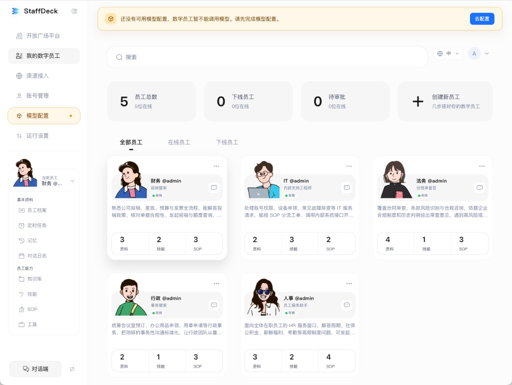
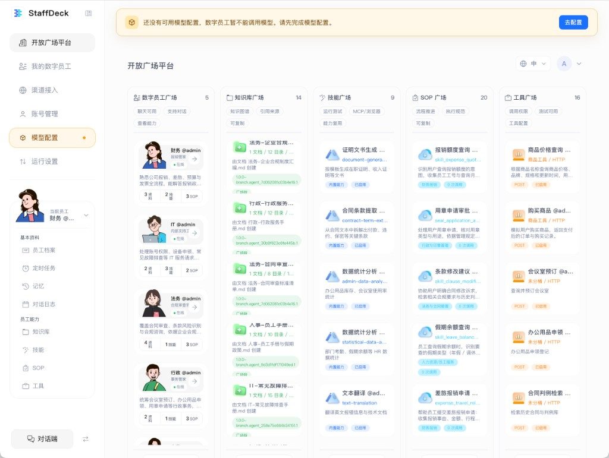
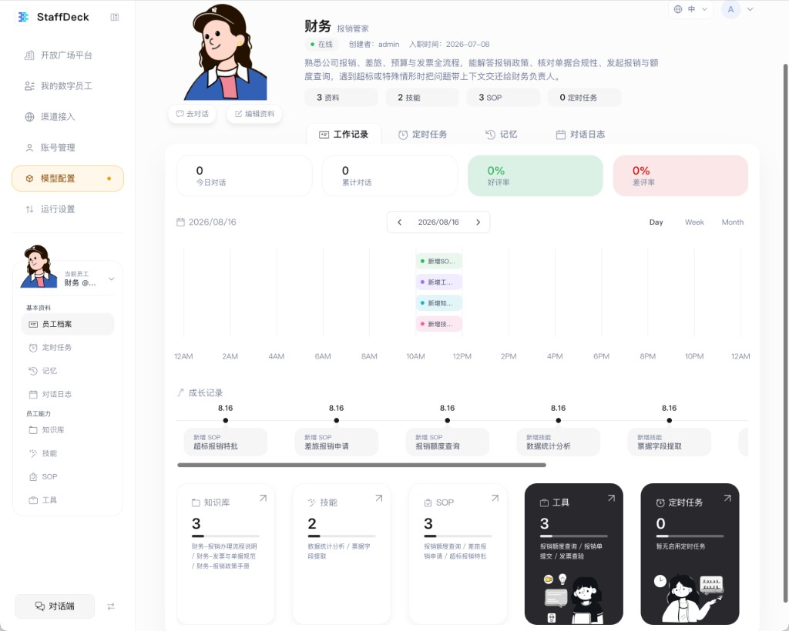
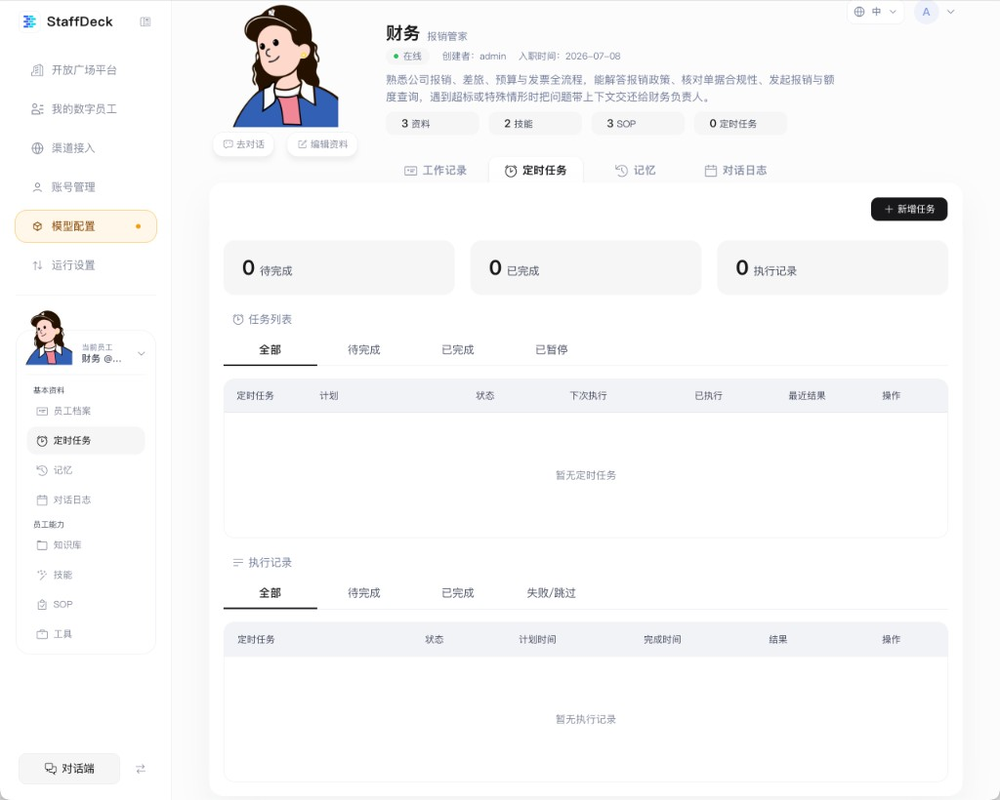
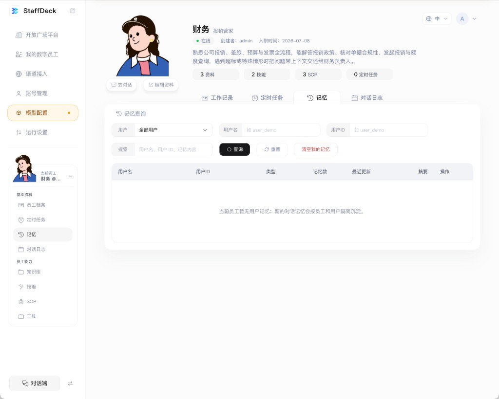
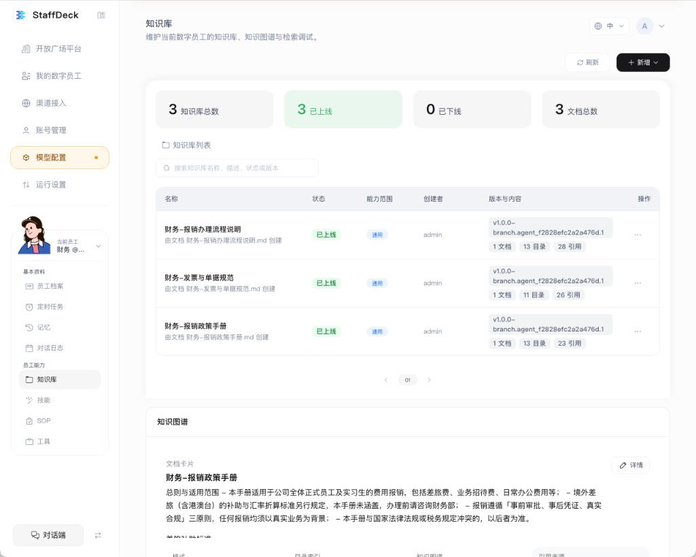
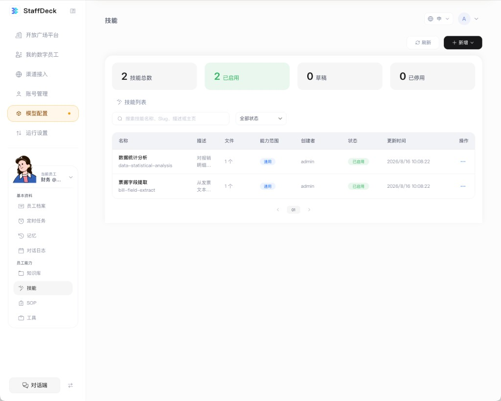
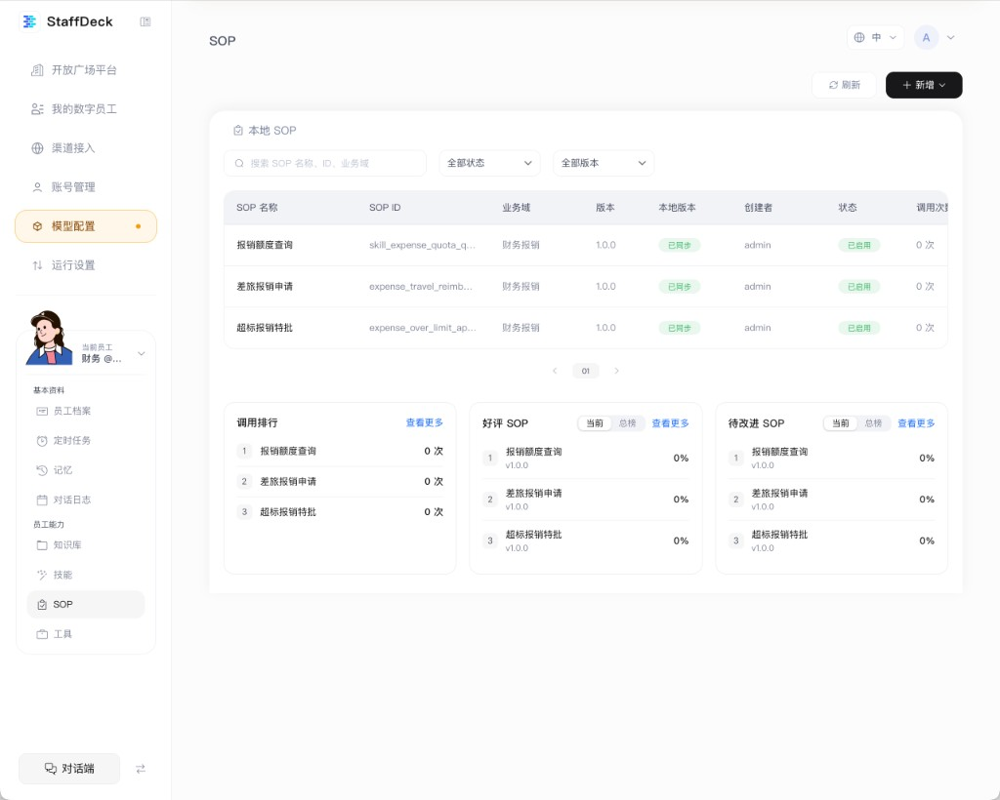
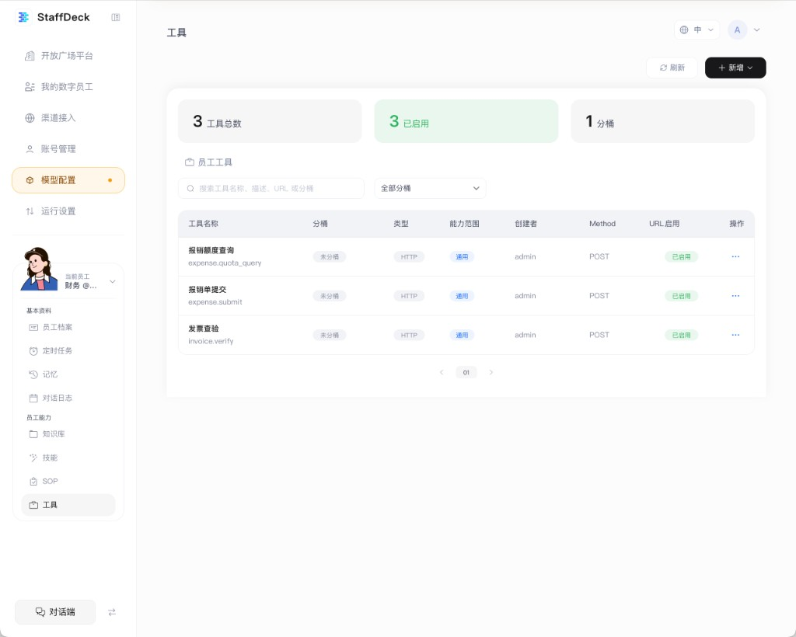
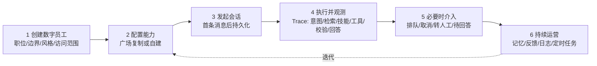

# StaffDeck 深度分析报告

> 版本：v1.1 · 2026-08-16
> 分析对象：StaffDeck（面壁智能 / OpenBMB；官方 README 宣布于 2026-07-15 开源；AGPL-3.0）
> 分析目的：为 utter-office 提取可借鉴的产品设计，输出到 [`docs/app-prd.md`](./app-prd.md)
> 材料来源：桌面端截图 9 张（`docs/assets/staffdeck/`）+ 官方仓库文档 + 官网

**分析基线**

| 对象 | 基线 | 能力状态说明 |
|---|---|---|
| StaffDeck `main` | `3a5703ccdaae7ae4b00b10b82e86a2a30ae0f75c`（提交时间 2026-08-15 20:20 UTC+8） | 本报告涉及的团队、竞标与黑板代码位于该基线 |
| 最新公开 Release | `v0.3.1-beta.5`（2026-08-10，`7c20259a5114d6fe530382f3b5de43f08ff723e2`） | 早于上述团队功能进入 `main`；不能把 `main` 能力等同于已发布桌面版能力 |
| 官网 | 2026-08-16 抓取的线上构建产物 | 文档正文嵌入压缩后的 JavaScript bundle，不在 `main/docs` 目录中 |
| 桌面端截图 | 用户于 2026-08-16 提供的本地实例；具体 commit 未知 | 只能证明该实例在截图时的界面与样例数据，不能代表所有部署 |

**证据标签**

- `[官方主张]`：README 或官网文档明确表述；
- `[截图]`：9 张本地实例截图可直接观察；
- `[实现-main]`：上述 `main` commit 的代码或 schema 可验证；
- `[设计记录]`：官方设计文档中的方案或自述状态，不等于已发布能力；
- `[分析]`：本文作者的比较、评价或产品建议。

**信息来源与可信度**

| 来源 | 用途 | 可信度 |
|---|---|---|
| 桌面端实机截图 ×9 | 信息架构、每屏结构、字段、状态 | 高（仅限该实例与截图时点） |
| [README.zh.md](https://raw.githubusercontent.com/OpenBMB/StaffDeck/main/README.zh.md) | 核心主张、六步流程、渠道接入、路线图、风险声明 | 高（官方） |
| [docs/open-api-v1.md](https://raw.githubusercontent.com/OpenBMB/StaffDeck/main/docs/open-api-v1.md) | 对外 API、鉴权与协议边界；不是完整数据库模型 | 高（官方） |
| [design-multi-agent-team-decisions.md](https://raw.githubusercontent.com/OpenBMB/StaffDeck/main/design-multi-agent-team-decisions.md) | 多 Agent 团队、竞标、黑板、HITL | 高（官方设计记录 v1.1；需与当前实现和 Release 分开看） |
| [design-qa.md](https://raw.githubusercontent.com/OpenBMB/StaffDeck/main/design-qa.md) | 路由命名、OKF 术语佐证 | 中（QA 报告） |
| [官网文档站](https://staffdeck.openbmb.cn/#/docs/introduce?lang=zh) | 定位、三层可靠性、核心能力、运营闭环及三个案例 | 高（官方线上构建内容） |
| `backend/app/db/models.py` 及相关 schema/service | 实体关系、状态转换、能力范围与运行时行为 | 高（`main` 实现） |
| [GitHub 仓库](https://github.com/OpenBMB/StaffDeck) | 项目结构、许可证 | 高 |

> 官网 `#/docs/*` 是 hash 路由单页应用，但正文可从线上构建 bundle 中提取。本版已交叉核验项目简介、核心能力、选择理由、数字员工、SOP、知识本体、自动任务与 Trace，以及经验继承、重复问答分担、主动工作三个案例。公开仓库未提供这些页面的可编辑 Markdown/组件源码。

---

## 目录

- [1. 定位与核心主张](#1-定位与核心主张)
- [2. 信息架构（逐屏还原）](#2-信息架构逐屏还原)
- [3. 核心实体模型](#3-核心实体模型)
- [4. 逐屏详解](#4-逐屏详解)
- [5. 核心工作流](#5-核心工作流)
- [6. 多 Agent 团队：最独特的设计](#6-多-agent-团队最独特的设计)
- [7. 开放 API 与集成能力](#7-开放-api-与集成能力)
- [8. 设计语言观察](#8-设计语言观察)
- [9. 批判性评估](#9-批判性评估)
- [10. 与 utter-office 的能力对照](#10-与-utter-office-的能力对照)
- [11. 可借鉴清单（分级）](#11-可借鉴清单分级)

---

## 1. 定位与核心主张

### 1.1 一句话

> StaffDeck 是**企业数字员工的构建与治理平台**：把专业员工的经验、流程、判断标准固化成有岗位、有工号、有能力档案、有工作记录的「数字员工」，让个人能力变成**可复用、可迭代、可追溯的组织资产**。

`[官方主张]` StaffDeck 由面壁智能、东北大学-面壁智能数据智能联合实验室、清华 THUNLP、OpenBMB 与 AI9Stars 联合研发。许可证为 AGPL-3.0。截至 2026-08-16 核验时，GitHub API 为 **1,569 stars / 273 forks**；该数字是动态快照，不是固定产品指标。

### 1.2 四大支柱（官方口径）

| 支柱 | 内容 | 技术形态 |
|---|---|---|
| 🧑‍💼 **数字员工构建与管理** | 岗位、工号、能力档案、工作记录；能力成长、权限隔离、发布复用 | `agent_profiles` + 能力挂载 |
| 🧩 **状态机驱动的流程型技能** | 自然语言生成结构化 SOP，状态机保证复杂流程准确执行；多流程实时切换、上下文保留、可视化编辑、版本管理、分支演化 | SOP 状态机 + 版本/diff/rollback |
| 📚 **文档结构感知的知识检索** | 按文档/章节/页面/摘要建可导航索引，先判断信息在哪、再逐层定位原文；知识分桶、定向检索、来源引用、检索调试 | OKF 分层索引 |
| 🔌 **自主执行与持续迭代** | HTTP API / MCP / 定时任务执行真实业务；长期记忆、完整 Trace、真人接管、用户反馈、反馈分析形成闭环 | Harness v2 + Runner |

### 1.3 官网的三层可靠性与六大模块

`[官方主张]` 官网不是用“四大支柱”解释可靠性，而是补充了一套三层模型；两套口径互补：

| 可靠性 | 要解决的问题 | 官方做法 |
|---|---|---|
| **流程可靠** | 流程不可控 | SOP 状态机保存上下文，被打断后回到原节点继续 |
| **知识可靠** | 知识不可溯 | 回答关联来源、规则与业务主题，能够说明依据 |
| **迭代可靠** | 能力不可积累 | Trace、用户反馈与人工兜底进入下一轮修订 |

官网同时把日常能力概括为六个模块：**技能、知识、工具、定时任务、可观测、记忆**。SOP 状态机、数字员工档案与 OKF 知识本体则被称为三项核心创新。本文后续的“能力四件套”只指员工侧栏里的四类配置资源，不代表 StaffDeck 的全部能力。

### 1.4 为什么选择 StaffDeck（官方问题定义）

`[官方主张]` 官网把产品机会归纳为三个组织问题：

1. **AI 能力留在个人，而没有留在组织**：提示词、流程与判断散落在个人电脑和文档中，人员流动后能力归零；
2. **Agent 上线后不再进化**：对话、反馈与边界案例没有回流到配置迭代；
3. **专业员工被重复问题拖住**：标准咨询量大，真正需要判断力的工作反而被挤压。

StaffDeck 对应提出“从工具到员工、从静态配置到持续运营、从个人经验到组织资产”。这套问题定义比单纯列功能更能解释数字员工、Trace、成长记录和广场为什么必须同时存在。

### 1.5 关键定位差异（对 utter-office 最重要的一条）

| 维度 | StaffDeck | utter-office / Multica |
|---|---|---|
| 工作对象 | **业务流程**（报销、合同审查、IT 工单、招聘） | **软件工程事项**（issue → PR） |
| 员工产出 | 对话回答、流程执行、定时任务、Run 产物 | 一次代码运行 / 一个 PR |
| 执行环境 | StaffDeck 服务管理的 Harness 运行时；可通过桌面端或源码部署在本机/自有服务器 | **用户自己的机器**（daemon + 多种 agent CLI/runtime） |
| 组织单元 | 员工 + 能力（知识/技能/SOP/工具） | 事项 + 项目 + 战队 |
| 记账单位 | 对话数、好评率 | task run、token、失败率 |
| 交付形态 | Web + 桌面端（单端口 FastAPI） | Web + 桌面 + **移动端** |
| 典型用户 | 希望把 AI 从个人工具升级为组织生产力的企业与机构；截图员工只是职能场景样例 | 工程团队 / 独立开发者 |

**这条差异决定了借鉴的边界**：StaffDeck 的**治理层设计**（身份、档案、能力可视化、工作记录、HITL）高度可借鉴；它的**执行层**（SOP 状态机、OKF 知识检索）与 utter-office 的领域不匹配，强行移植会造出用不上的空壳。

---

## 2. 信息架构（逐屏还原）

### 2.1 双层导航：平台级 + 当前员工级

这是 StaffDeck 最值得研究的 IA 决策。左侧栏被切成两段：

```
┌─ 侧边栏 ────────────────────┐
│  StaffDeck                  │
│                             │
│  【平台级】                  │
│  ⊞ 开放广场平台              │
│  ⊟ 我的数字员工              │
│  ⊕ 渠道接入                  │
│  ⊙ 账号管理                  │
│  ⊛ 模型配置          ●       │  ← 橙点 = 需处理
│  ⇅ 运行设置                  │
│                             │
│  ┌───────────────────────┐  │
│  │ 👤 当前员工            │  │  ← 上下文切换器
│  │    财务 @...        ▾  │  │
│  └───────────────────────┘  │
│                             │
│  【当前员工级 · 基本资料】    │
│  ▤ 员工档案                  │
│  ⏱ 定时任务                  │
│  ↺ 记忆                      │
│  ▦ 对话日志                  │
│                             │
│  【当前员工级 · 员工能力】    │
│  ▢ 知识库                    │
│  ⚡ 技能                      │
│  ⊡ SOP                       │
│  ⛭ 工具                      │
│                             │
│  ┌───────────────────────┐  │
│  │  💬 对话端         ⇄   │  │  ← 切换到对话形态
│  └───────────────────────┘  │
└─────────────────────────────┘
```

**核心机制**：切换「当前员工」后，下方 8 个菜单项（基本资料 4 + 员工能力 4）的内容**整体跟着切换**。也就是说，**员工是工作区的上下文**，不是列表里的一条记录。

这与 IDE 的「当前项目」、Figma 的「当前文件」是同一种 IA 模式，把「管理 N 个员工」降维成「管理当前这一个员工」，认知负担大幅下降。

### 2.2 模型配置告警

`[截图]` 仅截图 **01「我的数字员工」与 02「开放广场」**顶部出现橙色告警；03–09 没有顶部告警，但侧边栏「模型配置」仍带橙色提示点：

> ⚠️ 还没有可用模型配置，数字员工暂不能调用模型。请先完成模型配置。　　**[去配置]**

在出现告警条的页面中，它与侧边栏提示点构成双重提示，并带一键跳转。告警只说明**数字员工暂不能调用模型**，不能推导为整个管理端不可用；截图证明知识库、SOP、工具等配置与浏览页仍可访问。

### 2.3 页面清单

| 层级 | 页面 | 截图 | 说明 |
|---|---|---|---|
| 平台 | 开放广场平台 | [02](./assets/staffdeck/02-gallery.png) | 五类资源的共享市场 |
| 平台 | 我的数字员工 | [01](./assets/staffdeck/01-my-agents.png) | 员工列表 + 统计 + 创建 |
| 平台 | 渠道接入 | — | 微信 / 企业微信绑定 |
| 平台 | 账号管理 | — | 用户与角色 |
| 平台 | 模型配置 | — | OpenAI 兼容 / Anthropic / Gemini 多协议 |
| 平台 | 运行设置 | — | 运行时参数 |
| 员工 | 员工档案 | [03](./assets/staffdeck/03-profile-worklog.png) | 4 Tab：工作记录 / 定时任务 / 记忆 / 对话日志 |
| 员工 | 定时任务 | [04](./assets/staffdeck/04-profile-scheduled-tasks.png) | 任务列表 + 执行记录 |
| 员工 | 记忆 | [05](./assets/staffdeck/05-profile-memory.png) | 按用户隔离的长期记忆 |
| 员工 | 对话日志 | — | 会话历史 |
| 员工 | 知识库 | [06](./assets/staffdeck/06-knowledge.png) | 知识库列表 + 知识图谱 + 检索调试 |
| 员工 | 技能 | [07](./assets/staffdeck/07-skills.png) | 通用技能（代码/脚本） |
| 员工 | SOP | [08](./assets/staffdeck/08-sop.png) | 流程型技能 + 质量榜 |
| 员工 | 工具 | [09](./assets/staffdeck/09-tools.png) | HTTP / MCP 工具 |
| 独立 | 对话端 | — | `/chat/gallery`，与管理端分离的聊天形态 |

**注意「对话端」是独立形态**：侧边栏底部有一个显眼的「对话端 ⇄」按钮，说明 StaffDeck 把「管理员工」和「使用员工」当成两种模式，而不是同一屏的两个 Tab。

---

## 3. 核心实体模型

### 3.1 实体关系

```
租户 Tenant
 ├── 账号 User（admin / member）
 ├── 模型配置 ModelConfig（租户级）
 └── 数字员工 AgentProfile  ★核心
      ├── 基本资料：名称、描述、创建者、状态、metadata
      ├── 模型绑定 AgentModelBinding（兼容接口）
      │    └── 当前 main 的 Harness 运行时仍选择租户默认模型
      ├── 能力绑定 AgentResourceBinding
      │    ├── 知识库 KnowledgeBase → 多个文档 → 分桶/概念/引用
      │    ├── 技能 GeneralSkill（slug + 文件，可测试、可发布）
      │    ├── SOP（状态机，版本化，可 diff / rollback）
      │    └── 工具 Tool（HTTP / MCP，可测试）
      ├── 定时任务 ScheduledTask → 执行记录 Run
      ├── 记忆 Memory（tenant × user × agent 逻辑分区）
      ├── 会话 Session → Run → Trace（意图/检索/技能/工具/校验/回答）
      └── API Key（员工级运行密钥）

开放广场 Gallery（五类：员工 / 知识库 / 技能 / SOP / 工具）
 ├── 员工：加入使用或复制为独立员工
 └── 其他资源：README 明确可从广场复制/配置，不改广场原件

团队 Team（多 Agent，`main` 已实现、分析时尚未进入最新 Release）
 ├── 成员 TeamMember（role: leader / member）
 ├── 任务 TeamTask（状态机）
 │    └── 竞标 TeamTaskBid（round / statement|rebuttal / score）
 ├── 黑板 BlackboardEntry
 └── 唤醒事件 WakeEvent
```

### 3.2 数字员工（Agent）

档案页可见字段：**名称**（财务）、**岗位**（报销管家）、**在线状态**、**创建者**（admin）、**入职时间**（2026-07-08）、**职责描述**（一段自然语言，界定能力边界与升级路径）。

`[证据边界]` README 宣称数字员工具有“工号”，但本次档案截图没有展示工号，`main` 的 `AgentProfile` schema 也没有独立 `employee_no` 字段；岗位、入职时间等展示值可能来自 metadata、创建时间或 UI 派生。因此不能把“结构化工号字段”写成已实现事实。

职责描述的写法值得注意，它同时写了**能做什么**和**什么时候交给人**：

> 熟悉公司报销、差旅、预算与发票全流程，能解答报销政策、核对单据合规性、发起报销与额度查询，**遇到超标或特殊情形时把问题带上下文交还给财务负责人**。

这是「受治理的软件角色」的具体写法——把升级条件写进岗位描述本身。

### 3.3 四类配置资源（不是完整能力清单）

| 能力 | 粒度 | 关键字段 | 生命周期 |
|---|---|---|---|
| **知识库** | 一个知识库可包含多个文档；截图样例恰好都是 1 个文档 | 名称、状态（已上线/已下线）、能力范围（通用）、创建者、版本（`v1.0.0-branch.agent_xxx.1`）、文档/目录/引用计数 | 上线 / 下线 |
| **技能** | slug 化的代码单元 | 名称、slug（`data-statistical-analysis`）、描述、文件数、能力范围、状态（已启用/草稿/已停用）、更新时间 | 草稿 → 启用 → 停用 |
| **SOP** | 业务流程状态机 | 名称、SOP ID（`skill_expense_quota_q...`）、业务域（财务报销）、版本（1.0.0）、本地版本（已同步）、状态、**调用次数** | 草稿 → 发布 → 版本演进 / 回滚 |
| **工具** | 一个工具定义；截图样例为 HTTP，平台也支持 MCP | 名称、标识（`expense.quota_query`）、分桶、类型（HTTP）、能力范围、Method（POST）、URL 启用状态 | 启用 / 停用 |

`[实现-main]` 「能力范围」当前为 `general | sop_specific`，控制能力在一般运行时还是特定 SOP 中暴露/引用；它不是用户授权、租户隔离或访问控制机制。

`[截图 + 实现-main]` 版本号格式 `v1.0.0-branch.agent_f2828efc2a2a476d.1` 与 `AgentKnowledgeBranch`、同步、提升、回滚实现共同证明：知识库支持按员工分支独立演进。该结论不只来自版本号外观。

### 3.4 记忆

按 **员工 × 用户** 双维度隔离。查询界面提供：用户下拉、用户名、用户 ID、全文搜索、以及一个红色的「清空我的记忆」。

空态文案写得很清楚：

> 当前员工暂无用户记忆；新的对话记忆会按员工和用户隔离沉淀。

`[实现-main]` 记忆查询与写入按 `tenant_id + user_id + agent_id` 做逻辑分区，旨在降低跨员工、跨用户混用风险。这里不能承诺“绝不会泄漏”：管理员或员工创建者具有治理可见性，应用层过滤也不等于完成了全面安全证明。

### 3.5 执行内核

`AgentLoop / Harness v2` 统一驱动三种入口：对话端、定时任务、开放 API。Run 状态机：

```
queued → running → awaiting_input → succeeded / failed / cancelled
```

Trace 公开事件包含：意图 → TaskFrame → 能力选择 → 工具结果 → 引用 → 回复阶段。**明确不输出模型原始 COT**，只给可审计的结构化事件。

---

## 4. 逐屏详解

### 4.1 我的数字员工



**统计卡（4 格）**：`5 员工总数（5位在线）` / `0 下线员工` / `0 待审批` / `+ 创建新员工（几步搭好你的数字员工）`

第 4 格把「创建」做成和统计卡同形的入口，而不是右上角的小加号——降低了「创建员工」这个核心动作的发现成本。

**Tab**：全部员工 / 在线员工 / 下线员工

**员工卡片（3 列网格）**，每张卡：

```
┌──────────────────────────────────┐
│ 👤  财务 @admin              ⋯   │
│     报销管家                 💬  │
│     ● 在线                       │
│ ──────────────────────────────── │
│ 熟悉公司报销、差旅、预算与发票全   │
│ 流程，能解答报销政策、核对单据合   │
│ 规性、发起报销与额度查询…（截断）  │
│ ──────────────────────────────── │
│    3        2        3           │
│   资料     技能     SOP          │
└──────────────────────────────────┘
```

**截图实例中的五个样例员工**覆盖企业通用职能：财务（报销管家）、IT（内部支持工程师）、法务（合规审查官）、行政（事务管家）、人事（员工服务助手）。截图不能证明它们是所有安装都会自带的“预置员工”。

> **最值得抄的一处**：底部那条 `3 资料 / 2 技能 / 3 SOP` 的**能力计数条**。它用三个数字回答了「这个员工到底有多能干」，成本极低（三个 count），但让抽象的 agent 立刻有了可比较的能力密度。空员工一眼看出是 `0 / 0 / 0`。

### 4.2 开放广场平台



**五列并置**，每列一类资源，列头带数量与能力标签：

| 列 | 数量 | 能力标签 |
|---|---|---|
| 数字员工广场 | 5 | 聊天可用 · 支持对话 · 查看能力 |
| 知识库广场 | 14 | 知识图谱 · 引用来源 · 可复制 |
| 技能广场 | 9 | 运行测试 · MCP/浏览器 · 能力复用 |
| SOP 广场 | 20 | 流程推进 · 执行规范 · 可复制 |
| 工具广场 | 16 | 调用权限 · 测试可用 · 工具配置 |

资源卡片带来源行与版本号；截图可见的状态标签包括知识库的 `广场级`、技能的 `内置能力` / `已启用`、SOP 的 `0 次调用`。部分文件名在截图中被截断，不应补写成完整文件名。

**广场语义**（README + API 双重确认）：广场资源是**只读模板**。普通用户可以「复制」或「绑定」到自己的员工，原件受创建者与管理员权限保护。API 上体现为 `POST /gallery/agents/{id}:add`（加入可用列表，不复制资源）与 `POST /agents {source_mode:"copy", copy_from_agent_id}`（创建可独立修改的副本）两条不同路径。

### 4.3 员工档案 · 工作记录



**页头**：大头像 + 名称 + 岗位 + 在线态 + 创建者 + 入职时间 + 职责描述 + 能力计数 chip 行（`3 资料 / 2 技能 / 3 SOP / 0 定时任务`）+ 两个动作按钮（`去对话` / `编辑资料`）。

**4 Tab**：工作记录 / 定时任务 / 记忆 / 对话日志

**工作记录内容**：

1. **4 个 KPI 卡**：`0 今日对话` / `0 累计对话` / `0% 好评率`（绿底）/ `0% 差评率`（红底）
2. **日历导航 + Day/Week/Month 切换**：`< 2026/08/16 >`
3. **24 小时时间轴图**：12AM–12AM，事件以彩色 pill 落在对应时段（`新增SO...` / `新增工...` / `新增知...` / `新增技...`）
4. **成长记录**（横向时间线）：`8.16 新增SOP 超标报销特批` → `8.16 新增SOP 差旅报销申请` → `8.16 新增SOP 报销额度查询` → `8.16 新增技能 数据统计分析` → `8.16 新增技能 票据字段提取`
5. **底部 5 张能力卡**：知识库 3 / 技能 2 / SOP 3 / 工具 3（深色卡）/ 定时任务 0（深色卡），每张列出具体条目名，右上角有跳转箭头

> **第二处值得抄的设计**：「成长记录」把员工的**能力变更事件**做成时间线。这解决了数字员工最大的感知问题——它不像人一样会「进步」，你根本不知道它比上周强在哪。把「今天新增了 2 个技能、3 个 SOP」可视化出来，员工就有了成长感。
>
> 而 `好评率 / 差评率` 这对指标比「运行时长 / Token」更贴近**绩效**语义——前者回答「干得好不好」，后者只回答「干了多少」。

### 4.4 员工档案 · 定时任务



- 3 个统计卡：`0 待完成` / `0 已完成` / `0 执行记录`
- `+ 新增任务`
- **任务列表**（Tab：全部 / 待完成 / 已完成 / 已暂停）— 表头：定时任务、计划、状态、下次执行、已执行、最近结果、操作
- **执行记录**（Tab：全部 / 待完成 / 已完成 / 失败跳过）— 表头：定时任务、状态、计划时间、完成时间、结果、操作

「任务定义」和「执行历史」拆成两张表是对的——一个 cron 定义对应 N 次执行，混在一起会看不清。

API 侧支持 `:run`（手动触发）、`:pause`、`:resume`、`:archive`，并复用与对话相同的 Harness v2 内核。README 风险声明里特别提到：**定时任务依赖持续运行的 Worker 与正确的用户时区设置**。

### 4.5 员工档案 · 记忆



查询条件：用户下拉（全部用户）、用户名、用户 ID、关键词搜索。动作：`查询` / `重置` / `清空我的记忆`（红色）。

结果表：用户名、用户 ID、类型、记忆数、最近更新、摘要、操作。

### 4.6 知识库



页面副标题直接说明职责：**「维护当前数字员工的知识库、知识图谱与检索调试。」**

- 4 统计卡：`3 知识库总数` / `3 已上线`（绿）/ `0 已下线` / `3 文档总数`
- **知识库列表**：名称（+ `由文档 xxx.md 创建` 的来源行）、状态、能力范围、创建者、版本与内容（`v1.0.0-branch.agent_xxx.1` + `1文档 13目录 28引用`）、操作
- **知识图谱**：文档卡片展开显示结构化摘要正文，带 `详情` 按钮
- 下方还有检索调试区（格式 / 目录索引 / 知识图谱 / 引用来源）

`1文档 13目录 28引用` 这组数字是 OKF 分层索引的直接体现：一个文档被解析成 13 个可导航目录节点、28 个可引用片段。检索时先定位目录、再定位原文。

### 4.7 技能



4 统计卡：`2 技能总数` / `2 已启用` / `0 草稿` / `0 已停用`。

列表列：名称（+ slug）、描述、文件、能力范围、创建者、状态、更新时间、操作。

技能是**代码单元**（有文件、有 slug、可 `:test` 可 `:publish`），区别于 SOP 的**流程单元**。

### 4.8 SOP



- **本地 SOP 表**：SOP 名称、SOP ID、业务域、版本、本地版本（`已同步`）、创建者、状态、**调用次数**
- 三个筛选：全部状态 / 全部版本 / 搜索
- **底部三块质量榜**：
  - **调用排行**（1 报销额度查询 0次 / 2 差旅报销申请 0次 / 3 超标报销特批 0次）
  - **好评 SOP**（Tab：当前 / 总榜，带版本号与百分比）
  - **待改进 SOP**（同上）

> **第三处值得抄的设计**：把 SOP 的**调用量与口碑做成榜单**。它把「哪些流程真在被用、哪些流程用户不满意」直接摆在配置页上，形成「配置 → 使用 → 反馈 → 改进」的闭环入口。多数 agent 平台配置完就撒手，不告诉你哪条配置是死的。

`[截图 + 官方 API]` 「本地版本 / 已同步」说明本地 SOP 与来源版本存在同步关系；结合 `versions` / `diff` / `rollback` API，可确认版本比较和回滚能力。截图本身不足以证明所有资源都采用完全相同的同步规则。

### 4.9 工具



3 统计卡：`3 工具总数` / `3 已启用` / `1 分桶`。

列表列：工具名称（+ 标识 `expense.quota_query`）、分桶、类型（HTTP）、能力范围、创建者、Method（POST）、URL 启用、操作。

`[实现-main]` 「分桶」是管理、筛选与检索维度，不是工具调用权限机制。员工能否调用工具主要由资源绑定、允许技能和能力范围决定。API 侧工具与 MCP 并列，读取响应会掩码认证头、环境变量和连接凭证。

---

## 5. 核心工作流

### 5.1 官方六步



关键点：第 5 步「介入」是**一等公民**，不是异常处理。第 6 步的产出直接回流到第 2 步，构成能力迭代闭环。

### 5.2 渠道接入（微信 / 企业微信）

渠道内核是**渠道无关**的适配器注册表，新渠道只需加适配器。能力包括：

- 一个渠道账号挂载多个员工，用 `/员工`、`/切换 <名字>`、`/当前`、`/帮助` 指令调度
- **意图自动分发**：LLM 对每条消息分类，路由到最匹配的员工；SOP 进行中提高切换阈值；人工接管与手动切换后保持粘性
- **身份合并**：渠道用户用 `/绑定 <一次性码>` 把渠道身份并入既有账号（记忆与会话统一），`/解绑` 可逆
- 可靠性：入站幂等去重、崩溃恢复、出站退避重试、token 失效告警、微信会话自愈

「SOP 进行中提高切换阈值」这个细节很讲究——流程执行到一半不该被一句闲聊带走。

### 5.3 自动任务、Trace 与人工兜底闭环

`[官方主张 + 实现-main]` [自动任务与 Trace](https://staffdeck.openbmb.cn/#/docs/ops?lang=zh) 把“主动工作”和“持续运营”组织成一条链，而不是两个孤立功能：

```text
计划触发 / 自然语言创建任务
  → Agent 执行 SOP、知识检索和工具调用
  → Trace 记录路由、步骤、工具、知识、反思与回复
  → 归因到知识缺口 / 流程分支 / 工具失败 / 模型回复
  → 人工兜底或修订 SOP / 知识
  → 下一次执行改进
```

自动任务支持每日、每周、每月和一次性调度；官网还明确描述了在对话中通过自然语言创建任务，例如“每天早上九点把昨天的销售数据发给我”。超出规则边界时，数字员工把完整上下文交给创建者，而不是强行生成答案。

### 5.4 官网三个案例的共同方法

官网提供的不是成功率或 ROI 实证，而是三套**官方场景设计**。它们共同使用“知识承载事实、SOP 固化稳定步骤、工具连接外部系统、Trace 负责复盘、人工处理边界”的组合。

#### 案例 A · 经验继承：合规审查

来源：[经验继承](https://staffdeck.openbmb.cn/#/docs/handover?lang=zh)

- 背景：八年经验的合规审查员离职，难以交接的是判断标准、处理顺序和升级边界，而不是文件本身；
- 组合：5 个资料域 + 2 项通用技能 + 4 条审查 SOP + 2 个业务工具；
- 分工：稳定判断步骤进入 SOP；会变化的监管口径和判例进入知识库；外部事实交给合同判例检索与台账工具；
- 兜底：规则冲突、无先例或责任明显扩大时，携带合同片段、检索依据和未决问题交给法务负责人；
- 价值判断：衡量重点不是上传文档数，而是步骤是否稳定、结论能否溯源、转人工上下文是否完整、边界案例能否回流。

#### 案例 B · 重复问答分担：教务咨询

来源：[重复问答分担](https://staffdeck.openbmb.cn/#/docs/qa?lang=zh)

> 路由名 `qa` 在官网指 **High-volume Q&A / 重复问答分担**，不是“质量保证”或“服务质检”页面。

- 背景：教务主任反复回答学籍、奖学金、转专业等政策问题；
- 组合：5 个知识库 + 7 份制度文档 + 4 条服务 SOP + 1 个人工转交工具；
- 方法：先识别问题类型，再进入对应知识域；信息不足时追问年级、专业、批次等条件；
- 兜底：制度未覆盖或触发例外条款时，生成包含背景、引用依据与待判断点的教务工单；
- 价值判断：重点是标准咨询闭环率、资料域命中准确性、引用完整性与高频未解决问题的回流。

#### 案例 C · 主动工作：项目运营

来源：[主动工作](https://staffdeck.openbmb.cn/#/docs/proactive?lang=zh)

- 背景：项目办公室需要定期汇总进度、风险和待办，过去依赖专人记得催办和发周报；
- 组合：5 个资料域 + 4 条执行 SOP + 2 个项目工具 + 2 个自动任务；
- 调度：工作日 9:30 风险巡检；每周五 16:00 汇总周报；
- 执行：读取台账 → 校验必填字段 → 按统一规则识别风险 → 生成管理层可决策摘要 → 推送并留 Trace；
- 失败原则：查询接口失败时不使用旧数据生成“看似正常”的周报，而是记录失败节点、参数与重试结果并通知管理员；
- 价值判断：不只看是否设置定时器，还看任务是否按时启动、缺失数据是否先被识别、风险是否按统一口径升级、失败后能否定位和重跑。

`[分析]` 三个案例给 utter-office 的直接启示不是复制财务/教务 SOP，而是复用这条边界清晰的拆分原则：

```text
稳定执行方法 → agent instructions / skill
会变化的项目事实 → repository / project context
外部动作 → MCP / runtime tool
运行证据 → task run / timeline
不确定与高风险事项 → 人工审阅 / 升级
```

---

## 6. 多 Agent 团队：最独特的设计

来源：`design-multi-agent-team-decisions.md` v1.1（2026-08-11）与 `main` 的 `backend/app/teams/`。`[设计记录]` 文档自述“已锁定、增量 1–4 已实现并真机验收”；`[实现-main]` 代码确有 Teams API、竞标、黑板与会话实现，但这些提交晚于核验时最新 Release `v0.3.1-beta.5`，因此属于 **main-only**，不能表述为已发布桌面版能力，也不等于第三方生产验证。

### 6.1 贯穿原则：HITL

> 人在每个关键环节保留介入点：**下发可审、竞标可看可改判、过程以多线程方式全程可见、结果可收、黑板可治理。**

还有一条命名决策值得注意：

> 产品界面统一使用「项目领导」；`TL` 仅保留为内部角色、数据字段与 API 的兼容标识。

**这正是「对外用业务语言、对内保留技术标识」的标准做法**，与 utter-office PRD §2.1 的「UI 叫数字员工、字段仍是 agent」是同一个原则，可互相印证。

### 6.2 五组关键决策

| # | 决策 | 选择 | 被否方案 |
|---|---|---|---|
| 1 | TL 身份 | 数字员工扮演 TL（角色标记）+ **人类控制台兜底** | 纯人工 TL（丧失多 agent 差异点）；纯 agent TL（唤醒循环、错误派发风险，v2 再说） |
| 2 | 任务认领 | 指派 + 认领混合 + **竞标制** | 纯指派；纯认领抢单；无界自由辩论 |
| 3 | 执行载体 | 每任务一个独立 harness 会话 + 团队上下文注入；**全部后台异步**，统一线程列表 | 全团队共享长会话（上下文污染）；同步单任务对话 |
| 4 | 黑板语义 | TL 裁决时写入 + 双通道读取（启动注入 top-K + `blackboard` 查询工具）+ 按团队隔离 | 原始内容直写；自由集市直写（信噪比失控）；逐条审批（成本翻倍） |
| 5 | 权限 | 建团队与建员工同权，创建者 Owner；角色 = Owner / 协作人 / 成员 | 管理员审批建团队 |

### 6.3 竞标 arena：3 轮血条制

这是整个设计里最有意思的机制：

```
候选 ≥2 且 TL 未锁人  →  开启竞标
  Round 1：陈述（statement）
  Round 2+：反驳（rebuttal）
  每轮结束 TL 轻量打分 0–10

  HP = 100 − Σ(10 − 该轮得分) × 3      下限 0
  HP 归零 → 淘汰（bid_eliminated 审计）
  存活 ≤1 人 → 提前终局
  末轮后 TL 在存活者中裁决（bid_award）

默认 3 轮，团队 config `bid_rebuttal_rounds` 可调（0 = 直接裁决）
打分失败兜底全员 5 分，不阻塞流程
超时/失败候选 → TL 用已有材料照样判
候选上限 3 人（控成本）
```

设计者明确写了「**血条由真实打分驱动，不做假数据**」——和 utter-office PRD §0.4 的数据真实性分级是同一种自律。

### 6.4 团队任务状态机：设计词汇与当前实现

```
StaffDeck main 当前合法转换：
  pending     → bidding | in_progress | escalated
  bidding     → pending | escalated
  in_progress → review | escalated
  review      → done | rework | escalated
  rework      → in_progress | escalated
```

竞标结束先回到 `pending`，再由后续动作进入执行；当前实现的 `TASK_STATUSES` 没有 `cancelled`，虽然早期设计草案列过该状态。报告必须区分设计状态集合与当前代码转换。

与 utter-office 做**状态词汇层面**对照时，可观察到三个 StaffDeck 显式状态：

| StaffDeck 独有 | utter-office 对应 | 差距 |
|---|---|---|
| `bidding` | 无 | 竞标阶段 |
| `rework` | 用 `in_progress` 回退表示 | 缺「退回重做」的独立语义 |
| `escalated` | 用 `blocked` 近似 | `blocked` 是「卡住」，`escalated` 是「升级给人」，语义不同 |

`[分析]` 这不意味着两套任务模型“只差 3 个枚举值”。StaffDeck 团队任务还包含竞标进入条件、认领与裁决、负责人绑定、独立 Harness 会话、review/rework 循环、超时升级、审计事件、报告与黑板写入；`pending` 与 utter-office 的 `backlog/todo` 也不是严格同义。若借鉴，只能先评估业务语义，不能以增加枚举作为改造方案。

### 6.5 表结构（供未来参考）

`teams` / `team_members` / `team_tasks` / `team_task_bids` / `team_task_events`（审计流水）/ `team_blackboard_entries` / `team_wake_events`（唤醒队列）。

明确不做（v1）：渠道接入、纯 agent TL 常驻循环、无界辩论、agent 自动跨团队信息流转。

---

## 7. 开放 API 与集成能力

### 7.1 密钥模型（两级）

| 类型 | 绑定 | 能力 |
|---|---|---|
| **账号全量密钥** | 当前登录账号 | 浏览/选择广场员工、创建员工、运行账号可访问的员工、管理自有员工的全部能力 |
| **员工运行密钥** | 单个员工 | 创建会话、运行任务、读 Trace 与产物；**不能**读完整资源配置，**不能**调用其他员工 |

**权限每次请求重算**，不是创建时固化的 ID 列表——账号角色、员工归属、发布状态变化后，下一次请求立即生效。

密钥明文只在创建/轮换时返回一次，服务端只存带 pepper 的摘要与可识别前缀。

### 7.2 两种执行模式

```
POST /agents/{id}/runs:stream   →  同请求 SSE，直接消费回复增量
                                   响应头 X-Run-ID 可用于取消/续传
POST /agents/{id}/runs          →  HTTP 202 + Run Job
GET  /runs/{id}/events          →  SSE，支持 Last-Event-ID 断线续传
```

前者适合对话，后者适合任务队列与异步消费。两者共用同一个持久化 Run / Harness v2 内核。

### 7.3 工程协议（值得直接借鉴的部分）

| 机制 | 做法 |
|---|---|
| **幂等** | 创建 Run / 会话 / SOP 草稿 / 知识导入时传 `Idempotency-Key`；同 Key 同内容返回原资源，同 Key 异内容返回 `409 IDEMPOTENCY_CONFLICT`；记录保留 24h |
| **并发更新** | 读响应带 `ETag`，更新必须传 `If-Match`；缺失 428，冲突 412 |
| **错误结构** | 统一 `application/problem+json`（type / title / status / code / detail / request_id / errors） |
| **请求追踪** | 客户端可传 `X-Request-ID`，未传则服务端生成并在响应头与错误体返回 |
| **Webhook 验签** | `HMAC-SHA256(secret, timestamp + "." + raw_body)`，接收方校验时间窗 + 签名 + Event ID 去重 |
| **删除语义** | **默认归档，不提供物理删除** |
| **COT 保护** | 公共 API 不输出模型原始 COT，只给结构化可审计事件 |

> utter-office 的 `X-Request-ID` 做法与之一致（`apps/mobile/lib/request-id.ts`），可作为设计正确性的旁证。

---

## 8. 设计语言观察

从 9 张截图归纳：

| 维度 | StaffDeck 做法 |
|---|---|
| 整体风格 | 浅灰画布 + 白卡片 + 大圆角 + 极轻阴影；克制、偏工具感（圆角尺寸仅为目测，未读取 CSS token） |
| 强调色 | 主色偏黑（按钮 `+ 新增` 为深色实心）；绿色=已启用/已上线，红色=差评/危险，橙色=待处理提醒 |
| 统计卡 | 每个管理页顶部都是「大数字 + 小标签」的 3–4 格统计条，格式高度统一 |
| 状态表达 | 主要用**浅底彩色 pill**（`已上线` 绿、`已启用` 绿、`已同步` 绿、`广场级` 绿、`未分桶` 灰） |
| 列表 | 表格为主（管理页），卡片网格为辅（员工列表、广场） |
| 空态 | 一句话说明 + 解释为什么空（例：「当前员工暂无用户记忆；新的对话记忆会按员工和用户隔离沉淀。」） |
| 插画 | 员工头像用统一风格的手绘人物插画，弱化「机器人」感，强化「同事」感 |
| 深色卡 | 少量关键卡片用深色底（工具、定时任务）做视觉分区 |
| 告警 | 截图 01、02 使用顶部横条 + 侧边栏圆点双重提示；03–09 仅可见侧边栏提示 |

`[截图]` 五个员工使用风格统一的手绘人物插画（戴帽子的财务、戴眼镜的 IT、黑衣的法务、绿衣的行政、墨镜的人事），不是机器人图标或首字母色块。`[分析假设]` 这可能帮助用户把 agent 感知为“同事”而非纯工具，但该心理效果没有用户研究数据验证。

---

## 9. 批判性评估

### 9.1 做得好的

1. **员工是上下文，不是列表项**（§2.1）—— IA 层面把复杂度降了一维。
2. **能力可计数**（`3 资料 2 技能 3 SOP`）—— 抽象能力被量化成可比较的数字。
3. **成长记录**（§4.3）—— 解决了「AI 不会进步」的感知问题。
4. **SOP 质量榜**（§4.8）—— 配置页自带反馈闭环入口。
5. **数字员工广场区分“加入使用”与“复制副本”** —— 员工 API 明确支持两条路径；其他资源可从广场复制/配置由 README 支撑，但不能仅用员工 API 推导其接口完全相同。
6. **HITL 写进决策记录的贯穿原则** —— 不是补丁，是设计前提。
7. **诚实的风险声明**（README 专章）—— 明说模型会错、检索受文档质量影响、工具有真实副作用、不能替代专业审核。
8. **「血条由真实打分驱动，不做假数据」** —— 与本项目的数据真实性分级同源。

### 9.2 存疑与局限

1. **SOP 的现实门槛需要在真实场景验证。** 状态机要求流程可以拆成稳定节点，但不少企业流程仍依赖情境判断。截图实例里的三个 SOP 调用次数与评价均为 0，只能说明**本次截图没有可观察的使用样本**，不能据此否定 StaffDeck 的整体有效性。验证需要公开遥测、benchmark、真实部署访谈或可复现案例。
2. **「员工」隐喻的双刃。** 工号、入职时间、好评率强化了组织类比，但也会误导管理预期（以为可以像管人一样考核、追责、授权）。更准确的框定是「受治理的软件角色」：模型 + 知识 + 流程 + 工具 + 权限 + 记忆 + 监督的封装单元。
3. **五个截图样例员工偏演示性。** 财务/IT/法务/行政/人事覆盖面广，真实企业落地仍高度依赖内部制度、身份权限和业务系统连接。截图不能证明这些员工是预置模板，也不能证明模板开箱即用。
4. **竞标 arena 的成本与收益未验证。** 多候选、多轮陈述/反驳、逐轮评分和最终裁决必然增加模型工作量，但官方没有定义请求是否批处理，也允许 0 轮、提前终局和候选失败，因此不能断言“至少 4 次调用”。应按候选数、轮次、提前终止率和任务价值实测。
5. **模型配置是推理链路的硬前置。** 未配置模型时数字员工不能调用模型，但管理、配置与浏览页面仍可使用。首次体验的主要断点是“无法执行”，不是“整个产品不可用”。
6. **AGPL-3.0 允许商业使用，但需要合规评估。** 闭源修改、通过网络提供服务以及派生/组合集成可能触发对应源码提供义务；是否适合商业方案取决于部署和组合方式，应交由法务判断。
7. **未发现原生移动发行物。** 官方下载只列 macOS、Windows、Linux，仓库也没有 iOS/Android 原生工程；但官方 QA 做过窄屏响应式检查，因此不能说 StaffDeck 没有移动 Web 能力，实际移动体验仍需测试。
8. **发布状态容易被误读。** 团队、竞标和黑板在分析基线的 `main` 中存在，但没有进入当时最新 Release；对外比较时必须标记 `released / main-only / design-only`。

---

## 10. 与 utter-office 的能力对照

| StaffDeck 能力 | utter-office 现状 | 差距 | 可移植性 |
|---|---|---|---|
| 数字员工身份（名称/岗位/描述/创建时间） | `Agent`（name/description/instructions/status/skills/mcp_config/owner） | 两边都未验证独立 `employee_no` 字段；是否增加稳定工号属于 utter-office 自身产品选择 | 🟢 高（展示语义可借鉴） |
| 能力计数条（资料/技能/SOP） | `skills[]` + `mcp_config` + `agent-task-snapshot` | 技能数可算；工具配置可能因权限脱敏，在手任务只能按 snapshot 口径 | 🟡 中（需按权限降级） |
| 员工档案 4 Tab | 无（`more/agents.tsx` 是占位） | 完全缺失 | 🟢 高（数据已有） |
| 工作记录 KPI（今日/累计/好评/差评） | snapshot + dashboard 待上线端点 | snapshot 不足以证明全量累计与成功率；只能显示明确窗口内的“最近 N 条” | 🟡 中（完整口径需聚合端点） |
| 成长记录时间线 | 无能力变更事件流 | 需后端事件 | 🔴 低（本期不可） |
| 定时任务 | `packages/core` 有 **autopilots**（cron），移动端未对接 | 需确认后端可用性 | 🟡 中（待确认） |
| 记忆（员工×用户隔离） | 无 | 完全缺失 | 🔴 低（需后端） |
| 知识库 OKF 分层检索 | `ProjectResource`（github repo / 本地目录） | 语义不等价 | 🔴 低（领域不匹配） |
| SOP 状态机 | 无 | 完全缺失 | 🔴 低（领域不匹配） |
| SOP 质量榜（调用量/好评/待改进） | 无，但有 task 成功率数据 | 指标可替换 | 🟡 中（依赖 dashboard） |
| 工具（HTTP/MCP + 分桶） | `mcp_config` + `composio_toolkit_allowlist` | 有数据，无展示 | 🟢 高（只做展示） |
| 开放广场（五类模板） | 无 | 完全缺失 | 🔴 低（需后端） |
| 多 Agent 团队 + 竞标 + 黑板 | `Squad`（name/leader/members/activity_log） | 缺竞标、黑板、裁决、独立会话与审计副作用 | 🔴 低（是新子系统，不只是改枚举） |
| 任务状态词汇 | `IssueStatus` 7 态 | StaffDeck 显式有 `bidding` / `rework` / `escalated`，但两套转换与副作用不同 | 🟡 中（先做语义评估） |
| HITL 介入点 | 评论 / @提及 / 取消任务 / 审阅 | 已有，但未成体系表达 | 🟢 高（产品原则） |
| 渠道接入（微信/企微） | Slack/Lark/DingTalk/WeCom（web 侧） | 移动端无关 | ⚪ 不适用 |
| 顶部全局告警条 | 聊天屏的三个 banner | 有局部，无全局 | 🟢 高（零后端） |
| 员工作为工作区上下文 | 聊天会话带 `agent_id` | 天然具备，未强化 | 🟢 高（IA 调整） |
| 手绘人物头像 | `ActorAvatar`（首字母色块） | 视觉资产缺失 | 🟡 中（需设计资源） |

---

## 11. 可借鉴清单（分级）

### A 级 · 本期可在现有数据边界内落地

| # | 借鉴点 | 落到 utter-office PRD 的位置 | 理由 |
|---|---|---|---|
| A1 | **能力计数条** `N 技能 / N 工具 / N 在手` 放进员工卡片与档案页头 | §7.5 名册卡片、§7.6 档案页头 | 技能与在手任务可按现有口径计数；工具配置被权限脱敏时必须隐藏或显示未知，不能当 0 |
| A2 | **员工档案改 Tab 结构** | §7.6 | 单页滚动信息过载；Tab 同时为未来的记忆/定时任务预留位置 |
| A3 | **KPI 先换成绩效语义，再诚实标注统计窗口** | §7.6 | 若现有任务列表包含终态样本，可计算「最近 N 条成功/失败」；**累计运行与全量成功率仍需 dashboard/聚合端点**，不能由 snapshot 冒充 |
| A4 | **顶部全局告警条**（无可用员工 / 工位离线 / 未绑定工位）+ 一键跳转 | §7.2 工作台 | 现在这类提示只在聊天屏，用户在别的 Tab 不知道员工不可用 |
| A5 | **员工即工作区上下文**（选中员工 → 整屏上下文跟着切） | §7.1 | StaffDeck 的当前员工选择器印证了这个 IA 方向，可强化 rail 的语义 |
| A6 | **岗位描述写清升级条件**（「遇到 X 情形把问题交还给人」） | §7.6 + 文案规范 | 把能力边界写进描述本身，是「受治理的软件角色」的具体做法 |
| A7 | **状态用浅底彩色 pill 统一表达** | §9.1 设计系统 | 与现有 token 完全兼容，只是用法约定 |
| A8 | **空态说明「为什么空」而不只是「暂无数据」** | §9.4 全局状态约定 | 已在 v1.1 写入，StaffDeck 的记忆页空态是极好的范例 |
| A9 | **HITL 作为贯穿产品原则**明确写进文档 | §1 产品主张 | utter-office 已有介入点（评论/@/取消/审阅），但没成体系表达 |

### B 级 · 需后端支持（本期只登记）

| # | 借鉴点 | 需要的后端 | 优先级建议 |
|---|---|---|---|
| B1 | 可选的稳定员工身份字段 | 若业务确需稳定工号/岗位/入职日，再为 `Agent` 增 `employee_no` / `position` / `hired_at` | P2；这是 utter-office 自身产品选择，不是追平 StaffDeck 当前 schema |
| B2 | **定时任务**（每日简报、周报、站会） | 确认 Multica `autopilots` 能否复用并镜像到移动端 | **P1 — 对 AI 秘书是杀手级能力** |
| B3 | 成长记录时间线 | agent 能力变更事件流 | P2 |
| B4 | 员工记忆（员工 × 用户隔离） | 新实体 + 隔离规则 | P2 |
| B5 | 数字员工模板广场 | 新实体 + 复制/绑定语义 | P3 |
| B6 | 任务语义补 `rework` / `escalated` | 枚举、合法转换、触发者、审计副作用、统计口径与三端渲染 | P3；可独立于竞标评估，但不能只改枚举 |
| B7 | 好评 / 差评反馈 | 会话与任务的评价字段 | P3 |
| B8 | 员工绩效聚合 | 按员工与时间窗口返回运行总数、成功数、失败数，并明确取消任务口径 | P1；上线前只显示「最近 N 条」 |

### C 级 · 明确不借鉴

| 不借鉴 | 原因 |
|---|---|
| SOP 状态机 | 领域不匹配（utter-office 的工作是写代码，不是走审批流）；本次截图样例为 0 次调用，无法用于验证或否定其有效性 |
| 知识库 OKF 分层检索 | `ProjectResource` 语义不等价；强行移植会造出用不上的空壳 |
| 开放广场五列布局 | 移动端屏宽放不下；且本期无模板资源 |
| 竞标 arena（3 轮血条） | 需要竞标、裁决、独立会话、审计、黑板等完整子系统，并增加多轮模型工作量；成本收益未经 utter-office 场景验证 |
| 微信 / 企业微信渠道 | 移动端本身就是渠道，重复 |
| 「待审批」员工状态 | utter-office 无员工审批流 |
| 表格式管理页 | 桌面端形态，手机上不可用；改用卡片 + 分组列表 |

---

## 附：与 utter-office 的一句话结论

> StaffDeck 最值得借鉴的是**治理层的表达方式**——怎么让一个 agent 成为可评估、可比较、会成长且可人工接管的软件角色；其 SOP 状态机和 OKF 知识本体不宜直接照搬，应把背后的“稳定方法 / 变化事实 / 外部动作 / 运行证据 / 人工边界”原则翻译到软件工程场景。

**落地建议**：A 级交互与信息架构可以进入 PRD 的 M4，但 A1 必须处理权限脱敏，A3 在聚合端点上线前只能展示明确窗口内的「最近 N 条」，不能宣称累计值。B2（定时任务）仍应作为高优先级议题，因为「每天早上把简报和待办准备好」符合 AI 秘书定位；B8（绩效聚合）则负责给成功率与累计值提供可信数据。

> ⚠️ 本报告 v1.0 的 A1/A3 与状态机结论已被 `docs/app-prd.md` v1.3 引用。后续应同步修正 PRD 中“零后端即可计算累计 KPI”“只差三个枚举值”等表述，避免继续传播旧结论。

---

## 参考来源

- [OpenBMB/StaffDeck · GitHub](https://github.com/OpenBMB/StaffDeck)
- [StaffDeck 官网](https://staffdeck.openbmb.cn/)
- 官网文档：
  - [项目简介](https://staffdeck.openbmb.cn/#/docs/introduce?lang=zh)
  - [核心能力](https://staffdeck.openbmb.cn/#/docs/core?lang=zh)
  - [为什么选择 StaffDeck](https://staffdeck.openbmb.cn/#/docs/why?lang=zh)
  - [快速开始部署](https://staffdeck.openbmb.cn/#/docs/quick?lang=zh)
  - [数字员工管理](https://staffdeck.openbmb.cn/#/docs/employee?lang=zh)
  - [流程型技能](https://staffdeck.openbmb.cn/#/docs/sop?lang=zh)
  - [企业知识本体](https://staffdeck.openbmb.cn/#/docs/knowledge?lang=zh)
  - [自动任务与 Trace](https://staffdeck.openbmb.cn/#/docs/ops?lang=zh)
  - [经验继承](https://staffdeck.openbmb.cn/#/docs/handover?lang=zh)
  - [重复问答分担](https://staffdeck.openbmb.cn/#/docs/qa?lang=zh)
  - [主动工作](https://staffdeck.openbmb.cn/#/docs/proactive?lang=zh)
- [README.zh.md](https://raw.githubusercontent.com/OpenBMB/StaffDeck/main/README.zh.md)
- [数字员工开放 API v1](https://raw.githubusercontent.com/OpenBMB/StaffDeck/main/docs/open-api-v1.md)
- [多 Agent 团队功能 · 决策记录 v1.1](https://raw.githubusercontent.com/OpenBMB/StaffDeck/main/design-multi-agent-team-decisions.md)
- [模型 API 协议接入落地方案](https://raw.githubusercontent.com/OpenBMB/StaffDeck/main/design-model-api-protocols.md)
- [SD1 UI QA](https://raw.githubusercontent.com/OpenBMB/StaffDeck/main/design-qa.md)
- `main` 实现证据：
  - [数据库模型](https://github.com/OpenBMB/StaffDeck/blob/main/backend/app/db/models.py)
  - [员工 schema](https://github.com/OpenBMB/StaffDeck/blob/main/backend/app/agents/schema.py)
  - [模型配置解析](https://github.com/OpenBMB/StaffDeck/blob/main/backend/app/llm/model_config_resolver.py)
  - [能力分支](https://github.com/OpenBMB/StaffDeck/blob/main/backend/app/agents/branching.py)
  - [知识库 schema](https://github.com/OpenBMB/StaffDeck/blob/main/backend/app/knowledge/schema.py)
  - [记忆服务](https://github.com/OpenBMB/StaffDeck/blob/main/backend/app/memory/service.py)
  - [定时任务 schema](https://github.com/OpenBMB/StaffDeck/blob/main/backend/app/scheduled_tasks/schema.py)
  - [团队服务与状态转换](https://github.com/OpenBMB/StaffDeck/blob/main/backend/app/teams/service.py)
- [Multica · GitHub](https://github.com/multica-ai/multica) / [multica.ai](https://multica.ai/)
- 桌面端截图 9 张：`docs/assets/staffdeck/`

### 修订记录

| 版本 | 日期 | 变更 |
|---|---|---|
| v1.1 | 2026-08-16 | 交叉验证修订：① 增加 `main` commit / Release / 截图 / 官网基线与五类证据标签；② 实际提取并补齐官网三层可靠性、问题定义、自动任务与 Trace、经验继承、重复问答分担、主动工作；③ 修正告警覆盖范围、广场与知识库截图文案；④ 修正租户/账号/员工/模型关系、知识库 1:N、能力范围、工具分桶与记忆安全边界；⑤ 区分 README 的工号主张与当前 schema；⑥ 按当前 `main` 修正团队状态转换，删除“只差 3 个枚举”；⑦ 收敛 SOP 有效性、竞标调用量、模型前置、AGPL、移动端等过强结论；⑧ 修正 A1/A3 的数据可得性与 KPI 聚合依赖 |
| v1.0 | 2026-08-16 | 首版：基于 9 张桌面端截图 + 官方仓库文档，输出 IA / 实体模型 / 逐屏详解 / 多 Agent 团队 / 开放 API / 设计语言 / 批判性评估 / 能力对照 / 三级借鉴清单 |
